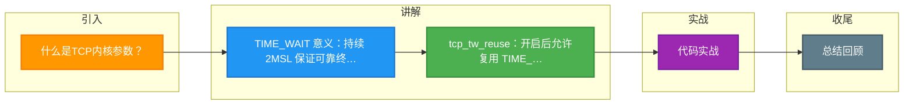

# 什么是TCP内核参数？

TCP 内核参数主要用于优化 TCP 连接的性能、资源占用和可靠性。以下针对连接关闭过程中的关键状态进行优化说明。

## 1. FIN_WAIT_2 状态优化

- **参数**：`tcp_fin_timeout`
- **作用**：控制处于 `FIN_WAIT_2` 状态的超时时间（默认 60 秒）。
- **场景**：当主动关闭方发送 FIN 并收到 ACK 后进入此状态，等待被动关闭方发送 FIN。如果被动方迟迟不发送 FIN，主动方会占用资源。
- **优化**：适当减小该值，避免孤儿连接长期占用系统资源。

## 2. TIME_WAIT 状态优化

`TIME_WAIT` 状态是主动关闭方在发送最后一个 ACK 后进入的状态，持续时长为 2MSL（通常 60 秒）。

### 为什么需要 TIME_WAIT？
1. **可靠终止 TCP 连接**：确保最后一个 ACK 能到达被动方，若丢失则能重传 FIN。
2. **避免旧数据包干扰**：让网络中旧的报文段自然消失，防止影响新连接。

### 优化参数

- **tcp_max_tw_buckets**：
  - **作用**：限制系统中 `TIME_WAIT` 状态连接的最大数量。
  - **优化**：当连接数超过此值，系统会直接销毁新的 TIME_WAIT 连接，不再等待 2MSL。防止过多 TIME_WAIT 耗尽内存或端口。

- **tcp_tw_reuse**：
  - **作用**：允许将 `TIME_WAIT` 状态的 socket 重新用于新的 TCP 连接。
  - **条件**：仅用于客户端（连接发起方），且默认要求开启 TCP 时间戳（`tcp_timestamps`）。
  - **原理**：通过时间戳区分新旧报文，安全地复用端口。

- **tcp_tw_recycle`（已废弃）：
  - *注意*：Linux 高版本已移除此参数，因为它在 NAT 环境下会导致数据包被错误丢弃，造成连接失败。

## 3. 孤儿连接优化

- **参数**：`tcp_max_orphans`
- **作用**：定义系统中孤儿连接（即调用 close 关闭后，已断开进程关联但内核未完成关闭的连接）的最大数量。
- **优化**：超过此数量，新的孤儿连接会被直接发送 RST 强制复位，防止资源耗尽攻击。

- **参数**：`tcp_orphan_retries`
- **作用**：控制孤儿连接在 FIN 阶段的重试次数。超过次数后直接丢弃。

## 实战与进阶

### 实战案例
在高并发短连接场景（如老版本 Nginx 作为反向代理）下，服务器出现大量 `TIME_WAIT`，导致“Cannot assign requested address”报错。通过将 `net.ipv4.tcp_tw_reuse` 设置为 1，端口复用率大幅提升，问题解决。

### 关键配置示例 (sysctl.conf)
```bash
# 开启端口复用，仅对客户端生效
net.ipv4.tcp_tw_reuse = 1
# 缩短 FIN_WAIT_2 超时时间，默认 60s，改为 30s
net.ipv4.tcp_fin_timeout = 30
# 限制 TIME_WAIT 最大数量，防止内存耗尽
net.ipv4.tcp_max_tw_buckets = 5000
```

### 参数对比表

| 参数 | 作用对象 | 主要副作用 | 典型应用场景 |
| :--- | :--- | :--- | :--- |
| **tcp_tw_reuse** | 客户端 | 几乎无（依赖时间戳） | 高并发 API 调用、爬虫 |
| **tcp_tw_recycle** | 服务端 | NAT 环境下丢包（已废弃） | 旧版本内核（现已禁用） |
| **tcp_max_tw_buckets** | 全局 | 超过限制直接丢弃包（RST） | 保护系统不受 DoS 攻击 |

## 常见考点

1. **大量 TIME_WAIT 状态会导致什么问题？**
   - 占用文件描述符和内存，如果端口耗尽，会导致无法建立新连接（特别是客户端，端口数有限）。
2. **`tcp_tw_reuse` 安全吗？为什么需要 `tcp_timestamps`？**
   - 安全。因为复用端口时，内核会检查 TCP 时间戳。如果新连接的初始序列号晚于旧连接的最后一个序列号，说明旧连接的数据已经失效，不会混淆。
3. **服务端开启 `tcp_tw_reuse` 有意义吗？**
   - 意义不大。因为作为连接的被动接收方，本地端口会复用，但连接的四元组（源IP、源端口、目的IP、目的端口）不同，通常不会受 TIME_WAIT 限制。该参数主要针对高并发短连接的客户端。


## 核心架构图

```mermaid
sequenceDiagram
    classDef start fill:#4CAF50,color:#fff
    classDef process fill:#2196F3,color:#fff
    classDef decision fill:#FF9800,color:#fff
    classDef special fill:#9C27B0,color:#fff
    classDef error fill:#f44336,color:#fff
    classDef info fill:#607D8B,color:#fff
    class ACK start
    class C process
    class ESTABLISHED decision
    class FIN special
    class S error
    class SYN info
    class TIME_WAIT start
    class ack process
    class as decision
    class seq special
    class u error
    class v info
    class w start
    class x process
    class y decision
    participant C as 客户端
    participant S as 服务端
    Note over C,S: 三次握手 建立连接
    C->>S: SYN seq=x
    S->>C: SYN+ACK seq=y ack=x+1
    C->>S: ACK seq=x+1 ack=y+1
    Note over C,S: 数据传输 ESTABLISHED
    Note over C,S: 四次挥手 断开连接
    C->>S: FIN seq=u 主动关闭
    S->>C: ACK seq=v ack=u+1 半关闭
    S->>C: FIN seq=w 数据发完
    C->>S: ACK seq=u+1 ack=w+1
    Note over C: TIME_WAIT 2MSL 后关闭
```

## 记忆要点

- TIME_WAIT 意义：持续 2MSL 保证可靠终止，防止旧报文干扰新连接，但也易导致端口耗尽
- tcp_tw_reuse：开启后允许复用 TIME_WAIT 端口，依赖时间戳安全校验，主要作用于客户端
- tcp_tw_recycle：NAT 环境下会丢包导致连接失败，高版本 Linux 已废弃禁用，切勿使用
- tcp_fin_timeout：控制主动方在 FIN_WAIT_2 状态的超时时间，默认 60s，可减小防资源占用
- tcp_max_tw_buckets：全局限制 TIME_WAIT 总数，超限直接销毁防内存和端口耗尽

## 结构化回答

**30 秒电梯演讲：** 调整内核参数管理TCP连接状态和资源。打个比方，像餐厅服务员（内核）清理餐桌，设定多长时间没人坐就收桌子（fin_timeout），桌子多了就把还没擦干净的桌子重新给客人用（tw_reuse）。

**展开框架：**
1. **TIME_WAIT 意义** — 持续 2MSL 保证可靠终止，防止旧报文干扰新连接，但也易导致端口耗尽
2. **tcp_tw_reuse** — 开启后允许复用 TIME_WAIT 端口，依赖时间戳安全校验，主要作用于客户端
3. **tcp_tw_recycle** — NAT 环境下会丢包导致连接失败，高版本 Linux 已废弃禁用，切勿使用

**收尾：** 我在项目里踩过坑——在高并发短连接场景（如老版本 Nginx 作为反向代理）下，服务器出现大量 `TIME_WAIT`，导致“Cannot assign requested address”报错。您想深入聊哪一段：原理、避坑还是对比选型？

## 视频脚本

> 预计时长：3 分钟 | 由浅入深

| 时间 | 画面/字幕 | 口播台词 | 讲解要点 |
|------|----------|----------|----------|
| 0:00 | 标题卡：什么是TCP内核参数 | "什么是TCP内核参数？一句话——像餐厅服务员（内核）清理餐桌，设定多长时间没人坐就收桌子（fin_timeout），桌子多了就把还没擦干净的桌子重新给客人用（tw_reuse）。" | 开场钩子 |
| 0:45 | 概念动画/示意图 | "调整内核参数管理TCP连接状态和资源——像餐厅服务员（内核）清理餐桌，设定多长时间没人坐就收桌子（fin_timeout），桌子多了就把还没擦干净的桌子重新给客人用（tw_reuse）" | 核心定义 |
| 1:30 | TIME_WAIT 意义示意 | "持续 2MSL 保证可靠终止，防止旧报文干扰新连接，但也易导致端口耗尽" | 要点1 |
| 2:15 | tcp_tw_r示意 | "开启后允许复用 TIME_WAIT 端口，依赖时间戳安全校验，主要作用于客户端" | 要点2 |
| 3:00 | 总结卡 | "记住这几条，面试不慌。下期讲进阶追问。" | 收尾 |

### 视频流程图



