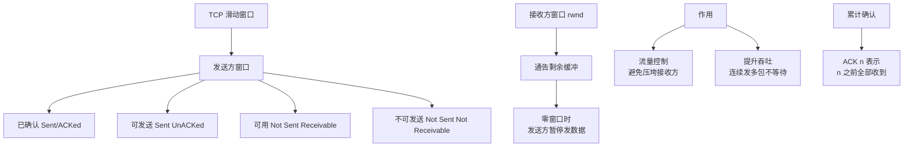

# 什么是TCP的滑动窗口？

TCP 滑动窗口是 TCP 流量控制和传输效率的核心机制。它允许发送方在未收到确认的情况下发送多个数据段，从而提高网络吞吐量。

## 1. 窗口的概念

- **定义**：窗口是接收方告诉发送方，自己目前还有多少缓冲区空间可以接收数据。
- **作用**：无需每发送一个字节就等待 ACK（停止-等待协议），而是批量发送，大幅提升效率。
- **累计确认**：接收方不需要对每一个包都回复 ACK，而是回复“期望收到的下一个序列号”，表示之前的所有数据都已收到。

## 2. 发送方滑动窗口（四个部分）

发送方的缓存根据处理情况划分为四个区域（假设窗口大小由接收方通告决定）：

1. **已发送并已确认**（#1）：数据已发出且收到 ACK，可从缓存清除。
2. **已发送未确认**（#2）：数据已发出，但还没收到 ACK，需保留在缓存以防重传。
3. **允许发送未发送**（#3）：可用窗口，在接收方处理能力范围内，可以立即发送的数据。
4. **不可发送**（#4）：超过了接收方通告的窗口大小，暂不能发送。

**滑动过程**：当 #2 中的数据收到 ACK 后，窗口右移，#3 的范围增大（原来 #4 的部分变成 #3），从而发送后续数据。

## 3. 关键指针

- `SND.UNA`：指向 #2 的第一个字节（已发送未确认的最小序号）。
- `SND.NXT`：指向 #3 的第一个字节（下一个要发送的字节序号）。
- `SND.WND`：发送窗口大小（由接收方 TCP 头部 Window 字段指定）。

## 4. 流量控制

- 接收方在回复 ACK 时，会在 TCP 头部填写自己的接收窗口大小（`rwnd`）。
- 如果接收方应用层读取慢，缓冲区变小，通告窗口变小，发送方的发送速度就会随之降低，形成流量控制。
- 如果窗口变为 0，发送方停止发送，并启动坚持定时器 探测接收方窗口何时恢复。

## 实战与进阶

### 实战案例
在进行大文件传输或视频流推送时，如果消费者处理速度慢，TCP 接收缓冲区满，导致发送端窗口变为 0。此时 `tcpdump` 抓包会发现发送端持续发送 `ZeroWindow` 探测包（通常携带 1 字节数据），直到接收方通告 `Window` 更新。

### 逻辑示例
```c
// 伪代码：计算实际发送窗口
uint32_t rwnd = rcv_buffer_size - rcv_buffer_used; // 接收方剩余空间
uint32_t cwnd = calculate_congestion_window();      // 拥塞控制窗口

// 发送方实际可用窗口 = min(接收方通告窗口, 拥塞窗口)
uint32_t send_window = min(rwnd, cwnd); 

if (send_window == 0) {
    start_persist_timer(); // 启动零窗口探测定时器
}
```

### 窗口机制对比

| 特性 | 滑动窗口 | 拥塞窗口 |
| :--- | :--- | :--- |
| **控制目标** | **流量控制**（保护接收方） | **拥塞控制**（保护网络） |
| **决策依据** | 接收方缓冲区剩余空间 | 网络丢包率/延迟 (ACK/超时) |
| **通告方式** | TCP Header Window 字段 | 发送方内部计算，不显式通告 |
| **限制关系** | `rwnd` | `cwnd` |
| **最终窗口** | **Effective Window = min(rwnd, cwnd)** | |

## 滑动窗口状态示意图

```text
    发送方缓存字节流
    ┌─────┬─────┬─────┬─────┬─────┬─────┬─────┬─────┬─────┬─────┐
    │  1  │  2  │  3  │  4  │  5  │  6  │  7  │  8  │  9  │ ... │
    └─────┴─────┴─────┴─────┴─────┴─────┴─────┴─────┴─────┴─────┘
    │     │     │     │     │     │     │     │     │     │
    ▼     ▼     ▼     ▼     ▼     ▼     ▼     ▼     ▼     ▼
┌───────────────────────────────────────────────────────────────┐
│ #1 已发送并确认 │ #2 已发送未确认 │ #3 允许发送 │ #4 不可发送 │
└───────────────────────────────────────────────────────────────┘
                      │
             ┌────────┴────────┐
             │                 │
        SND.UNA             SND.NXT
    (左侧边界)          (右侧边界)
    
    当收到 ACK：窗口右移 → 窗口大小可能调整 → 持续发送数据
```

## 常见考点

1. **零窗口死锁如何解决？**
   - 当接收方通告窗口为0后，发送方停止发送。如果后续接收方有了空间但通告丢失，发送方会一直等待。解决：发送方启动**零窗口探测定时器**，定时发送小报文探测接收方窗口。
2. **滑动窗口和拥塞窗口 的区别？**
   - **滑动窗口**：是**流量控制**，由接收方根据自己的处理能力通告，保护接收方不被淹没。
   - **拥塞窗口**：是**拥塞控制**，由发送方根据网络拥塞程度计算，保护网络不被堵死。
   - 发送方的实际发送窗口 = `min(rwnd, cwnd)`。
3. **糊涂窗口综合征（SWS）是什么？**
   - 当发送方发送极小的数据包（如1字节）或者接收方通告极小的窗口（如1字节），会导致网络效率极低。解决：发送方开启 Nagle 算法（积攒数据）；接收方延迟 ACK（等缓冲区有一定空间再通告）。


## 核心架构图



## 记忆要点

- 核心定义：接收方通过 TCP Header 的 Window 字段通告剩余缓冲区，发送方据此批量发送实现流量控制
- 发送方四区：已确认、未确认、可发送、不可发送。收到 ACK 后窗口右移滑动
- 三个指针：SND.UNA 指向未确认起点，SND.NXT 指向可发送起点，二者夹角为可用窗口大小
- 窗口对比：滑动窗口(rwnd)是流量控制保护接收方，拥塞窗口(cwnd)是拥塞控制保护网络
- 零窗口死锁：接收方通告窗口为 0 时发送方停止，依靠坚持定时器发探测包解决死锁

## 结构化回答

**30 秒电梯演讲：** 利用窗口批量发送数据实现流量控制。打个比方，像送快递，不需要送一个确认一个，而是根据客户（接收方）家里的柜子（窗口）大小，一次性送一批，柜子满了就停下。

**展开框架：**
1. **核心定义** — 接收方通过 TCP Header 的 Window 字段通告剩余缓冲区，发送方据此批量发送实现流量控制
2. **发送方四区** — 已确认、未确认、可发送、不可发送。收到 ACK 后窗口右移滑动
3. **三个指针** — SND.UNA 指向未确认起点，SND.NXT 指向可发送起点，二者夹角为可用窗口大小

**收尾：** 我在项目里踩过坑——在进行大文件传输或视频流推送时，如果消费者处理速度慢，TCP 接收缓冲区满，导致发送端窗口变为 0。您想深入聊哪一段：原理、避坑还是对比选型？

## 视频脚本

> 预计时长：3 分钟 | 由浅入深

| 时间 | 画面/字幕 | 口播台词 | 讲解要点 |
|------|----------|----------|----------|
| 0:00 | 标题卡：什么是TCP的滑动窗口 | "什么是TCP的滑动窗口？一句话——像送快递，不需要送一个确认一个，而是根据客户（接收方）家里的柜子（窗口）大小，一次性送一批，柜子满了就停下。" | 开场钩子 |
| 0:45 | 概念动画/示意图 | "利用窗口批量发送数据实现流量控制——像送快递，不需要送一个确认一个，而是根据客户（接收方）家里的柜子（窗口）大小，一次性送一批，柜子满了就停下" | 核心定义 |
| 1:30 | 核心定义示意 | "接收方通过 TCP Header 的 Window 字段通告剩余缓冲区，发送方据此批量发送实现流量控制" | 要点1 |
| 2:15 | 发送方四区示意 | "已确认、未确认、可发送、不可发送。收到 ACK 后窗口右移滑动" | 要点2 |
| 3:00 | 总结卡 | "记住这几条，面试不慌。下期讲进阶追问。" | 收尾 |
