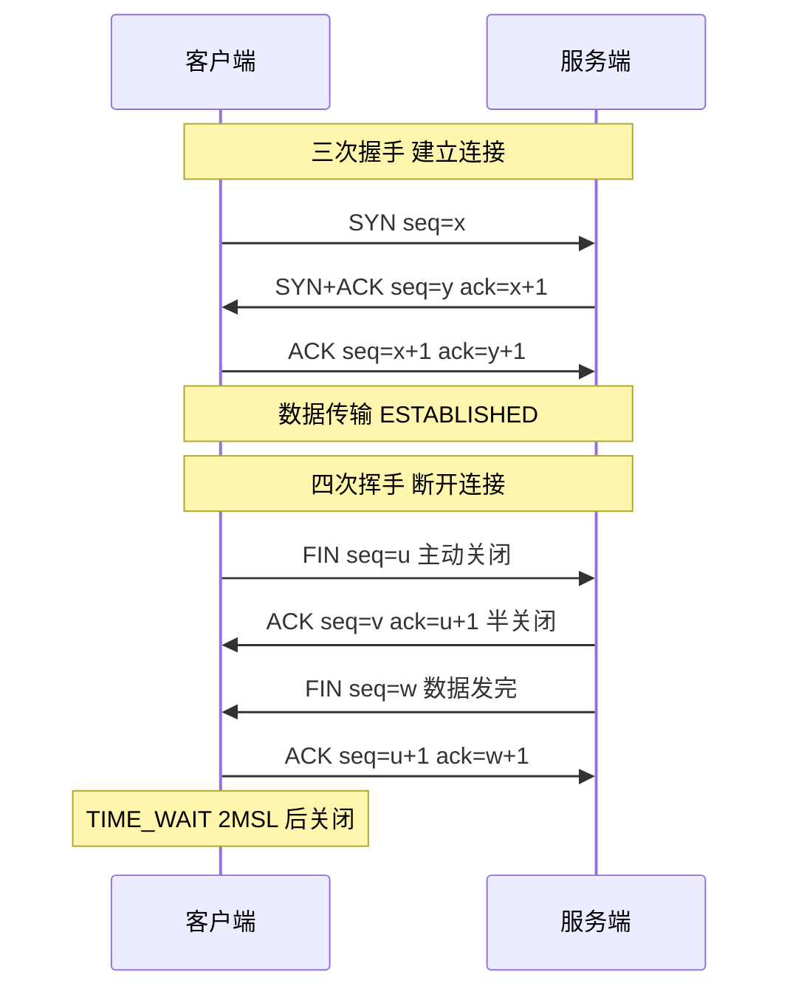

# 什么是TCP粘包问题？如何解决TCP粘包问题？

TCP是面向字节流的协议，无消息边界，因此会发生“粘包/拆包”现象。即发送方多个数据包可能粘在一起发送，或一个大包被拆分发送。

**产生原因**：
1. **字节流特性**：TCP本质是流，数据无边界。
2. **缓冲区机制**：发送方 Nagle 算法可能合并小包；接收方缓冲区堆积数据导致粘包。
3. **MSS/MTU 限制**：数据超过最大传输单元会被拆包。

**解决方案**：
1. **固定长度**：规定每个消息大小一致（定长），空位补齐。
2. **特殊分隔符**：在消息末尾添加换行符等特殊符号（如 FTP）。
3. **长度字段**：在消息头部定义长度字段，标明后续数据长度（最常用，如 Redis）。

## 实战与进阶

### 实战案例
在一个即时通讯系统中，服务端接收到的消息偶尔出现“指令错乱”或解析异常。排查发现是客户端快速连续发送两条短消息，TCP Nagle 算法将其合并发送，而服务端按单条逻辑处理导致错误。最终在协议头增加了 4 字节的 Length 字段解决。

### 代码示例: Java 解析长度字段协议
```java
// 简单的基于长度字节的缓冲区处理
ByteBuffer buffer = ByteBuffer.allocate(1024);

void process(byte[] data) {
    buffer.put(data);
    buffer.flip();
    
    while (buffer.remaining() >= 4) { // 至少要有头部长度
        buffer.mark();
        int length = buffer.getInt(); // 读取头部长度
        
        if (buffer.remaining() < length) {
            buffer.reset(); // 数据不够，重置指针等待下次读取
            break;
        }
        
        byte[] body = new byte[length];
        buffer.get(body);
        handleCompleteMessage(body); // 处理完整包
    }
    buffer.compact(); // 压缩缓冲区，保留未处理数据
}
```

### 解决方案对比

| 方案 | 优点 | 缺点 | 典型应用 |
| :--- | :--- | :--- | :--- |
| **固定长度** | 解析极快，逻辑简单 | 浪费带宽，数据需补齐 | 传统金融报文 |
| **特殊分隔符** | 文本协议友好，人类可读 | 需转义分隔符，解析效率稍低 | HTTP, FTP, Redis (Pub/Sub) |
| **长度字段** | 高效，二进制安全，严格边界 | 需定义字节序（大小端） | Dubbo, Redis, MQ |

## TCP 粘包/拆包原理示意图

```text
发送方应用层连续发送两个数据包：
  [Packet 1: "ABC"]  [Packet 2: "DEF"]

  ↓ (经过 TCP 缓冲区 / Nagle 算法 / MTU 分片)

接收方 TCP 缓冲区收到的字节流可能是：

  情况1：粘包
  ┌─────────────────────┐
  │ "ABCDEF"            │
  └─────────────────────┘

  情况2：拆包
  ┌────────┐  ┌────────┐
  │ "AB"   │  │ "CDEF"  │
  └────────┘  └────────┘

  情况3：粘包+拆包
  ┌────────┐  ┌────────┐
  │ "ABC"  │  │ "D" ... │ (后续数据未全到达)
  └────────┘  └────────┘
```

## 长度字段法解析流程

```text
接收方字节流: ┌──────┬──────┬─────────────────┐
             │ Len  │ Len  │  Data Body      │
             │ 4B   │ 4B   │  (实际长度)      │
             └──────┴──────┴─────────────────┘

解析步骤:
1. 读取头部 4 字节 -> 长度 N
2. 检查缓冲区剩余可读字节数 >= N ?
   ├─ 是: 读取 N 字节 -> 完整包 -> 移出缓冲区 -> 循环解析下一个
   └─ 否: 继续等待数据 (半包，不读)
```

## 常见考点

1. **为什么 UDP 不会粘包？**
   - UDP 是面向消息的协议，保留了消息边界。UDP 对应用层交付的数据块加上首部就形成 IP 数据报，接收方一次recvfrom只接收一个数据报，不会合并。
2. **Netty 是如何解决 TCP 粘包拆包的？**
   - Netty 提供了多种解码器：
     - `FixedLengthFrameDecoder`：定长。
     - `DelimiterBasedFrameDecoder`：特殊分隔符。
     - `LengthFieldBasedFrameDecoder`：长度字段（最灵活，支持偏移量调整）。
3. **什么是 Nagle 算法？它会导致什么问题？**
   - Nagle 算法要求发送方缓冲数据，只有收集到足够多的数据（或收到上一个包的 ACK）才发送。这会导致小数据包延迟发送，造成高延迟。在实时性要求高的场景（如游戏、即时通讯）通常需要禁用（`TCP_NODELAY`）。


## 核心架构图



## 记忆要点

- 本质成因：TCP 是面向字节流的协议，底层无消息边界保护，而 UDP 面向报文不粘包
- 机制影响：发送端合并小包的 Nagle 算法，以及接收端读取不及时导致缓冲区数据堆积
- 方案一：消息定长，不够补齐，解析极快但浪费带宽（传统金融报文）
- 方案二：特殊分隔符，如结尾加换行符，适合文本协议，二进制数据需转义（HTTP/FTP）
- 方案三（最推荐）：头部长度字段法，二进制安全且高效，Netty 用 LengthFieldBasedFrameDecoder

## 结构化回答

**30 秒电梯演讲：** TCP数据像水流一样无边界，需自定义规则切分。打个比方，像水管流水，你不知道哪滴水属于哪杯水，需自己在杯子上做标记。

**展开框架：**
1. **本质成因** — TCP 是面向字节流的协议，底层无消息边界保护，而 UDP 面向报文不粘包
2. **机制影响** — 发送端合并小包的 Nagle 算法，以及接收端读取不及时导致缓冲区数据堆积
3. **方案一** — 消息定长，不够补齐，解析极快但浪费带宽（传统金融报文）

**收尾：** 我在项目里踩过坑——在一个即时通讯系统中，服务端接收到的消息偶尔出现“指令错乱”或解析异常。您想深入聊哪一段：原理、避坑还是对比选型？

## 视频脚本

> 预计时长：3 分钟 | 由浅入深

| 时间 | 画面/字幕 | 口播台词 | 讲解要点 |
|------|----------|----------|----------|
| 0:00 | 标题卡：什么是TCP粘包问题？如何解决TCP… | "什么是TCP粘包问题？如何解决TCP粘包问题？一句话——像水管流水，你不知道哪滴水属于哪杯水，需自己在杯子上做标记。" | 开场钩子 |
| 0:45 | 概念动画/示意图 | "TCP数据像水流一样无边界，需自定义规则切分——像水管流水，你不知道哪滴水属于哪杯水，需自己在杯子上做标记" | 核心定义 |
| 1:30 | 本质成因示意 | "TCP 是面向字节流的协议，底层无消息边界保护，而 UDP 面向报文不粘包" | 要点1 |
| 2:15 | 机制影响示意 | "发送端合并小包的 Nagle 算法，以及接收端读取不及时导致缓冲区数据堆积" | 要点2 |
| 3:00 | 总结卡 | "记住这几条，面试不慌。下期讲进阶追问。" | 收尾 |
