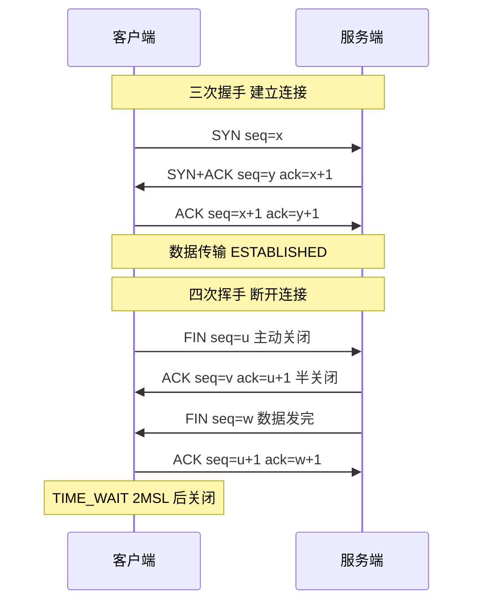

# 什么是TCP？

### 什么是 TCP？

**定义**：
TCP（Transmission Control Protocol，传输控制协议）是一种面向连接的、可靠的、基于字节流的传输层通信协议。它旨在在不可靠的 IP 层之上提供可靠的数据传输服务。

**主要特性**：
1. **面向连接**：通信前必须进行三次握手建立连接，结束后需四次挥手断开连接。
2. **可靠传输**：通过序列号、确认应答（ACK）、重传机制、校验和等保证数据无差错、不丢失、不重复、且按序到达。
3. **面向字节流**：将数据看作一连串无结构的字节流，不保留应用层消息的边界（需解决粘包/拆包问题）。
4. **全双工通信**：连接的双方可以在任何时候发送和接收数据。
5. **流量控制**：利用滑动窗口机制防止发送方发送速度过快导致接收方缓冲区溢出。
6. **拥塞控制**：包含慢启动、拥塞避免、快重传、快恢复算法，防止过多的数据注入到网络中造成网络拥塞。

## 实战与进阶

### 实战案例
使用 `tcpdump` 抓包分析三次握手时，可以通过 `[S]` (SYN)、`[.]` (ACK) 标志确认连接过程。若发现 SYN 包发送后无响应，通常意味着防火墙拦截或服务未监听；若收到 `[R]` (RST)，则说明服务端口被拒绝。

### 代码示例: TCP 连接建立
```python
import socket

# TCP 客户端演示: 可靠传输与流式传输
sock = socket.socket(socket.AF_INET, socket.SOCK_STREAM) # SOCK_STREAM 代表 TCP
sock.connect(('example.com', 80)) # 面向连接：三次握手

sock.sendall(b'GET / HTTP/1.1\r\nHost: example.com\r\n\r\n') # 发送数据

# 面向字节流：不一定一次 recv 就能收到完整响应
data = b''
while True:
    chunk = sock.recv(1024) # 可靠传输：保证有序到达
    if not chunk: break
    data += chunk
print(data.decode())
sock.close() # 四次挥手
```

### TCP vs UDP 对比

| 特性 | TCP (传输控制协议) | UDP (用户数据报协议) |
| :--- | :--- | :--- |
| **连接性** | 面向连接（1对1） | 无连接（1对1, 1对多, 多对多） |
| **可靠性** | 高（确认、重传、去重） | 低（可能丢包、乱序） |
| **有序性** | 有序 | 无序
| **边界性** | 面向字节流（无边界） | 面向报文（有边界）
| **传输速度** | 较慢（首部开销20B+） | 较快（首部开销8B）
| **流量控制** | 滑动窗口 | 无
| **应用场景** | 文件传输、邮件、浏览 | 视频直播、DNS、语音通话 |

---

### TCP 报文首部详解

TCP 首部通常为 20 字节（不含选项），最长可达 60 字节。

```text
 0                   1                   2                   3
 0 1 2 3 4 5 6 7 8 9 0 1 2 3 4 5 6 7 8 9 0 1 2 3 4 5 6 7 8 9 0 1
+-+-+-+-+-+-+-+-+-+-+-+-+-+-+-+-+-+-+-+-+-+-+-+-+-+-+-+-+-+-+-+-+
|          Source Port          |       Destination Port        |
+-+-+-+-+-+-+-+-+-+-+-+-+-+-+-+-+-+-+-+-+-+-+-+-+-+-+-+-+-+-+-+-+
|                        Sequence Number                        |
+-+-+-+-+-+-+-+-+-+-+-+-+-+-+-+-+-+-+-+-+-+-+-+-+-+-+-+-+-+-+-+-+
|                    Acknowledgment Number                      |
+-+-+-+-+-+-+-+-+-+-+-+-+-+-+-+-+-+-+-+-+-+-+-+-+-+-+-+-+-+-+-+-+
|  Data |           |U|A|P|R|S|F|                               |
| Offset| Reserved  |R|C|S|S|Y|I|            Window             |
|       |           |G|K|H|T|N|N|                               |
+-+-+-+-+-+-+-+-+-+-+-+-+-+-+-+-+-+-+-+-+-+-+-+-+-+-+-+-+-+-+-+-+
|           Checksum            |         Urgent Pointer        |
+-+-+-+-+-+-+-+-+-+-+-+-+-+-+-+-+-+-+-+-+-+-+-+-+-+-+-+-+-+-+-+-+
|                    Options                    |    Padding    |
+-+-+-+-+-+-+-+-+-+-+-+-+-+-+-+-+-+-+-+-+-+-+-+-+-+-+-+-+-+-+-+-+
```

**字段说明**：
*   **源端口和目的端口**：标识发送方和接收方的进程，用于多路复用/分解。
*   **序列号**：
    -   占 4 字节。
    -   **原理**：TCP 是面向字节流的，TCP 给发送的每一个字节的数据都进行了编号。该字段表示本报文段所发送数据的第一个字节的序号。
    -   **作用**：解决网络包乱序问题。
*   **确认应答号**：
    -   占 4 字节。
    -   **原理**：期望收到对方下一个报文段的第一个字节的序号。
    -   **作用**：配合 ACK 标志位，解决不丢包的问题。若 `ack=N`，则表示 N 之前的所有数据都已正确收到。
*   **数据偏移**：
    -   占 4 位。
    -   **作用**：指出 TCP 首部的长度，单位是 4 字节。最大值为 15 (0b1111)，即 60 字节。


## 核心架构图



## 记忆要点

- 核心定义：TCP 是一种面向连接的、可靠的、基于字节流的传输层通信协议
- 可靠性保障：通过序列号、确认应答（ACK）、重传机制和校验和保证数据无差错按序到达
- 流量与拥塞控制：滑动窗口解决收发两端速率匹配（保护接收方），拥塞窗口控制网络注入量
- 对比 UDP：TCP 面向连接可靠但慢（20B头），UDP 无连接不可靠但快（8B头）保留边界
- 应用场景：TCP 用于文件/网页/邮件，UDP 用于视频直播/语音/游戏等

## 结构化回答

**30 秒电梯演讲：** 传输层提供可靠、面向连接的字节流服务。打个比方，像打电话，先建立连接再对话，保证每句话都按顺序说到。

**展开框架：**
1. **核心定义** — TCP 是一种面向连接的、可靠的、基于字节流的传输层通信协议
2. **可靠性保障** — 通过序列号、确认应答（ACK）、重传机制和校验和保证数据无差错按序到达
3. **流量与拥塞控制** — 滑动窗口解决收发两端速率匹配（保护接收方），拥塞窗口控制网络注入量

**收尾：** 我在项目里踩过坑——使用 `tcpdump` 抓包分析三次握手时，可以通过 `[S]` (SYN)、`[.]` (ACK) 标志确认连接过程。您想深入聊哪一段：原理、避坑还是对比选型？

## 视频脚本

> 预计时长：3 分钟 | 由浅入深

| 时间 | 画面/字幕 | 口播台词 | 讲解要点 |
|------|----------|----------|----------|
| 0:00 | 标题卡：什么是TCP | "什么是TCP？一句话——像打电话，先建立连接再对话，保证每句话都按顺序说到。" | 开场钩子 |
| 0:45 | 概念动画/示意图 | "传输层提供可靠、面向连接的字节流服务——像打电话，先建立连接再对话，保证每句话都按顺序说到" | 核心定义 |
| 1:30 | 核心定义示意 | "TCP 是一种面向连接的、可靠的、基于字节流的传输层通信协议" | 要点1 |
| 2:15 | 可靠性保障示意 | "通过序列号、确认应答（ACK）、重传机制和校验和保证数据无差错按序到达" | 要点2 |
| 3:00 | 总结卡 | "记住这几条，面试不慌。下期讲进阶追问。" | 收尾 |
