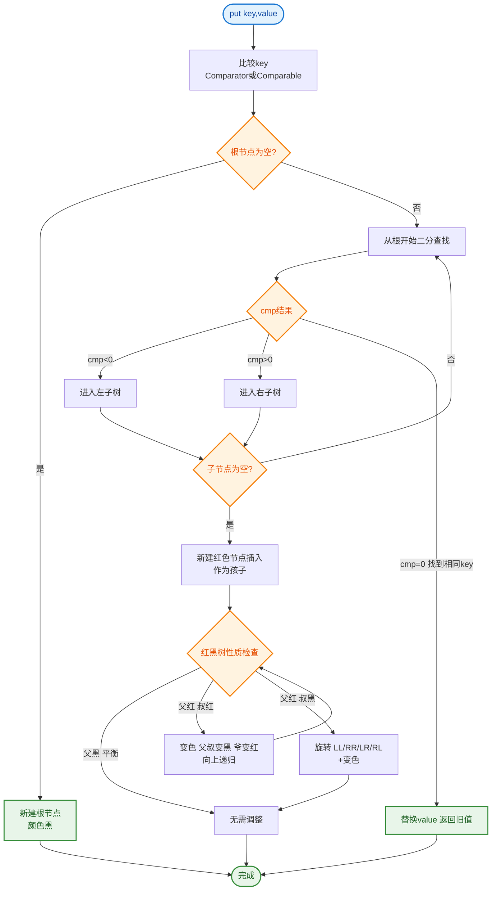

# 什么是treemap？

### 什么是 TreeMap？

**定义**：
TreeMap 是 Java 集合框架中基于**红黑树**实现的 `NavigableMap` 接口。它继承自 AbstractMap，保证了 Key 的有序存储和高效操作。

**核心特性**：
1.  **有序性**：
    *   默认情况下，根据 Key 的**自然顺序**（Natural Ordering，如数字从小到大，字符串按字典序）进行排序。
    *   也可以在构造时传入自定义的 `Comparator`（比较器）来指定排序规则。
2.  **时间复杂度**：
    *   由于底层是平衡二叉树（红黑树），查询、插入、删除操作的时间复杂度均为 **O(logN)**。
3.  **非线程安全**：
    *   TreeMap 不是线程安全的。若需要在多线程环境中使用，需在外部加锁或使用 `Collections.synchronizedSortedMap` 进行包装。

**关键细节**：
*   **Key 不能为 null**：
    *   若使用自然顺序，Key 不能为 null（因为 `null.compareTo(...)` 会抛出 NPE）。
    *   若使用自定义 Comparator，且 Comparator 能处理 null，则 Key 可以允许为 null（视具体实现而定，但一般不推荐）。
*   **数据结构原理**：
    *   TreeMap 的底层是红黑树，这是一种自平衡二叉查找树。
    *   为了保持树的平衡（避免退化为链表导致性能降为 O(N)），在插入和删除节点时会进行**左旋**、**右旋**和**节点变色**操作。

**红黑树性质简述**：
1.  节点是红色或黑色。
2.  根节点是黑色。
3.  所有叶子节点（NIL 节点，空节点）都是黑色。
4.  红色节点的两个子节点都是黑色（不能有两个连续的红色节点）。
5.  从任一节点到其每个叶子的所有路径都包含相同数目的黑色节点。

**ASCII 架构图 (TreeMap 结构示意图)**：
```text
       TreeMap (Root)
           │
           ▼
       ┌───(50)────┐       
       │    │      │       (数字代表 Key)
       │  Black    │
   ┌───┴───┐ ┌────┴─────┐
   ▼       ▼ ▼          ▼
(30)    (70)(60)      (80)
 Red     Red  Red     Black
```
*注：上述仅为结构示意，实际红黑树颜色根据平衡性动态调整。* 

**API 拓展**：
由于实现了 `SortedMap` 和 `NavigableMap`，TreeMap 支持丰富的区间查询操作：
*   `firstEntry()` / `lastEntry()`：获取最小/最大键值对。
*   `subMap(fromKey, toKey)`：获取指定范围内的子 Map。
*   `higherKey(key)` / `lowerKey(key)`：获取大于/小于给定 key 的最近 key。

### ## 常见考点

1.  **HashMap 和 TreeMap 的区别？**
    *   **HashMap**：底层是数组+链表/红黑树（JDK1.8），无序，O(1) 的查询效率，Key 允许一个 null。
    *   **TreeMap**：底层是红黑树，有序（按 Key 排序），O(logN) 的查询效率，Key 不能为 null（自然排序下）。
2.  **TreeMap 如何实现自定义排序？**
    *   构造时传入 `new Comparator() { ... }` 并重写 `compare` 方法。
3.  **为什么 TreeSet 的底层实现依赖 TreeMap？**
    *   TreeSet 没有单独维护数据结构，而是内部持有一个 TreeMap 实例，将 TreeSet 的元素作为 TreeMap 的 Key，Value 是一个固定的 Object 常量（PRESENT）。

---

**实战案例**：
在实现“滑动窗口最大值”或需要按时间戳范围查询的事件溯源系统时，TreeMap 的 `subMap` 方法能极大地简化区间查询逻辑；但在高并发写入场景下，曾因频繁的树平衡调整导致 CPU 飙升，后改用 ConcurrentHashMap 分段处理。

**代码示例**：
```java
// 实战：利用 TreeMap 获取最近 10 分钟内的订单（按时间戳倒序）
Map<Long, Order> recentOrders = new TreeMap<>((k1, k2) -> k2.compareTo(k1)); // 倒序
long tenMinutesAgo = System.currentTimeMillis() - 10 * 60 * 1000;
// headMap 返回小于 toKey 的键值对，因倒序，toKey 即为最早允许的时间点
Map<Long, Order> snapshot = ((TreeMap<Long, Order>) recentOrders).headMap(tenMinutesAgo, true);
// snapshot 即为最近 10 分钟的数据视图
```

**对比表格**：

| 特性 | HashMap | TreeMap | LinkedHashMap |
| :--- | :--- | :--- | :--- |
| **底层结构** | 数组+链表/红黑树 | 红黑树 | 数组+链表+双向链表 |
| **有序性** | 无序 | 按 Key 排序 | 插入序或访问序 |
| **时间复杂度** | O(1) / O(logN) | O(logN) | O(1) / O(logN) |
| **适用场景** | 快速查找，高频读写 | 需要排序/范围查询 | 需要保持插入顺序/LRU |


## 核心流程图


## 记忆要点

- 底层结构：基于红黑树（自平衡二叉查找树）实现，Key 强制有序（自然排序或 Comparator）
- 性能与限制：增删改查的时间复杂度为 O(logN)，非线程安全，自然排序下 Key 不能为 null
- 红黑树原理：节点红黑相间，通过左旋、右旋、节点变色保持大致平衡，防止退化为链表
- 对比 HashMap：HashMap 无序且 O(1) 查询，TreeMap 牺牲速度换取了强大的排序与范围查询
- 高频考点：支持丰富的区间导航操作，如 subMap 截取子集，firstEntry 获取极值

## 结构化回答

**30 秒电梯演讲：** 基于红黑树的有序Map，查找效率高且自动排序。打个比方，像自动排序的字典，存入词条后自动按拼音排序，查找时翻目录。

**展开框架：**
1. **底层结构** — 基于红黑树（自平衡二叉查找树）实现，Key 强制有序（自然排序或 Comparator）
2. **性能与限制** — 增删改查的时间复杂度为 O(logN)，非线程安全，自然排序下 Key 不能为 null
3. **红黑树原理** — 节点红黑相间，通过左旋、右旋、节点变色保持大致平衡，防止退化为链表

**收尾：** 我在项目里踩过坑——在实现“滑动窗口最大值”或需要按时间戳范围查询的事件溯源系统时，TreeMap 的 `subMap` 方法能极大地简化区间查询逻辑；但在高并发写入场景下，曾因频繁的树平衡调整导致 CPU 飙升，后改用 ConcurrentHashMap 分段处理。您想深入聊哪一段：原理、避坑还是对比选型？

## 视频脚本

> 预计时长：3 分钟 | 由浅入深

| 时间 | 画面/字幕 | 口播台词 | 讲解要点 |
|------|----------|----------|----------|
| 0:00 | 标题卡：什么是treemap | "什么是treemap？一句话——像自动排序的字典，存入词条后自动按拼音排序，查找时翻目录。" | 开场钩子 |
| 0:45 | 概念动画/示意图 | "基于红黑树的有序Map，查找效率高且自动排序——像自动排序的字典，存入词条后自动按拼音排序，查找时翻目录" | 核心定义 |
| 1:30 | 底层结构示意 | "基于红黑树（自平衡二叉查找树）实现，Key 强制有序（自然排序或 Comparator）" | 要点1 |
| 2:15 | 性能与限制示意 | "增删改查的时间复杂度为 O(logN)，非线程安全，自然排序下 Key 不能为 null" | 要点2 |
| 3:00 | 总结卡 | "记住这几条，面试不慌。下期讲进阶追问。" | 收尾 |
