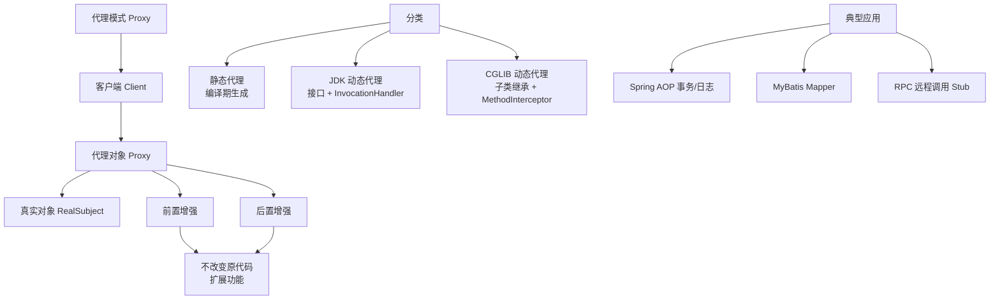

# 什么是代理模式？

**代理模式（Proxy Pattern）**是一种结构型设计模式，通过引入代理对象来控制对原始对象的访问。

## 定义

代理模式为其他对象提供一种代理以控制对这个对象的访问。代理对象在客户端和目标对象之间起到中介作用，可以在不改变目标对象的前提下，增加额外功能（延迟加载、权限控制、日志记录等）。

## 主要角色

| 角色 | 职责 | 说明 |
|------|------|------|
| **抽象主题** | 定义共同接口 | 代理和真实对象实现同一接口 |
| **真实主题** | 执行实际业务逻辑 | 被代理的目标对象 |
| **代理** | 控制访问 + 增强功能 | 持有 RealSubject 引用 |

## 代码示例

```java
// 1. 抽象主题
public interface Subject {
    void request();
}

// 2. 真实主题
public class RealSubject implements Subject {
    @Override
    public void request() {
        System.out.println("执行真实请求");
    }
}

// 3. 代理
public class Proxy implements Subject {
    private RealSubject realSubject;

    @Override
    public void request() {
        if (realSubject == null) {
            realSubject = new RealSubject();
        }
        preRequest();
        realSubject.request();
        postRequest();
    }

    private void preRequest() { System.out.println("权限校验"); }
    private void postRequest() { System.out.println("日志记录"); }
}
```

## 应用场景

1. **远程代理**：RPC Stub，隐藏远程调用细节（Dubbo/gRPC）
2. **虚拟代理**：延迟加载重对象（图片懒加载/Hibernate）
3. **保护代理**：权限控制（Spring Security）
4. **智能引用代理**：引用计数/日志/缓存（Spring AOP/MyBatis）

## 与装饰器/适配器对比

| 对比项 | 代理模式 | 装饰器模式 | 适配器模式 |
|--------|----------|------------|------------|
| **目的** | 控制访问 | 增强功能 | 转换接口 |
| **接口** | 与目标相同 | 与目标相同 | 与目标不同 |

## 优缺点

**优点**：职责清晰、智能引用、延迟加载
**缺点**：增加复杂度、间接调用可能有性能开销

---

**实战案例**：
在微服务调用中，常用 **动态代理**（如 Feign 或 JDK 动态代理）拦截接口调用，透明地注入服务发现、熔断降级和 TraceId 透传等逻辑，解决了手写 REST 客户端代码冗余且难以维护的问题。

**代码示例**（JDK 动态代理实战）：
```java
// 实战：使用动态代理统一记录方法执行耗时
public class TimingProxy implements InvocationHandler {
    private Object target;

    public static <T> T createProxy(T target) {
        return (T) Proxy.newProxyInstance(
            target.getClass().getClassLoader(),
            target.getClass().getInterfaces(),
            new TimingProxy(target)
        );
    }
    @Override
    public Object invoke(Object proxy, Method method, Object[] args) throws Throwable {
        long start = System.currentTimeMillis();
        Object result = method.invoke(target, args);
        System.out.println(method.getName() + " cost: " + (System.currentTimeMillis() - start) + "ms");
        return result;
    }
}
```

**对比表格**：

| 类型 | 实现方式 | 特点 | 常见应用 |
| :--- | :--- | :--- | :--- |
| **静态代理** | 手动编写代理类 | 编译期确定，代码清晰但冗余 | 老旧系统封装 |
| **JDK 动态代理** | 反射机制 | 只能代理接口，JDK 原生支持 | Spring AOP (默认) |
| **CGLIB 代理** | 字节码生成 (ASM) | 代理类（子类），无法代理 final 类 | Spring AOP (无接口时) |


## 核心架构图



## 记忆要点

- 代理模式是结构型模式，通过代理对象控制对原对象的访问并增强功能
- 三角色：抽象主题接口、真实主题类、代理类持有真实主题引用
- 核心场景：远程代理、虚拟代理、保护代理、智能引用
- 易混对比：代理控制访问，装饰器增强功能，适配器转换接口
- 实战动态代理：JDK只能代理接口，CGLIB生成子类，常用于Spring AOP

## 结构化回答

**30 秒电梯演讲：** 使用代理对象控制对真实对象的访问，以此增强功能。打个比方，像明星的经纪人，客户找明星必须先通过经纪人，经纪人负责过滤和安排。

**展开框架：**
1. **代理模式是结构型模式** — 通过代理对象控制对原对象的访问并增强功能
2. **三角色** — 抽象主题接口、真实主题类、代理类持有真实主题引用
3. **核心场景** — 远程代理、虚拟代理、保护代理、智能引用

**收尾：** 我在项目里踩过坑——在微服务调用中，常用 动态代理（如 Feign 或 JDK 动态代理）拦截接口调用，透明地注入服务发现、熔断降级和 TraceId 透传等逻辑，解决了手写 REST 客户端代码冗余且难以维护的问题。您想深入聊哪一段：原理、避坑还是对比选型？

## 视频脚本

> 预计时长：2 分钟 | 由浅入深

| 时间 | 画面/字幕 | 口播台词 | 讲解要点 |
|------|----------|----------|----------|
| 0:00 | 标题卡：什么是代理模式 | "什么是代理模式？一句话——像明星的经纪人，客户找明星必须先通过经纪人，经纪人负责过滤和安排。" | 开场钩子 |
| 0:40 | 概念动画/示意图 | "使用代理对象控制对真实对象的访问，以此增强功能——像明星的经纪人，客户找明星必须先通过经纪人，经纪人负责过滤和安排" | 核心定义 |
| 1:20 | 代理模式是结构型模式示意 | "通过代理对象控制对原对象的访问并增强功能" | 要点1 |
| 2:00 | 总结卡 | "记住这几条，面试不慌。下期讲进阶追问。" | 收尾 |
