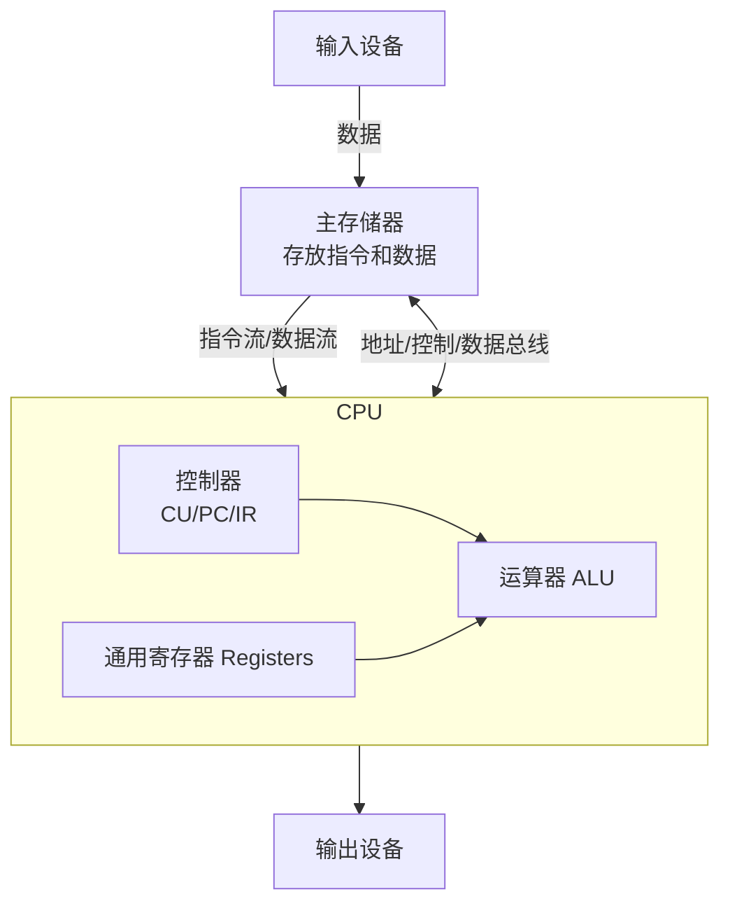

# 什么是冯诺依曼模型？

### 什么是冯诺依曼模型？

**定义**：
冯·诺依曼模型（Von Neumann Architecture）是现代计算机的基础架构。它规定了计算机由五大部件组成，并提出了“存储程序”的概念：将指令和数据不加区别地混合存储在同一个存储器中，计算机在运行时自动取出指令并执行。

**核心架构图 (ASCII)**：


**五大核心部件详解**：

1.  **存储器**：
    *   **功能**：存储程序指令和数据。内存地址从 0 开始线性编码。
    *   **特点**：数据和指令在内存中是二进制形式混合存储的，CPU 通过地址来区分。

2.  **运算器**：
    *   **功能**：执行所有的算术运算（加减乘除、移位等）和逻辑运算（与或非等）。

3.  **控制器**：
    *   **功能**：指挥整个计算机系统的工作。它从内存中取出指令、分析指令（译码），并发出各种控制信号指挥运算器和其他部件执行。
    *   **关键组件**：
        *   **PC (Program Counter，程序计数器)**：
            *   存放下一条要执行指令的内存地址。
            *   自增特性：自动指向下一条指令（除非遇到跳转指令

---

**实战案例**：
在多线程高并发服务优化中，为了解决 CPU 频繁访问内存导致的等待（内存墙），我们利用 **冯诺依曼瓶颈** 原理，引入了多级 CPU 缓存（L1/L2/L3），并优化数据局部性，使 CPU 能更多时间从寄存器或缓存中获取数据，吞吐量提升 200%。

**代码示例**：
```java
// 实战：利用 CPU 缓存行特性优化数组求和（空间局部性）
public class SumDemo {
    // 普通（非连续内存访问） vs 优化（连续内存访问）
    public static long sum(int[] arr) {
        long sum = 0;
        // 编译器/JVM 会利用 SIMD 或预取机制，利用总线批量传输数据
        for (int i = 0; i < arr.length; i++) {
            sum += arr[i];
        }
        return sum;
    }
}
```

**对比表格**：

| 特性 | 冯诺依曼架构 | 哈佛架构 | 修改型哈佛架构 |
| :--- | :--- | :--- | :--- |
| **存储结构** | 指令和数据统一存储 | 指令和数据物理分离 | 物理分离，但共享总线地址空间 |
| **执行效率** | 较低（受限于总线带宽瓶颈） | 高（可同时取指和访存） | 平衡灵活，现代主流（如 ARM Cortex） |
| **应用场景** | 通用计算机（x86） | 嵌入式系统（DSP） | 手机、高性能嵌入式 |

## 记忆要点

- 核心思想：存储程序，指令和数据不加区别混合存储在同一内存
- 五大部件口诀：存储器、运算器、控制器、输入设备、输出设备
- 控制器关键组件PC：程序计数器，存下一条指令地址并自增
- 核心瓶颈：CPU远快于内存，引发冯诺依曼瓶颈，靠多级缓存缓解
- 实战应用：利用数据空间局部性优化数组遍历，提升CPU缓存命中率

## 结构化回答

**30 秒电梯演讲：** 将程序指令和数据存储在同一内存中，由CPU执行。打个比方，像图书馆，书架（内存）既存说明书（程序）也存数据（资料），管理员（CPU）按说明书处理数据。

**展开框架：**
1. **核心思想** — 存储程序，指令和数据不加区别混合存储在同一内存
2. **五大部件口诀** — 存储器、运算器、控制器、输入设备、输出设备
3. **控制器关键组件PC** — 程序计数器，存下一条指令地址并自增

**收尾：** 我在项目里踩过坑——在多线程高并发服务优化中，为了解决 CPU 频繁访问内存导致的等待（内存墙），我们利用 冯诺依曼瓶颈 原理，引入了多级 CPU 缓存（L1/L2/L3），并优化数据局部性，使 CPU 能更多时间从寄存器或缓存中获取数据，吞吐量提升 200%。您想深入聊哪一段：原理、避坑还是对比选型？

## 视频脚本

> 预计时长：3 分钟 | 由浅入深

| 时间 | 画面/字幕 | 口播台词 | 讲解要点 |
|------|----------|----------|----------|
| 0:00 | 标题卡：什么是冯诺依曼模型 | "什么是冯诺依曼模型？一句话——像图书馆，书架（内存）既存说明书（程序）也存数据（资料），管理员（CPU）按说明书处理数据。" | 开场钩子 |
| 0:45 | 概念动画/示意图 | "将程序指令和数据存储在同一内存中，由CPU执行——像图书馆，书架（内存）既存说明书（程序）也存数据（资料），管理员（CPU）按说明书处理数据" | 核心定义 |
| 1:30 | 核心思想示意 | "存储程序，指令和数据不加区别混合存储在同一内存" | 要点1 |
| 2:15 | 五大部件口诀示意 | "存储器、运算器、控制器、输入设备、输出设备" | 要点2 |
| 3:00 | 总结卡 | "记住这几条，面试不慌。下期讲进阶追问。" | 收尾 |
