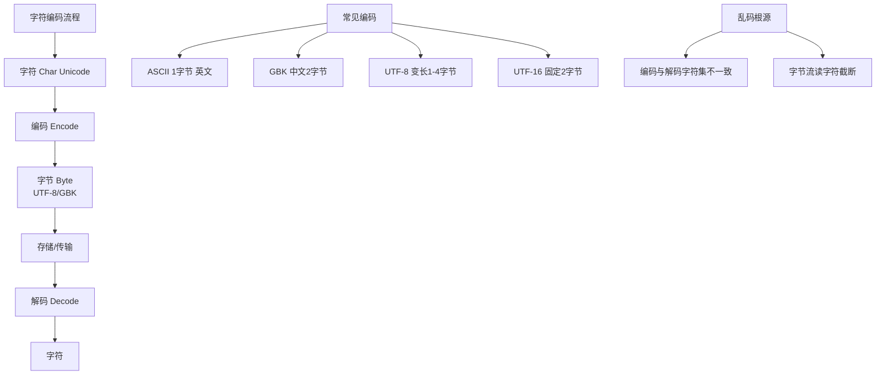
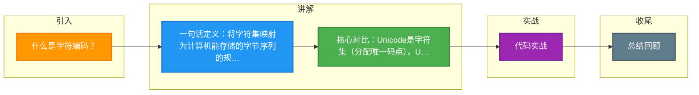

# 什么是字符编码？

字符编码是将字符集中的字符映射为特定的字节序列或二进制数据的规则集。

**核心概念**：
1. **字符集**：字符的集合（如 Unicode 包含全球所有字符）。
2. **编码**：字符如何在计算机中存储（如 UTF-8, UTF-16, GBK）。

**原理细节**：
- **Unicode vs UTF-8**：Unicode 是字符集（给每个字符分配唯一编号，如 '中' 的码点是 U+4E2D），而 UTF-8 是编码规则（如何将码点存入字节）。
- **BOM (Byte Order Mark)**：UTF-16/UTF-32 存在大小端问题，BOM (U+FEFF) 用来标识字节序。UTF-8 通常不需要 BOM，但部分 Windows 软件会添加，可能导致处理文本时出现隐藏字符。

**常见编码**：
- **ASCII**：1字节表示英文字符。
- **ISO-8859-1**：单字节编码，兼容 ASCII 但不支持中文。
- **GBK/GB2312**：中国国家标准，支持中文，双字节表示一个汉字。
- **Unicode**：统一种字符集，解决乱码问题。
- **UTF-8**：Unicode 的一种**变长**实现，互联网标准，英文占1字节，中文占3字节。变长特性使其空间利用率高，但随机访问效率低（无法直接通过下标计算字节偏移）。

```text
字符: 'A'   '中'
Unicode码点: U+0041 U+4E2D
---------------------------------
UTF-8 编码:  41     E4 B8 AD
 (十六进制)
---------------------------------
GBK 编码:   41     D6 D0
```

**实战案例**：
在做 Java 文件下载功能时，经常遇到文件名乱码。这通常是因为浏览器默认解码不同（如 IE 用 GBK，Chrome 用 UTF-8）。实战中通常使用 `URLEncoder.encode(filename, "UTF-8")` 进行统一编码，或者在 `Content-Disposition` 头中明确指定 `filename*=UTF-8''...` 来解决兼容性问题。

**## 常见考点**
1. 为什么会产生乱码？
   - 编码与解码方式不一致。例如：发送方用 UTF-8 编码，接收方用 ISO-8859-1 解码，会导致字节映射错误。
2. UTF-8 占用几个字节？
   - 变长：1字节（英文）、2字节（部分欧洲语言）、3字节（常用中文）、4字节（emoji 等）。
3. MySQL 中 utf8 和 utf8mb4 的区别？
   - MySQL 旧版 `utf8` 只支持最多 3 字节，无法存储 emoji；`utf8mb4` 是完整的 UTF-8，支持 4 字节。

**代码示例**：
```java
// Java 中读取文件时指定编码，防止乱码
try (BufferedReader reader = new BufferedReader(
        new InputStreamReader(new FileInputStream("test.txt"), StandardCharsets.UTF_8))) {
    String line;
    while ((line = reader.readLine()) != null) {
        System.out.println(line);
    }
}
```


## 核心架构图



## 记忆要点

- 一句话定义：将字符集映射为计算机能存储的字节序列的规则
- 核心对比：Unicode是字符集(分配唯一码点)，UTF-8是编码规则
- UTF-8特性：变长存储，英文1字节，中文常用3字节，Emoji占4字节
- 乱码根源：编码与解码使用的字符集规则不一致导致映射错误
- 实战避坑：MySQL旧版utf8仅支持3字节，存Emoji必须用utf8mb4

## 结构化回答

**30 秒电梯演讲：** 字符与二进制数据的映射规则，解决乱码问题。打个比方，像摩尔斯密码表，规定了每个字母（字符）对应的长短信号（二进制）。

**展开框架：**
1. **一句话定义** — 将字符集映射为计算机能存储的字节序列的规则
2. **核心对比** — Unicode是字符集(分配唯一码点)，UTF-8是编码规则
3. **UTF-8特性** — 变长存储，英文1字节，中文常用3字节，Emoji占4字节

**收尾：** 我在项目里踩过坑——在做 Java 文件下载功能时，经常遇到文件名乱码。您想深入聊哪一段：原理、避坑还是对比选型？

## 视频脚本

> 预计时长：3 分钟 | 由浅入深

| 时间 | 画面/字幕 | 口播台词 | 讲解要点 |
|------|----------|----------|----------|
| 0:00 | 标题卡：什么是字符编码 | "什么是字符编码？一句话——像摩尔斯密码表，规定了每个字母（字符）对应的长短信号（二进制）。" | 开场钩子 |
| 0:45 | 概念动画/示意图 | "字符与二进制数据的映射规则，解决乱码问题——像摩尔斯密码表，规定了每个字母（字符）对应的长短信号（二进制）" | 核心定义 |
| 1:30 | 一句话定义示意 | "将字符集映射为计算机能存储的字节序列的规则" | 要点1 |
| 2:15 | 核心对比示意 | "Unicode是字符集(分配唯一码点)，UTF-8是编码规则" | 要点2 |
| 3:00 | 总结卡 | "记住这几条，面试不慌。下期讲进阶追问。" | 收尾 |

### 视频流程图



