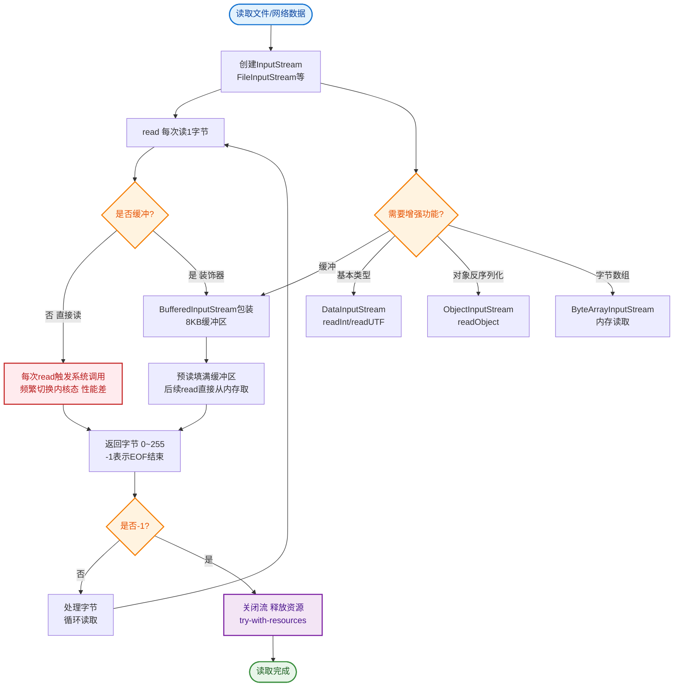

# 什么是字节输入流？

字节输入流

java.io 包下所有的字节输⼊流都继承自 InputStream，并且实现了其中的方法。InputStream 中提供的主要数据操作方法如下:
int read():从输⼊流中读取一个字节的⼆进制数据。
int read(byte[] b):将多个字节读到数组中，填满 整个数组
int read(byte[] b, int off, int len):从输⼊流中读取长度为 len 的数据，从数组 b 中下标为 off 的位置开始放置读读⼊的数据，读完返回读取的字节数。
void close():关闭数据流，释放系统资源。
int available(): 返回目前可以从数据流中读取的字节数(注意：对于网络流，该值可能不准确，通常返回 0)。
long skip(long l):跳过数据流中指定数量的字节不读取，返回值表示实际跳过的字节数。

对数据流中字节的 读取通常是按从头到尾顺序进行的，如果需要以反方向读取，则需要使用回推操作。在 支持回推操作的 数据流中经常用到如下几个方法:
boolean markSupported():用于测试数据流是否支持回推操作。
void mark(int readlimit):用于标记数据流的当前位置。
void reset():将输⼊流重新定位到对此流最后调用 mark() 方法时的位置。

**核心架构细节**：
Java IO 流使用了**装饰器模式**。`InputStream` 是抽象组件，`FileInputStream` 等是具体组件，`FilterInputStream` 是抽象装饰类，`BufferedInputStream`、`DataInputStream` 是具体装饰类。这使得我们可以动态组合功能（如：缓冲 + 数据类型读取）。

**关键类补充**：
- **BufferedInputStream**：内部维护一个 `byte[] buf` 缓冲区（默认 8192 字节）。读取时先从缓冲区读，缓冲区空了再从底层流填充。减少底层 I/O 调用次数，显著提升性能。
- **DataInputStream**：允许以机器无关的方式读取 Java 基本数据类型（如 `readLong`, `readDouble`），使用 Big-Endian（大端序）。

```text
┌─────────────────────┐
│   Application       │
└──────────┬──────────┘
           │ read()
┌──────────▼──────────┐
│ BufferedInputStream │ ◄─── 装饰者：增加缓冲功能
│  (Internal Buffer)  │
└──────────┬──────────┘
           │ read(byte[])
┌──────────▼──────────┐
│  FileInputStream    │ ◄─── 具体组件：底层 OS 交互
└──────────┬──────────┘
           │
     Physical File
```

**实战案例**：
在进行大文件 HTTP 上传接收时，如果直接使用 `ServletInputStream` 的 `read()` 方法逐字节读取，CPU 利用率会飙升且速度极慢。实战中务必包装一层 `BufferedInputStream` 或直接使用 `byte[] buffer` 进行批量读取（如每次 8KB），能将上传性能提升 10 倍以上。

**## 常见考点**
1. read() 方法返回值为什么是 int 而不是 byte？
   - 因为 byte 范围是 -128~127，无法有效表示“流结束”状态。int 返回 0~255 对应字节值，返回 -1 表示读取结束。
2. 既然有 BufferedInputStream，为什么还需要 Micro-batching（微批处理）？
   - 虽然 BufferedInputStream 缓冲了单次读取，但如果我们自己定义一个大数组（如 8KB）去 read，也能达到类似效果。但在频繁小量读取时，BufferedInputStream 性能更好。
3. 如何实现对象读取？
   - 使用 `ObjectInputStream`，对象必须实现 `Serializable` 接口，且 serialVersionUID 最好显式定义。

**代码示例**：
```java
// 推荐的文件读取方式：手动缓冲区 + BufferedInputStream 双重保障
try (InputStream is = new BufferedInputStream(new FileInputStream("large.dat"))) {
    byte[] buffer = new byte[8192]; // 8KB buffer
    int bytesRead;
    while ((bytesRead = is.read(buffer)) != -1) {
        // 处理 buffer 数据，注意不要越界，只处理 0 到 bytesRead
        process(buffer, bytesRead);
    }
}
```


## 核心流程图


## 记忆要点

- 核心架构：InputStream是顶层抽象基类，字节输入流采用装饰器模式
- 高频考点：read()返回int，用0-255表示字节数据，-1代表读取结束
- 性能优化：BufferedInputStream内置8KB缓冲区，大幅减少系统IO调用
- 实用API：mark/reset支持流回推，available返回预估可读字节数

## 结构化回答

**30 秒电梯演讲：** 以字节为单位读取数据的输入流，适合处理二进制文件。打个比方，像用吸管喝水，每次吸一小口（字节），不管水的味道。

**展开框架：**
1. **核心架构** — InputStream是顶层抽象基类，字节输入流采用装饰器模式
2. **高频考点** — read()返回int，用0-255表示字节数据，-1代表读取结束
3. **性能优化** — BufferedInputStream内置8KB缓冲区，大幅减少系统IO调用

**收尾：** 我在项目里踩过坑——在进行大文件 HTTP 上传接收时，如果直接使用 `ServletInputStream` 的 `read()` 方法逐字节读取，CPU 利用率会飙升且速度极慢。您想深入聊哪一段：原理、避坑还是对比选型？

## 视频脚本

> 预计时长：3 分钟 | 由浅入深

| 时间 | 画面/字幕 | 口播台词 | 讲解要点 |
|------|----------|----------|----------|
| 0:00 | 标题卡：什么是字节输入流 | "什么是字节输入流？一句话——像用吸管喝水，每次吸一小口（字节），不管水的味道。" | 开场钩子 |
| 0:45 | 概念动画/示意图 | "以字节为单位读取数据的输入流，适合处理二进制文件——像用吸管喝水，每次吸一小口（字节），不管水的味道" | 核心定义 |
| 1:30 | 核心架构示意 | "InputStream是顶层抽象基类，字节输入流采用装饰器模式" | 要点1 |
| 2:15 | 高频考点示意 | "read()返回int，用0-255表示字节数据，-1代表读取结束" | 要点2 |
| 3:00 | 总结卡 | "记住这几条，面试不慌。下期讲进阶追问。" | 收尾 |
