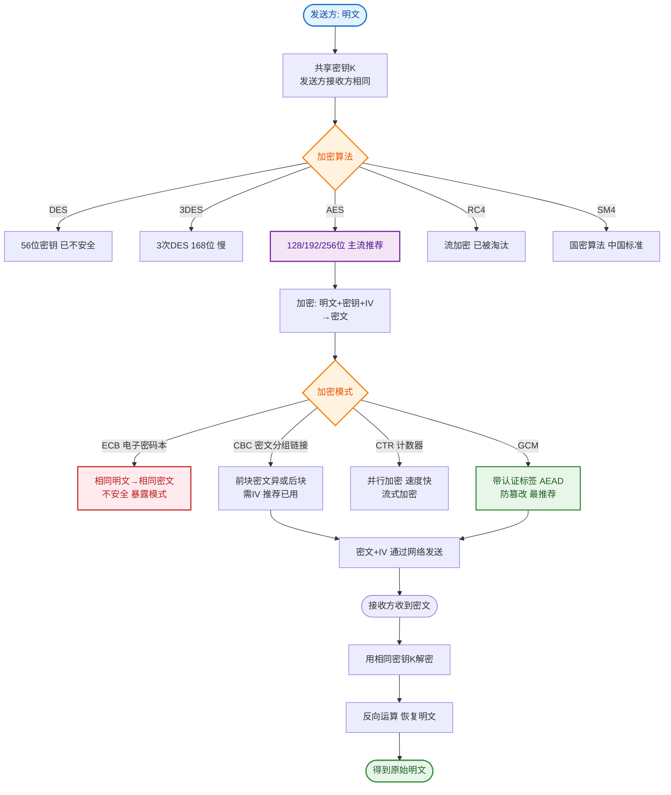

# 什么是对称加密？

HTTPS的特点

1. 特点
信息加密：采用对称加密+非对称加密的混合加密的方式，对传输的数据加密，实现信息的机密性，解决了窃听的风险。
校验机制：用摘要算法为数据生成独一无⼆的「指纹」校验码，指纹用来校验数据的完整性，解决了被篡改的风险。
身份证书：将服务端的公钥放⼊到CA数字证书中，解决了服务端被冒充的风险。

2. 优点
在数据传输过程中，使用秘钥加密，安全性更高
可认证用户和服务器，确保数据发送到正确的用户和服务器

3. 缺点
握手阶段延时较高：在会话前还需进行SSL握手
部署成本高：需要购买CA证书；需要加解密计算，占用CPU资源，需要服务器配置或数目高

HTTPS和HTTP的区别

HTTP： 以明文的方式在网络中传输数据，HTTPS 解决了HTTP 不安全的缺陷，在 TCP 和 HTTP 网络层之间加⼊了 SSL/TLS 安全协议，使得报文能够加密传输。
HTTPS 在 TCP 三次握手之后，还需进行 SSL/TLS 的握手过程，才可进⼊加密报文传输。
HTTP 的端口号是 80，HTTPS 的端口号是 443。
HTTPS 协议需要向CA（证书权威机构）申请数字证书，来保证服务器的身份是可信的。

**对称加密**

对称加密也称为私钥加密，使用相同的密钥来进行加密和解密。
在加密过程中，明文数据通过应用特定的算法和密钥进行加密，生成密文数据。解密过程则是将密文数据应用同样的算法和密钥进行解密，恢复为明文数据。
由于加密和解密都使用相同的密钥，因此对称加密算法的速度通常较快，但密钥的安全性很重要。如果密钥泄漏，攻击者可以轻易地解密数据。

**原理细节**：
- **常见算法**：AES (Advanced Encryption Standard，目前最常用)、DES (Data Encryption Standard，已被破解，不安全)、RC4 (流密码，存在漏洞，TLS 中已禁用)。
- **工作模式**：以 AES 为例，常用 ECB（不安全，相同明文生成相同密文）、CBC（需要初始化向量 IV，安全性较高）、GCM（带认证的加密，不仅保密还能校验完整性，现代 HTTPS 倾向于使用 AES-GCM）。
- **密钥长度**：AES 支持 128、192、256 位。密钥越长越安全，但计算开销越大。

```text
    Sender                                  Receiver
      │                                       │
      │  (Data + Secret Key)                 │
      │ ───────────────────────────────────►  │
      │     Encrypted Data                   │
      │                                       │ (Data + Secret Key)
      │                                       │ Decrypted = Plain Data
      ▼                                       ▼
```

**实战案例**：
在敏感数据存储（如身份证号、银行卡）到数据库时，通常使用 AES-256-GCM 进行加密。切忌使用 ECB 模式，因为攻击者可以通过分析密文块的模式推断出部分明文信息（如加密的图片依然可见轮廓）。一定要每次生成随机 IV（初始化向量）并随密文一起存储。

**## 常见考点**
1. 为什么 HTTPS 要使用混合加密（对称+非对称），而不仅仅使用对称加密？
   - **性能**：对称加密速度快 100-1000 倍，适合大数据传输；非对称加密计算复杂，仅用于握手阶段协商对称密钥。
   - **密钥分发**：非对称加密解决了“如何在不安全的信道上安全传输对称密钥”的问题。
2. AES 和 RSA 的区别？
   - AES 是对称加密算法，RSA 是非对称加密算法。HTTPS 中用 RSA 传输 AES 的密钥，之后用 AES 传输数据。
3. 什么是对称加密的“雪崩效应”？
   - 优秀的加密算法（如 AES）应具有雪崩效应：明文或密钥的微小改变（1 bit）会导致密文发生巨大变化（约 50% 的 bit 翻转）。

**代码示例**：
```java
import javax.crypto.Cipher;
import javax.crypto.spec.SecretKeySpec;

public class AESUtil {
    public static byte[] encrypt(byte[] data, String key) throws Exception {
        SecretKeySpec secretKey = new SecretKeySpec(key.getBytes(), "AES");
        Cipher cipher = Cipher.getInstance("AES/ECB/PKCS5Padding"); // 生产环境慎用ECB
        cipher.init(Cipher.ENCRYPT_MODE, secretKey);
        return cipher.doFinal(data);
    }
}
```


## 核心流程图


## 记忆要点

- 核心：加密和解密使用同一个密钥，速度快，适合大数据量加解密
- 典型算法：AES最常用，DES已淘汰，严禁使用不安全的ECB模式
- HTTPS混合加密：非对称加密传密钥，对称加密传数据解决性能与分发
- 安全特性：优秀的算法具有雪崩效应，明文或密钥微变导致密文剧变

## 结构化回答

**30 秒电梯演讲：** 加密和解密使用同一个密钥，速度快但密钥分发难。打个比方，像家用门锁，锁门和开门用同一把钥匙，钥匙丢了就不安全了。

**展开框架：**
1. **核心** — 加密和解密使用同一个密钥，速度快，适合大数据量加解密
2. **典型算法** — AES最常用，DES已淘汰，严禁使用不安全的ECB模式
3. **HTTPS混合加密** — 非对称加密传密钥，对称加密传数据解决性能与分发

**收尾：** 我在项目里踩过坑——在敏感数据存储（如身份证号、银行卡）到数据库时，通常使用 AES-256-GCM 进行加密。您想深入聊哪一段：原理、避坑还是对比选型？

## 视频脚本

> 预计时长：3 分钟 | 由浅入深

| 时间 | 画面/字幕 | 口播台词 | 讲解要点 |
|------|----------|----------|----------|
| 0:00 | 标题卡：什么是对称加密 | "什么是对称加密？一句话——像家用门锁，锁门和开门用同一把钥匙，钥匙丢了就不安全了。" | 开场钩子 |
| 0:45 | 概念动画/示意图 | "加密和解密使用同一个密钥，速度快但密钥分发难——像家用门锁，锁门和开门用同一把钥匙，钥匙丢了就不安全了" | 核心定义 |
| 1:30 | 核心示意 | "加密和解密使用同一个密钥，速度快，适合大数据量加解密" | 要点1 |
| 2:15 | 典型算法示意 | "AES最常用，DES已淘汰，严禁使用不安全的ECB模式" | 要点2 |
| 3:00 | 总结卡 | "记住这几条，面试不慌。下期讲进阶追问。" | 收尾 |
