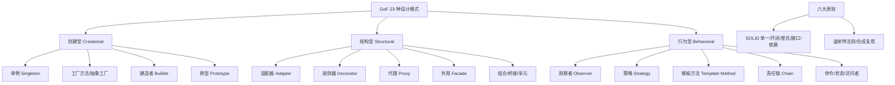

# 什么是手写单例设计模式？

### 手写单例设计模式

单例模式确保一个类只有一个实例，并提供一个全局访问点。

#### 1. 饿汉式

在类加载时就创建唯一实例。利用 JVM 的类加载机制保证了线程安全，但无法实现懒加载（可能造成资源浪费）。

```java
public class EagerSingleton {
    private static final EagerSingleton instance = new EagerSingleton();
    private EagerSingleton() {}
    public static EagerSingleton getInstance() {
        return instance;
    }
}
```

#### 2. 懒汉式 (双重检查锁定)

在第一次调用时才创建实例，使用双重检查锁定确保线程安全且性能较高。

```java
public class Singleton {
    // volatile 禁止指令重排序，防止其他线程获取到未初始化完全的实例
    private static volatile Singleton instance; 
    private Singleton() {}
    public static Singleton getInstance() {
        if (instance == null) { // 第一次检查（无需锁）
            synchronized (Singleton.class) {
                if (instance == null) { // 第二次检查（持有锁）
                    instance = new Singleton();
                }
            }
        }
        return instance;
    }
}
```

#### 3. 静态内部类

利用类加载机制保证线程安全，实现懒加载。外部类加载时不会加载内部类，只有在调用 `getInstance` 时才会加载 `SingletonHolder`，从而完成实例初始化。这是推荐的最佳实践之一。

```java
public class InnerStaticSingleton {
    private static class SingletonHolder {
        private static final InnerStaticSingleton instance = new InnerStaticSingleton();
    }
    private InnerStaticSingleton() {}
    public static InnerStaticSingleton getInstance() {
        return SingletonHolder.instance;
    }
}
```

#### 4. 枚举单例

不仅能避免多线程同步问题，还能防止反序列化重新创建新的对象，并且天然防止反射攻击。这是《Effective Java》作者推荐的方式。

```java
public enum EnumSingleton {
    INSTANCE;
    public void doSomething() {
        // 业务方法
    }
}
```

### 对比选型

| 特性 | 饿汉式 | 懒汉式(DCL) | 静态内部类 | 枚举单例 |
| :--- | :--- | :--- | :--- | :--- |
| **线程安全** | 是 | 是 | 是 | 是 |
| **懒加载** | 否 | 是 | 是 | 否 (但通常可接受) |
| **实现难度** | 简单 | 复杂 (易错) | 简单 | 极简 |
| **防反射攻击** | 否 | 需额外代码 | 需额外代码 | **是 (天然)** |
| **防序列化破坏** | 需readResolve | 需readResolve | 需readResolve | **是 (天然)** |
| **推荐场景** | 肯定会使用 | 需延迟加载且传参 | 一般场景 | **最佳实践** |

## 常见考点
1. **双重检查锁定中 `volatile` 的作用是什么？**
   - 防止指令重排序。`new Singleton()` 不是原子操作，可能分为 1.分配内存 2.初始化对象 3.引用指向内存。重排序后可能是 1->3->2，导致线程拿到未初始化的引用。volatile 保证有序性。
2. **为什么推荐静态内部类而不是懒汉式？**
   - 静态内部类代码更简洁，利用 JVM 保证了线程安全，且没有 synchronized 带来的性能开销，同时支持懒加载。
3. **如何破坏单例模式？**
   - **序列化/反序列化**：可以通过在单例类中定义 `readResolve()` 方法并在其中返回实例来解决。
   - **反射攻击**：通过反射调用私有构造函数。枚举单例天然无法被反射破坏，普通单例可以在构造函数中添加判断防止二次创建。

### 实战补充

**实战案例**：在一个高并发的 Spring 应用中，使用双重检查锁（DCL）管理数据库连接池。开发初期忘记加 `volatile`，在压测时偶发 `NullPointerException`，因为线程获取到了未初始化完的连接池对象，导致服务启动失败。最终改用静态内部类方式解决。

**代码示例（DCL 潜在问题修复）**：
```java
public class DataSourceSingleton {
    private static volatile DataSource instance;
    private DataSourceSingleton(){}
    public static DataSource getInstance() {
        if (instance == null) {
            synchronized (DataSourceSingleton.class) {
                if (instance == null) {
                    // 模拟耗时的初始化，暴露重排序风险
                    instance = new DataSource(); 
                }
            }
        }
        return instance;
    }
}
```


## 核心架构图


## 核心知识点图


## 记忆要点

- 核心：类仅有一个实例，并提供全局唯一访问点
- 饿汉与懒汉：饿汉类加载即创建，懒汉延迟加载需处理并发安全
- 双重检查(DCL)：必须加volatile修饰实例，禁止指令重排防拿半初始化对象
- 最佳实践：静态内部类利用类加载保安全且懒加载；枚举天然防反射反序列化

## 结构化回答

**30 秒电梯演讲：** 保证类仅有一个实例，并提供全局访问点。打个比方，就像公司的 CEO，同一时间只能有一个，大家找他办事都找同一个人。

**展开框架：**
1. **核心** — 类仅有一个实例，并提供全局唯一访问点
2. **饿汉与懒汉** — 饿汉类加载即创建，懒汉延迟加载需处理并发安全
3. **双重检查(DCL)** — 必须加volatile修饰实例，禁止指令重排防拿半初始化对象

**收尾：** 我在项目里踩过坑——在一个高并发的 Spring 应用中，使用双重检查锁（DCL）管理数据库连接池。您想深入聊哪一段：原理、避坑还是对比选型？

## 视频脚本

> 预计时长：3 分钟 | 由浅入深

| 时间 | 画面/字幕 | 口播台词 | 讲解要点 |
|------|----------|----------|----------|
| 0:00 | 标题卡：什么是手写单例设计模式 | "什么是手写单例设计模式？一句话——就像公司的 CEO，同一时间只能有一个，大家找他办事都找同一个人。" | 开场钩子 |
| 0:45 | 概念动画/示意图 | "保证类仅有一个实例，并提供全局访问点——就像公司的 CEO，同一时间只能有一个，大家找他办事都找同一个人" | 核心定义 |
| 1:30 | 核心示意 | "类仅有一个实例，并提供全局唯一访问点" | 要点1 |
| 2:15 | 饿汉与懒汉示意 | "饿汉类加载即创建，懒汉延迟加载需处理并发安全" | 要点2 |
| 3:00 | 总结卡 | "记住这几条，面试不慌。下期讲进阶追问。" | 收尾 |
