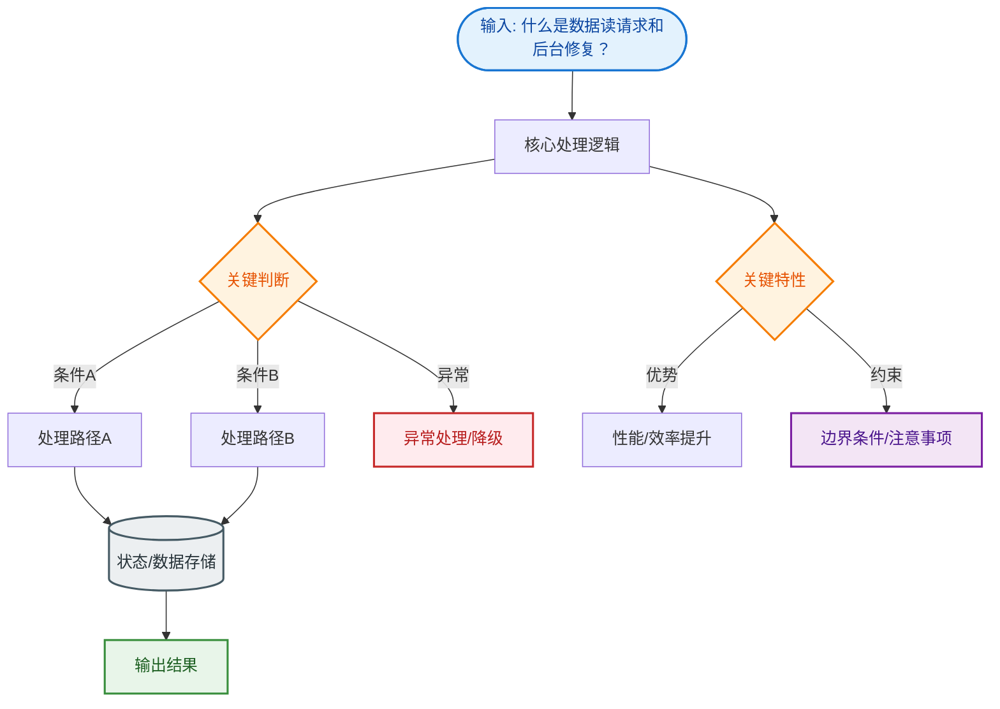

# 什么是数据读请求和后台修复？

### 数据读请求和后台修复

在分布式数据库（如 Cassandra, HBase, Dynamo）中，数据通常会有多个副本以实现高可用和容错。由于网络分区、写入失败等原因，不同副本上的数据可能出现不一致。

#### 数据读请求流程

1.  **协调者**：接收客户端的读请求。
2.  **分发请求**：协调者根据配置的一致性级别（Consistency Level, CL），向副本节点发送读请求。例如 CL=QUORUM，则联系超过半数的节点。
3.  **数据收集与比对**：协调者收集各节点返回的数据（通常包含数据本身和 Timestamp 时间戳）。如果联系了多个节点，协调者会在内存中比较这些数据。
4.  **返回最新数据**：协调者根据时间戳或 Vector Clock 判定哪个副本的数据最新，将该数据返回给客户端。

#### 后台修复

-   **触发时机**：协调者在返回给客户端数据后，如果发现不同副本间的数据存在不一致（有的返回旧数据，有的返回新数据），会启动后台修复机制。
-   **修复机制**：协调者会在后台向那些持有旧数据的副本发送写请求（Mutation），将最新的数据强制更新到过时的副本上。
-   **结果**：通过这种方式，在不阻塞读请求响应时间的前提下，保证了副本间的最终一致性。

#### 流程示意图

```text
  Client                     Coordinator                   Replica Nodes
    │                               │                              │
    │ ──── Read(key) ──────────────>│                              │
    │                               │                              │
    │         (CL=2, Request N1, N2)│                              │
    │                               │─── Read(key) ──────────────>│ (N1: Latest v2)
    │                               │                              │
    │                               │─── Read(key) ──────────────>│ (N2: Old   v1)
    │                               │                              │
    │                               │<─── v2 (Timestamp 100) ──────│
    │                               │<─── v1 (Timestamp 90) ───────│
    │                               │                              │
    │      Compare: v2 > v1         │                              │
    │                               │                              │
    │ <───── Result(v2) ────────────│                              │
    │                               │                              │
    │     (Background Repair)       │                              │
    │                               │                               │
    │                               │─── Write(v2) Repair ────────>│ (Update N2 to v2)
    │                               │
```

### 实战补充

**实战案例**：在使用 DynamoDB 或 Cassandra 存储用户配置信息时，由于跨区域网络抖动导致写请求在 A 区域成功但 B 区域失败。虽然用户读到了最新数据，但随后的请求路由到 B 区域时却读到了旧配置，导致用户体验不一致。开启 Read Repair 后，协调节点自动修正了 B 区域的数据，解决了“幽灵读取”问题。

**代码示例（协调者伪代码）**：
```java
// 模拟协调者读修复逻辑 (Java-like pseudo code)
public Data readWithRepair(String key) {
    List<Data> replicas = contactReplicas(key, ConsistencyLevel.QUORUM);
    Data latest = Collections.max(replicas, Comparator.comparing(Data::getTimestamp));
    
    // 后台异步修复不一致的副本
    for (Data data : replicas) {
        if (data.getTimestamp() < latest.getTimestamp()) {
            executor.submit(() -> {
                sendMutation(data.getNodeId(), key, latest); // 异步发送最新数据
            });
        }
    }
    return latest;
}
```


## 核心流程图


## 记忆要点

- 核心场景：多副本分布式数据库中，解决网络分区导致的数据不一致。
- 读请求：协调者向多节点发请求，比对时间戳返回最新数据给客户端。
- 后台修复：发现新旧数据不一致时，后台异步把最新值写回旧副本节点。
- 关键优势：不阻塞当前读请求的响应时间，顺便实现数据的最终一致性。

## 结构化回答

**30 秒电梯演讲：** 读取时比对多个副本数据，并在后台异步更新旧副本。打个比方，开会时大家核对笔记，发现谁记错了，会后悄悄让他改过来。

**展开框架：**
1. **核心场景** — 多副本分布式数据库中，解决网络分区导致的数据不一致。
2. **读请求** — 协调者向多节点发请求，比对时间戳返回最新数据给客户端。
3. **后台修复** — 发现新旧数据不一致时，后台异步把最新值写回旧副本节点。

**收尾：** 我在项目里踩过坑——在使用 DynamoDB 或 Cassandra 存储用户配置信息时，由于跨区域网络抖动导致写请求在 A 区域成功但 B 区域失败。您想深入聊哪一段：原理、避坑还是对比选型？

## 视频脚本

> 预计时长：3 分钟 | 由浅入深

| 时间 | 画面/字幕 | 口播台词 | 讲解要点 |
|------|----------|----------|----------|
| 0:00 | 标题卡：什么是数据读请求和后台修复 | "什么是数据读请求和后台修复？一句话——开会时大家核对笔记，发现谁记错了，会后悄悄让他改过来。" | 开场钩子 |
| 0:45 | 概念动画/示意图 | "读取时比对多个副本数据，并在后台异步更新旧副本——开会时大家核对笔记，发现谁记错了，会后悄悄让他改过来" | 核心定义 |
| 1:30 | 核心场景示意 | "多副本分布式数据库中，解决网络分区导致的数据不一致。" | 要点1 |
| 2:15 | 读请求示意 | "协调者向多节点发请求，比对时间戳返回最新数据给客户端。" | 要点2 |
| 3:00 | 总结卡 | "记住这几条，面试不慌。下期讲进阶追问。" | 收尾 |
