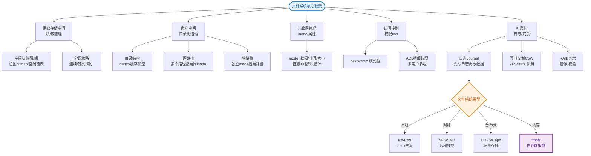

# 什么是文件系统的实现？

### 文件系统的实现

文件存储实现的关键问题是记录各个文件分别用到哪些磁盘块。不同的操作系统用到不同的方法。

#### 1. 文件系统布局

文件系统存放在磁盘上。多数磁盘划分为一个或多个分区，每个分区中有一个独立的文件系统。
- **主引导记录 (MBR)**：位于磁盘 0 号扇区，用来引导计算机。结尾包含分区表。
- **引导块**：每个分区的第一个块，用于装载该分区的操作系统。
- **超级块**：包含文件系统的所有关键信息（如块大小、空闲块数量、inode 数量等）。

#### 2. 文件的实现 (分配方式)

**1. 连续分配**
- 每个文件作为一连串连续数据块存储。
- **优点**：实现简单，读写性能好（顺序读写，寻道时间少）。
- **缺点**：会产生磁盘碎片，文件扩展困难（需要寻找足够大的连续空间）。

**2. 链表分配**
- 每个磁盘块有一个指针指向下一块。
- **优点**：充分利用磁盘，无外部碎片。
- **缺点**：随机访问慢（必须从头开始遍历），指针占用空间（通常放在块末尾）。

**3. FAT (文件分配表)**
- 在内存中维护一张表，记录磁盘块的链接关系（数组的下标对应块号，值指向下一块）。
- **优点**：解决了链表分配随机访问慢的问题（只需查表），整个文件系统的分配情况一目了然。
- **缺点**：整个表必须驻留在内存，限制了磁盘大小（随着磁盘变大，FAT 表占据大量内存）。

**4. i 节点**
- 每个文件赋予一个 i 节点数据结构，包含文件属性和所有磁盘块的地址列表。
- **多级索引结构**：为了支持大文件，inode 中包含直接块指针、一次间接块指针、二次间接块指针、三次间接块指针。
- **优点**：支持随机访问，只需 i 节点在内存即可，不依赖连续的内存空间。

#### 3. 目录的实现

- 目录项包含文件名和指向文件控制块（如 i 节点）的指针。
- 打开文件时，系统通过路径名找到目录项，进而获取文件属性和磁盘地址。

#### 4. 日志文件系统

- 保存一个用于记录系统下一步将要做什么的日志（元数据变更日志）。
- **作用**：当系统崩溃时，重启后可以通过查看日志，只重做已完成的事务或回滚未完成的事务，保证文件系统一致性（如 NTFS, ext4）。极大地减少了系统启动时的 fsck 时间。

#### 文件分配方式对比

| 方式 | 随机访问性能 | 外部碎片 | 实现复杂度 | 典型应用 |
| :--- | :--- | :--- | :--- | :--- |
| **连续分配** | 高 (Excellent) | 严重 (Severe) | 简单 | 早期 CD-ROM, 特殊实时系统 |
| **链表分配** | 低 (Poor) | 无 | 简单 | 旧版 MS-DOS (FAT前身) |
| **FAT** | 中等 | 无 | 中等 | Windows (FAT32) |
| **i-node** | 高 | 无 | 复杂 | Linux (ext4), Unix |

#### i-node 结构示意图

```text
  i-node 结构
  ┌──────────────┐
  │  文件属性    │ (大小、权限、时间戳)
  ├──────────────┤
  │  直接块指针  │ ───> [数据块0][数据块1]...[数据块11]
  ├──────────────┤
  │  1级间接指针 │ ───> [指针表] ──> [数据块12] ... [数据块N]
  ├──────────────┤
  │  2级间接指针 │ ───> [1级表] ──> [2级表] ──> [数据块...]
  ├──────────────┤
  │  3级间接指针 │ ───> ... (用于超大文件)
  └──────────────┘
```

## 常见考点
1. **UNIX/Linux 系统中删除大文件很慢还是很快？为什么？**
   - 通常很快。删除操作只需断开文件名与 inode 的链接（删除目录项），并将 inode 标记为空闲。数据块通常不会立即物理擦除，只有当该块被重新分配时才会被覆盖。
2. **软链接和硬链接的区别？**
   - 硬链接：指向同一个 inode，删除原文件不影响硬链接访问，目录不能创建硬链接。
   - 软链接：是一个独立的文件，内容是目标文件的路径，指向目标文件的 inode。删除原文件会导致软链接失效（红字闪烁）。

### 实战补充

**实战案例**：服务器日志文件 `/var/log/nginx/access.log` 被进程占用，直接使用 `rm` 删除后磁盘空间并未释放，因为 inode 引用计数未归零。正确做法是 `echo > access.log` 截断文件，或者重启进程释放句柄。这也解释了为什么 `rm` 只删除目录项，数据块在文件句柄关闭前依然占用空间。

**代码示例（模拟 Inode 结构）**：
```java
// 模拟 Linux Inode 中的多级索引结构
class Inode {
    int[] directBlocks = new int[12]; // 直接指向数据块
    int singleIndirect;               // 指向一级索引表
    int doubleIndirect;               // 指向二级索引表
    
    // 获取大文件的逻辑块号对应的物理块号（简化逻辑）
    public int getBlockNumber(long logicalBlockIndex) {
        if (logicalBlockIndex < 12) {
            return directBlocks[(int)logicalBlockIndex];
        } else if (logicalBlockIndex < 12 + 256) { // 假设每块存256个指针
            // 读取 singleIndirect 指向的块并查找
            return readIndexTable(singleIndirect, (int)(logicalBlockIndex - 12));
        }
        // ... 处理 doubleIndirect
        return -1; 
    }
}
```


## 核心流程图


## 记忆要点

- 连续分配：顺序快但碎片多，链表分配：零碎无外片但随机访问慢。
- FAT表：内存中存链表关系，查表快但表大会吃内存（如Windows）。
- i节点：多级索引(直接+间接指针)，支持高效随机访问（如Linux）。
- 日志结构：记录元数据变更日志，崩溃后快速恢复一致性（如ext4）。

## 结构化回答

**30 秒电梯演讲：** 通过特定数据结构（如i节点、FAT）管理文件在磁盘块上的存储位置。打个比方，像图书管理，目录是索引，书架是磁盘，系统负责记录书放在哪一层。

**展开框架：**
1. **连续分配** — 顺序快但碎片多，链表分配：零碎无外片但随机访问慢。
2. **FAT表** — 内存中存链表关系，查表快但表大会吃内存（如Windows）。
3. **i节点** — 多级索引(直接+间接指针)，支持高效随机访问（如Linux）。

**收尾：** 我在项目里踩过坑——服务器日志文件 `/var/log/nginx/access.log` 被进程占用，直接使用 `rm` 删除后磁盘空间并未释放，因为 inode 引用计数未归零。您想深入聊哪一段：原理、避坑还是对比选型？

## 视频脚本

> 预计时长：3 分钟 | 由浅入深

| 时间 | 画面/字幕 | 口播台词 | 讲解要点 |
|------|----------|----------|----------|
| 0:00 | 标题卡：什么是文件系统的实现 | "什么是文件系统的实现？一句话——像图书管理，目录是索引，书架是磁盘，系统负责记录书放在哪一层。" | 开场钩子 |
| 0:45 | 概念动画/示意图 | "通过特定数据结构（如i节点、FAT）管理文件在磁盘块上的存储位置——像图书管理，目录是索引，书架是磁盘，系统负责记录书放在哪一层" | 核心定义 |
| 1:30 | 连续分配示意 | "顺序快但碎片多，链表分配：零碎无外片但随机访问慢。" | 要点1 |
| 2:15 | FAT表示意 | "内存中存链表关系，查表快但表大会吃内存（如Windows）。" | 要点2 |
| 3:00 | 总结卡 | "记住这几条，面试不慌。下期讲进阶追问。" | 收尾 |
