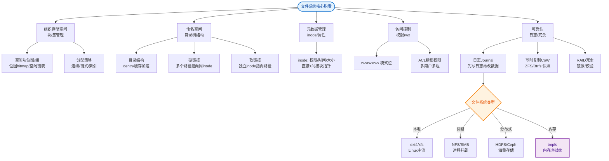

# 什么是文件系统？

### 什么是文件系统

文件系统是操作系统用于明确存储设备（如磁盘）或分区上的文件的方法和数据结构；即在存储设备上组织文件的方法。

**核心功能**
1.  **抽象机制**：提供一种在磁盘上保存信息并方便以后读取的方法，屏蔽底层存储细节（如扇区、磁道）。
2.  **文件管理**：负责文件的创建、删除、读写、命名、属性设置等。
3.  **目录管理**：提供层次结构（目录树）组织文件，记录文件位置。
4.  **存储空间管理**：管理空闲空间（如位图、空闲表），处理磁盘块的分配与回收。

**文件属性**
除了文件名和数据，操作系统还会保存创建日期、时间、大小、所有者、保护位等附加信息。这些元数据通常存储在特定的控制结构中（如 inode 或 FAT 表项）。

**文件访问**
- **顺序访问**：按顺序读取字节（如磁带），使用 `read` 指针自动后移。
- **随机访问**：可以任意次序读取字节或记录（如磁盘），使用 `lseek` 定位读写指针。

**路径名**
- **绝对路径**：从根目录开始的完整路径（如 `/usr/ast/mailbox`）。
- **相对路径**：相对于当前工作目录的路径（如 `./mailbox`）。

**目录操作**
常见的系统调用包括：创建目录、删除目录、打开目录、读取目录项、重命名等。

**文件系统布局架构**
文件系统通常将磁盘划分为多个区域，其逻辑布局如下：

```text
┌─────────────────────────────────────────────────────┐
│                   引导控制块                         │  (Boot Control Block, 引导区)
├─────────────────────────────────────────────────────┤
│                     超级块                           │  (Superblock, 包含文件系统元信息: 空闲块数、inode数等)
├─────────────────────────────────────────────────────┤
│  ├── inode 1 ───┤  ├── inode 2 ───┤  ...           │  (每个 inode 包含文件类型、权限、数据块指针)
│                  │                  │
├─────────────────────────────────────────────────────┤
│                   数据块区域                         │  (Data Blocks, 实际存储文件内容和目录数据)
├─────────────────────────────────────────────────────┤
```

*(注：关于文件系统的具体底层实现如 i 节点、FAT 等请参考 core-255 题目答案)*

## 常见考点
1. **硬链接与软链接的区别**：硬链接指向 inode，不能跨分区；软链接指向路径，可以跨分区。
2. **文件系统一致性**：如果系统在写入文件时崩溃（如只写了 metadata 但没写数据），如何通过日志或一致性检查恢复？
3. **inode 耗尽问题**：即使磁盘空间未满，如果小文件很多耗尽了 inode，也无法创建新文件。
4. **磁盘碎片**：什么是内部碎片（固定分页）和外部碎片（连续分配），如何缓解？

### 实战补充

**实战案例**：在运维某电商静态资源服务器时，磁盘利用率显示仅 50%，但系统不断报错 "No space left on device"。经排查是因为服务器存储了大量由于 CDN 配置错误产生的小碎片文件（平均 1KB），虽然总数据量不大，但数量级高达数千万，耗尽了 Ext4 文件系统的 inode 表。通过格式化磁盘并指定更小的 inode 比例（如 `mkfs.ext4 -I 512`）解决了该问题。

**代码示例（检查磁盘 Inode 使用率）**：
```bash
# Shell 脚本实战：检测磁盘空间与 Inode 使用情况
#!/bin/bash

# 检查数据目录磁盘使用率（百分比）
DATA_USAGE=$(df -h /data | awk 'NR==2 {print $5}' | sed 's/%//')

# 检查 Inode 使用率（百分比）
INODE_USAGE=$(df -i /data | awk 'NR==2 {print $5}' | sed 's/%//')

if [ $INODE_USAGE -gt 90 ]; then
    echo "CRITICAL: Inodes exhausted! Usage: ${INODE_USAGE}%"
fi
```


## 核心流程图


## 记忆要点

- 一句话定义：操作系统在存储设备上组织文件的方法和数据结构。
- 四大功能：文件抽象管理、目录层级管理、存储空间块分配回收。
- 访问方式：顺序读写按流自动后移，随机读写用lseek任意定位。
- 核心考点：硬链接同指一个inode不跨区，软链接指路径可跨区。

## 结构化回答

**30 秒电梯演讲：** 操作系统在存储设备上组织和管理文件的机制。打个比方，像柜子和档案管理员，负责把文件分门别类放好，并记录位置以便查找。

**展开框架：**
1. **一句话定义** — 操作系统在存储设备上组织文件的方法和数据结构。
2. **四大功能** — 文件抽象管理、目录层级管理、存储空间块分配回收。
3. **访问方式** — 顺序读写按流自动后移，随机读写用lseek任意定位。

**收尾：** 这三点都能配合实战聊。您想深入聊原理、对比还是避坑？

## 视频脚本

> 预计时长：3 分钟 | 由浅入深

| 时间 | 画面/字幕 | 口播台词 | 讲解要点 |
|------|----------|----------|----------|
| 0:00 | 标题卡：什么是文件系统 | "什么是文件系统？一句话——像柜子和档案管理员，负责把文件分门别类放好，并记录位置以便查找。" | 开场钩子 |
| 0:45 | 概念动画/示意图 | "操作系统在存储设备上组织和管理文件的机制——像柜子和档案管理员，负责把文件分门别类放好，并记录位置以便查找" | 核心定义 |
| 1:30 | 一句话定义示意 | "操作系统在存储设备上组织文件的方法和数据结构。" | 要点1 |
| 2:15 | 四大功能示意 | "文件抽象管理、目录层级管理、存储空间块分配回收。" | 要点2 |
| 3:00 | 总结卡 | "记住这几条，面试不慌。下期讲进阶追问。" | 收尾 |

### 视频流程图


