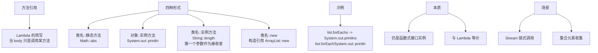

# 什么是方法引用？

### 方法引用

**概念**
方法引用是 Lambda 表达式的一种简写形式，它直接引用类或对象的方法。当 Lambda 表达式的体只调用一个方法而不做其他操作时，可以使用方法引用，旨在提高代码的可读性。

**语法**
使用 `::` 运算符分隔方法名与对象或类名。

**主要形式**

1.  **对象::实例方法**
    - Lambda 参数作为方法的显式参数传入。
    - 例如：`System.out::println` 等价于 `x -> System.out.println(x)`。

2.  **类::静态方法**
    - Lambda 参数传递到这个静态方法。
    - 例如：`Integer::valueOf` 等价于 `x -> Integer.valueOf(x)`。

3.  **类::实例方法**
    - 第一个 Lambda 参数成为调用方法的对象（隐式对象），剩余参数传递给方法。
    - 例如：`String::trim` 等价于 `(s) -> s.trim()`。
    - **例如比较器**：`String::compareToIgnoreCase` 等价于 `(s1, s2) -> s1.compareToIgnoreCase(s2)`。

4.  **类::new (构造器引用)**
    - 引用构造函数。
    - 例如：`ArrayList::new` 等价于 `() -> new ArrayList<>()`。

5.  **类型[]::new (数组引用)**
    - 创建指定长度的数组。
    - 例如：`String[]::new` 等价于 `(int x) -> new String[x]`。

**实战案例**
在 Spring Bean 转换或 Map 处理中，常使用 `Class::new` 结合 Function 接口延迟初始化对象，避免了在 Stream 操作中显式写繁琐的 `new` 关键字。需注意，若 `new` 的构造函数抛出受检异常，方法引用无法直接使用，必须改回 Lambda 或 try-catch 包装。

**代码示例**
```java
// 使用构造器引用创建 Map 集合，定制初始容量
Map<String, User> userMap = users.stream()
    .collect(Collectors.toMap(
        User::getId, 
        User::new, // 构造器引用：等价于 u -> new User(u)
        (k1, k2) -> k1,
        () -> new HashMap<>(128) // Supplier 构造器引用
    ));
```

**注意**
- 方法引用不能独立存在，总是会转换为函数式接口的实例。
- 包含对象的方法引用（如 `obj::method`）在引用时如果对象为 null，立即抛出 NPE，而 Lambda 表达式只有在调用时才抛出。
- 方法引用的目标方法参数列表和返回类型需要与函数式接口的抽象方法兼容（函数描述符匹配）。

## 常见考点
1. **`String::compareToIgnoreCase` 属于哪种引用？**：属于 `类::实例方法`，因为 Lambda 的第一个参数作为调用者。
2. **方法引用与 Lambda 的性能区别**：两者编译后字节码基本一致，性能差异可忽略，主要优势在于简洁性。
3. **构造器引用如何处理带参构造？**：如 `User::new`，若函数式接口接受 `String`，则自动匹配 `User(String name)` 构造器。
4. **为什么重载方法可能导致方法引用模糊？**：编译器有时无法推断出具体调用哪个重载方法，此时需要显式使用 Lambda。


## 核心架构图


## 核心知识点图


## 记忆要点

- 一句话定义：Lambda表达式只调一个方法时的简写，用::符号分隔。
- 三大基础：对象::实例方法、类::静态方法、类::实例方法。
- 特殊引用：类::new构造器引用，以及类型[]::new数组引用。
- 匹配规则：引用方法的参数列表与返回类型，需匹配函数式接口。

## 结构化回答

**30 秒电梯演讲：** Lambda 表达式的简写，直接引用已有方法。打个比方，就像起外号，外号指代那个人（方法），不用每次把全名（代码逻辑）写一遍。

**展开框架：**
1. **一句话定义** — Lambda表达式只调一个方法时的简写，用::符号分隔。
2. **三大基础** — 对象::实例方法、类::静态方法、类::实例方法。
3. **特殊引用** — 类::new构造器引用，以及类型[]::new数组引用。

**收尾：** 我在项目里踩过坑——在 Spring Bean 转换或 Map 处理中，常使用 `Class::new` 结合 Function 接口延迟初始化对象，避免了在 Stream 操作中显式写繁琐的 `new` 关键字。您想深入聊哪一段：原理、避坑还是对比选型？

## 视频脚本

> 预计时长：3 分钟 | 由浅入深

| 时间 | 画面/字幕 | 口播台词 | 讲解要点 |
|------|----------|----------|----------|
| 0:00 | 标题卡：什么是方法引用 | "什么是方法引用？一句话——就像起外号，外号指代那个人（方法），不用每次把全名（代码逻辑）写一遍。" | 开场钩子 |
| 0:45 | 概念动画/示意图 | "Lambda 表达式的简写，直接引用已有方法——就像起外号，外号指代那个人（方法），不用每次把全名（代码逻辑）写一遍" | 核心定义 |
| 1:30 | 一句话定义示意 | "Lambda表达式只调一个方法时的简写，用::符号分隔。" | 要点1 |
| 2:15 | 三大基础示意 | "对象::实例方法、类::静态方法、类::实例方法。" | 要点2 |
| 3:00 | 总结卡 | "记住这几条，面试不慌。下期讲进阶追问。" | 收尾 |
