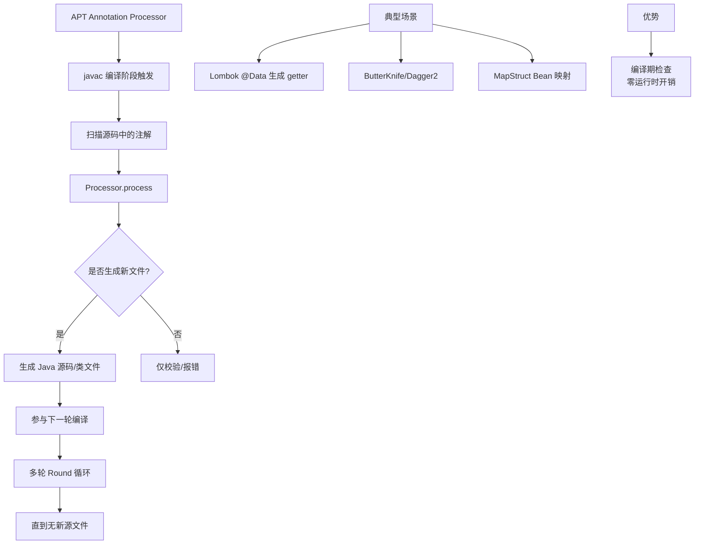

# 什么是注解处理器？

### 注解处理器

注解处理器是用来处理注解的工具。如果没有读取注解的方法，注解就仅相当于注释。Java SE5 扩展了反射机制的 API，支持程序员在运行时通过反射读取注解（Runtime Retention），也支持在编译时通过注解处理器处理注解（Source/Class Retention）。

**处理分类**
注解的处理根据 `@Retention` 的策略分为两类：
1.  **运行时处理**：利用反射机制，在程序运行时解析注解（常用于依赖注入、序列化、测试框架如 JUnit）。
2.  **编译时处理**：利用 Java 的 Pluggable Annotation Processing API (JSR 269)，在编译阶段生成源代码或修改已有代码（常用于 Lombok, ButterKnife, AutoValue）。

**实战案例**
在 Android 开发中，早期使用 ButterKnife (`@BindView`) 通过编译时生成 `ViewBinding` 类替代了繁琐的 `findViewById`，显著提升启动性能并避免了运行时反射开销。踩坑点：若 Gradle 配置中增量编译开启但 Processor 未正确声明 `@SupportedAnnotationTypes`，可能导致注解处理偶发失效。

**代码示例**
```java
// 简单的自定义注解处理器（编译时）
@SupportedAnnotationTypes("com.example.MyAnnotation")
@SupportedSourceVersion(SourceVersion.RELEASE_8)
public class MyProcessor extends AbstractProcessor {
    @Override
    public boolean process(Set<? extends TypeElement> annotations, RoundEnvironment roundEnv) {
        for (TypeElement annotation : annotations) {
            for (Element element : roundEnv.getElementsAnnotatedWith(annotation)) {
                processingEnv.getMessager().printMessage(Diagnostic.Kind.NOTE, "Found: " + element);
                // 这里通常使用 JavaPoet 生成 Java 源代码文件
            }
        }
        return true;
    }
}
```

**示例：运行时注解处理**

以下示例展示了如何通过反射在运行时读取字段上的注解信息。

```java
// 1. 定义注解
@Target(ElementType.FIELD)
@Retention(RetentionPolicy.RUNTIME)
public @interface FruitProvider {
    public int id() default -1;
    public String name() default "";
    public String address() default "";
}

// 2. 使用注解
public class Apple {
    @FruitProvider(id = 1, name = "陕西红富士集团", address = "陕西省西安市延安路")
    private String appleProvider;
    // getter/setter...
}

// 3. 注解处理器（通过反射读取）
public class FruitInfoUtil {
    public static void getFruitInfo(Class<?> clazz) {
        Field[] fields = clazz.getDeclaredFields();
        for (Field field : fields) {
            if (field.isAnnotationPresent(FruitProvider.class)) {
                FruitProvider fruitProvider = field.getAnnotation(FruitProvider.class);
                System.out.println("供应商编号：" + fruitProvider.id() + 
                                   " 供应商名称：" + fruitProvider.name());
            }
        }
    }
}
```

**编译时处理流程**
编译时注解处理器工作流程如下，它不修改已有的 AST，而是生成新的 Java 文件：

```text
┌──────────┐      1. Parse      ┌───────────┐      2. Analyze &      ┌───────────┐
│  Source  │ ──────────────────>│   AST     │ ────────────────────> │   Symbol  │
│  .java   │  (源代码 -> 语法树)  │ (Abstract)│  (语义分析，填充符号表)│   Table   │
└──────────┘                    └───────────┘                     └───────────┘
                                            ^
                                            |
                                      3. Process (Round)
                                   (调用 Processor 处理注解)
                                            |
                              ┌─────────

**对比表格：运行时 vs 编译时**

| 特性 | 运行时处理 | 编译时处理 |
| :--- | :--- | :--- |
| **原理** | Java 反射机制 | JSR 269 API (插入编译器) |
| **时机** | 程序运行期 | 代码编译期 |
| **性能影响** | 有反射开销，影响运行速度 | 无运行时开销，仅增加编译时长 |
| **能力** | 只能读取，无法修改结构 | 可生成新代码、修改 AST(需Lombok等Hack) |
| **典型应用** | Spring DI, JUnit, Jackson | Lombok, MapStruct, Dagger |


## 核心架构图


## 记忆要点

- 两大分类：运行时靠反射解析，编译时靠Pluggable API生成代码。
- 运行时：保留策略为RUNTIME，依赖反射API读取（如JUnit/Spring）。
- 编译时：保留策略为SOURCE，编译期生成Java文件（如Lombok）。
- 核心限制：编译时处理器不能修改原有AST，只能生成新的源码文件。

## 结构化回答

**30 秒电梯演讲：** 在运行时或编译时解析注解信息并执行相应逻辑。打个比方，像批阅作业，老师（处理器）看到标记（注解）就进行特定的点评或操作。

**展开框架：**
1. **两大分类** — 运行时靠反射解析，编译时靠Pluggable API生成代码。
2. **运行时** — 保留策略为RUNTIME，依赖反射API读取（如JUnit/Spring）。
3. **编译时** — 保留策略为SOURCE，编译期生成Java文件（如Lombok）。

**收尾：** 我在项目里踩过坑——在 Android 开发中，早期使用 ButterKnife (`@BindView`) 通过编译时生成 `ViewBinding` 类替代了繁琐的 `findViewById`，显著提升启动性能并避免了运行时反射开销。您想深入聊哪一段：原理、避坑还是对比选型？

## 视频脚本

> 预计时长：3 分钟 | 由浅入深

| 时间 | 画面/字幕 | 口播台词 | 讲解要点 |
|------|----------|----------|----------|
| 0:00 | 标题卡：什么是注解处理器 | "什么是注解处理器？一句话——像批阅作业，老师（处理器）看到标记（注解）就进行特定的点评或操作。" | 开场钩子 |
| 0:45 | 概念动画/示意图 | "在运行时或编译时解析注解信息并执行相应逻辑——像批阅作业，老师（处理器）看到标记（注解）就进行特定的点评或操作" | 核心定义 |
| 1:30 | 两大分类示意 | "运行时靠反射解析，编译时靠Pluggable API生成代码。" | 要点1 |
| 2:15 | 运行时示意 | "保留策略为RUNTIME，依赖反射API读取（如JUnit/Spring）。" | 要点2 |
| 3:00 | 总结卡 | "记住这几条，面试不慌。下期讲进阶追问。" | 收尾 |
