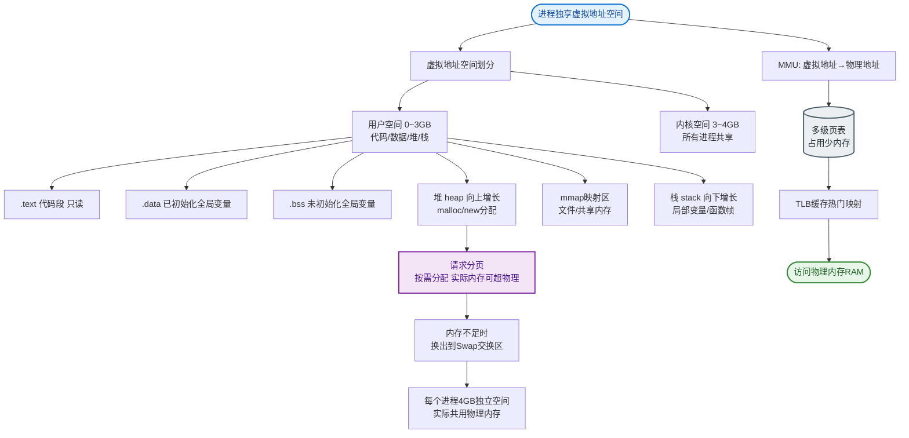

# 什么是虚拟内存？

### 虚拟内存

**简述**
虚拟内存是计算机系统内存管理的一种技术。它使得应用程序认为自己拥有连续的可用内存空间（一个连续的逻辑地址空间），而实际上物理内存被分隔成多个物理页帧，数据可能暂时存储在磁盘上的交换分区中。虚拟内存的实现依赖于硬件异常、硬件地址翻译（MMU）、主存、磁盘以及内核软件。

#### 1. 核心概念

*   **地址空间**：物理内存的抽象，是一个进程可用于寻址内存的一套地址集合（32位系统为 4GB）。
*   **分页**：地址空间被分割成多个块（页，通常 4KB）。每一页被映射到连续的物理内存（页框）。
*   **页表**：记录虚拟页面到物理页框的映射关系。从数学角度看，页表是一个函数，输入是虚拟页号，输出是物理页框号或磁盘地址。
*   **多级页表**：将页表分级，压缩页表占用空间，适合大地址空间（避免顶级页表必须连续占用大内存）。

#### 2. 地址翻译与加速

虚拟地址到物理地址的转换过程：

```text
   CPU (Virtual Address)
       │
       ▼
   ┌───────────────┐     ┌──────────────┐
   │  Virtual Page │     │   Virtual    │
   │   Number(VPN) │     │   Offset(V)  │
   └───────┬───────┘     └──────┬───────┘
           │                    │
           ▼                    │
      ┌─────────┐              │
      │   TLB   │──Hit─────>    │  ┌──────────────┐
      │ (Cache) │              └─>│ Physical Addr│
      └────┬────┘                 └──────┬───────┘
           │ Miss                       │
           ▼                            │
      ┌─────────┐                      │
      │ Page    │ ──> PTE (Page Table Entry) │
      │ Table   │      (Valid? Dirty? R/W?)  │
      └─────────┘                      │
           │                            │
           ▼                            ▼
   ┌──────────────────────────────────────────┐
   │            Physical Memory               │
   └──────────────────────────────────────────┘
```

*   **TLB (Translation Lookaside Buffer)**：
    - 即快表，是一个缓存，存储最近使用过的虚拟页号到物理页框的映射。
    - **命中**：直接从 TLB 获取物理地址，无需访问页表（极快）。
    - **未命中**：查询页表（可能在内存中，也可能在磁盘），并更新 TLB。

#### 3. 缺页异常

*   当访问的页面不在物理内存中（PTE 的 Valid 位为 0）时，触发缺页异常。
*   **处理流程**：
    1.  操作系统内核接管。
    2.  检查虚拟地址是否合法。
    3.  在物理内存中寻找空闲页框。
    4.  若内存已满，执行**页面置换算法**（如 LRU）踢出一个页面（若 dirty 位为 1 则写回磁盘）。
    5.  从磁盘将目标页面调入内存。
    6.  更新页表和 TLB。
    7.  重新执行导致异常的指令。

#### 4. 大内存处理

*   **多级页表**：将页表分级，压缩页表占用空间，适合大地址空间。
*   **倒排页表**：物理内存中只有一个页表，索引是物理页框，通过哈希查找，节省空间但速度稍慢。

#### 5. 虚拟内存的能力

1.  **高速缓存**：将磁盘作为内存的扩充，通过页换入换出，提供比物理内存更大的容量。
2.  **内存管理**：简化

**实战案例**
在 Java 服务端大内存分配（如分配 8GB 堆内存）时，如果开启了大页内存且物理内存不足，Linux 内核可能会触发 OOM Killer 即使还有 Swap 空间，因为缺页中断导致的阻塞过高，或者直接触发 DirectMemory 的 OOM。经验表明，对于高频随机访问的数据库索引，开启 Transparent Huge Pages (THP) 可能导致性能抖动，建议关闭或显式配置 Huge Pages。

**代码示例**
```c
// Linux 查看缺页中断情况（Shell命令）
// 实战中用于分析内存抖动
$ perf stat -e major-faults,minor-faults java -jar app.jar

// 代码中建议使用 mlock 锁定关键内存页，防止被 swap
#include <sys/mman.h>
void lock_critical_memory(void *addr, size_t len) {
    if (mlock(addr, len) == -1) {
        perror("mlock"); // 失败通常意味着超限或权限不足
    }
}
```


## 核心流程图


## 记忆要点

- 核心思想：屏蔽物理内存离散，为进程提供连续且独立的逻辑地址空间。
- 加速机制：依赖MMU翻译，靠TLB(快表)缓存近期映射极速转换地址。
- 缺页处理：Valid位为0触发缺页异常，OS接管并执行页面置换算法。
- 多级页表：将页表分级，避免大地址空间页表必须连续占用大内存。

## 结构化回答

**30 秒电梯演讲：** 通过软硬件结合，将磁盘扩展为内存，提供大容量、隔离的虚拟地址空间。打个比方，像图书馆借书，书桌（物理内存）有限，读不完的书暂存书架（磁盘），但感觉像有无限大书桌。

**展开框架：**
1. **核心思想** — 屏蔽物理内存离散，为进程提供连续且独立的逻辑地址空间。
2. **加速机制** — 依赖MMU翻译，靠TLB(快表)缓存近期映射极速转换地址。
3. **缺页处理** — Valid位为0触发缺页异常，OS接管并执行页面置换算法。

**收尾：** 这三点都能配合实战聊。您想深入聊原理、对比还是避坑？

## 视频脚本

> 预计时长：3 分钟 | 由浅入深

| 时间 | 画面/字幕 | 口播台词 | 讲解要点 |
|------|----------|----------|----------|
| 0:00 | 标题卡：什么是虚拟内存 | "什么是虚拟内存？一句话——像图书馆借书，书桌（物理内存）有限，读不完的书暂存书架（磁盘），但感觉像有无限大书桌。" | 开场钩子 |
| 0:45 | 概念动画/示意图 | "通过软硬件结合，将磁盘扩展为内存，提供大容量、隔离的虚拟地址空间——像图书馆借书，书桌（物理内存）有限，读不完的书暂存书架（磁盘），但感觉像有无限大书桌" | 核心定义 |
| 1:30 | 核心思想示意 | "屏蔽物理内存离散，为进程提供连续且独立的逻辑地址空间。" | 要点1 |
| 2:15 | 加速机制示意 | "依赖MMU翻译，靠TLB(快表)缓存近期映射极速转换地址。" | 要点2 |
| 3:00 | 总结卡 | "记住这几条，面试不慌。下期讲进阶追问。" | 收尾 |

### 视频流程图


