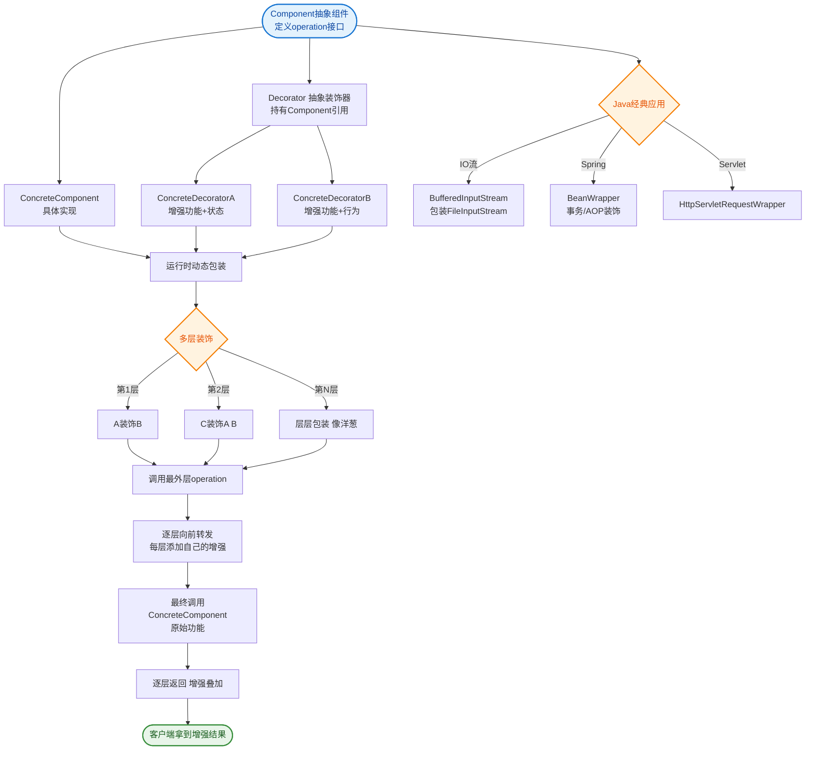
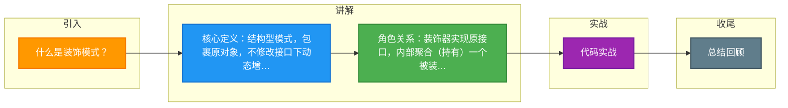

# 什么是装饰模式？

### 什么是装饰模式？

装饰模式是一种结构型设计模式，允许在不改变原始类接口的情况下，动态地添加功能或责任。它通过创建一个装饰类包裹原始对象，并在保持接口不变的前提下提供额外的功能。相较于继承子类，装饰模式在扩展功能上更加灵活。

**主要角色**
1.  **组件接口**：定义具体组件和装饰器共同的接口。
2.  **具体组件**：实现组件接口，是被装饰的对象。
3.  **装饰器**：持有组件对象的引用并实现接口，通常为抽象类。
4.  **具体装饰器**：继承装饰器，实现具体装饰逻辑。

**结构图**
装饰模式的核心在于装饰器与组件继承自同一接口，且装饰器内部包含一个组件对象：

```text
          <<interface>>
          +───────────+
          │ Component │
          +───────────+
          + operation()│
          +────────────┘
         △            △
        │              │
┌───────────────┐  ┌───────────────┐
│ConcreteComponent│ │  Decorator    │
├───────────────┤  ├───────────────┤
│+ operation()  │  │- component:   │
└───────────────┘  │  Component     │
                  ├───────────────┤
                  │+ operation()  │◄─────────┐
                  +───────────────┘          │
                         △                   │ 调用
                        │                    │
               ┌─────────────────┐           │
               │ConcreteDecorator│           │
               ├─────────────────┤           │
               │+ addedBehavior()│───────────┘
               │+ operation()    │ (执行前/后增强)
               └─────────────────┘
```

**代码逻辑示例**
```java
// 装饰器的 operation 方法典型实现
public void operation() {
    // 1. 执行附加行为
    addedBehavior(); 
    // 2. 转发给被装饰对象
    component.operation(); 
}
```

**实战案例**
在实际的 Web 框架开发中，常用于实现“拦截器链”或“过滤器链”。例如在 Netty 中，`ChannelPipeline` 本质上是一个装饰模式的变种，将 `ChannelHandler` 像积木一样串联起来。一个常见坑是：如果装饰器 A 依赖装饰器 B 的副作用执行顺序（如事务提交必须在连接关闭前），错误的嵌套顺序会导致资源泄露或逻辑错误。

**代码示例**
```java
// 模拟 Java IO 的装饰模式：先加缓冲，再加Base64编码
InputStream in = new FileInputStream("input.txt");
// 装饰1：缓冲功能
InputStream buffered = new BufferedInputStream(in);
// 装饰2：数据转换功能（在缓冲基础之上）
DataInputStream data = new DataInputStream(buffered);

// 自定义装饰器：压缩装饰器
class GzipCompressDecorator extends InputStreamDecorator {
    public int read() {
        // 读取数据并即时压缩的逻辑
        int data = super.read();
        return compress(data);
    }
}
```

**优缺点**
- **优点**：不改变原有对象结构；比继承更灵活（遵循开闭原则）；可以通过排列组合产生大量功能。
- **缺点**：多层装饰会导致复杂性增加；小对象过多，排错困难。

## 常见考点
1. **装饰模式 vs 代理模式**：结构相似但目的不同。装饰模式是为了**增加功能**，代理模式是为了**控制访问**（如权限校验、懒加载）。
2. **Java I/O 中的装饰模式**：`InputStream` 是组件，`FileInputStream` 是具体组件，`BufferedInputStream` 和 `DataInputStream` 是具体装饰器。
3. **如何解决多层装饰的透明性问题**：如果装饰器改变了接口（增加了新方法），就不再是透明的装饰模式，称为“半透明”装饰模式。
4. **与继承的区别**：为什么“多用组合，少用继承”？装饰模式利用组合动态扩展，避免了继承导致的类爆炸。

**对比表格：装饰模式 vs 代理模式**

| 维度 | 装饰模式 | 代理模式 |
| :--- | :--- | :--- |
| **核心目的** | 增强/添加对象功能 | 控制/限制对象访问 |
| **对象创建** | 通常由客户端层层组装 | 代理内部创建或持有真实对象引用 |
| **对接口的影响** | 保持接口一致（透明） | 可能精简接口（保护代理） |
| **关注点** | 动态组合行为 | 隐藏细节、延迟加载 |
| **典型应用** | Java IO 流, Python 装饰器 | RPC 动态代理, 防火墙代理 |


## 核心流程图


## 记忆要点

- 核心定义：结构型模式，包裹原对象，不修改接口下动态增加新功能。
- 角色关系：装饰器实现原接口，内部聚合(持有)一个被装饰组件对象。
- 执行逻辑：执行附加增强行为，再通过聚合的对象转发原方法调用。
- 模式对比：装饰模式为增加功能，代理模式为控制访问（重点考点）。

## 结构化回答

**30 秒电梯演讲：** 不改变接口，动态给对象包装新功能。打个比方，像给手机套壳、贴膜，手机本身不变，功能却增加了。

**展开框架：**
1. **核心定义** — 结构型模式，包裹原对象，不修改接口下动态增加新功能。
2. **角色关系** — 装饰器实现原接口，内部聚合(持有)一个被装饰组件对象。
3. **执行逻辑** — 执行附加增强行为，再通过聚合的对象转发原方法调用。

**收尾：** 我在项目里踩过坑——在实际的 Web 框架开发中，常用于实现“拦截器链”或“过滤器链”。您想深入聊哪一段：原理、避坑还是对比选型？

## 视频脚本

> 预计时长：3 分钟 | 由浅入深

| 时间 | 画面/字幕 | 口播台词 | 讲解要点 |
|------|----------|----------|----------|
| 0:00 | 标题卡：什么是装饰模式 | "什么是装饰模式？一句话——像给手机套壳、贴膜，手机本身不变，功能却增加了。" | 开场钩子 |
| 0:45 | 概念动画/示意图 | "不改变接口，动态给对象包装新功能——像给手机套壳、贴膜，手机本身不变，功能却增加了" | 核心定义 |
| 1:30 | 核心定义示意 | "结构型模式，包裹原对象，不修改接口下动态增加新功能。" | 要点1 |
| 2:15 | 角色关系示意 | "装饰器实现原接口，内部聚合(持有)一个被装饰组件对象。" | 要点2 |
| 3:00 | 总结卡 | "记住这几条，面试不慌。下期讲进阶追问。" | 收尾 |

### 视频流程图



