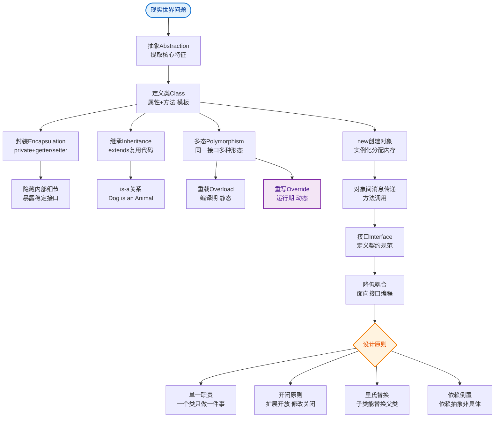

# 什么是面向对象程序设计概述？

面向对象程序设计概述
 
面向过程：
先确定如何操作数据，再决定数据的结构。适用于小规模问题;  
面向对象OOP：
先决定数据的结构，在考虑操作数据的算法。适用于大规模问题;
1. 类
 
1、类是构造对象的模板或蓝图
2、封装是处理对象的一个重要概念
就是将数据和行为组合在一个包中，并对对象的使用者隐藏具体的实现方式
1. 实例字段：对象中的数据数据;  
2. 方法：操作数据的过程;  
3. 对象的状态：特定对象有一组特定的实例字段值，这些值的集合就是这个对象的当前状态。  
3、OOP原则：  
1. 封装：绝对不能让类中的方法直接访问其他类的实例字段;  
2. 扩展：可以通过扩展其他类扩展来构建新类。
4、类、超类和⼦：
1. 继承：基于已有的类创建新的类。继承一个类就是复用（继承）这些类的方法，而且可以增加一些新的方法和
字段
2. 继承：is-a 关系
5、定义⼦类
1. extends 关键字
2. 父类，又叫基类、超类  
3. ⼦类，又叫派生类、孩⼦类  
4. ⼦类比父类拥有的功能更多
1. 通过扩招父类定义⼦类时，只用指出⼦类与父类的不同之处  
2. 一般的方法放在父类中，更特殊的方法放在⼦类中  
6、覆盖方法
7、⼦类构造器
1. super(...) 调用父类构造器  
1. 超类中的有些方法对⼦类并不一定适用，此时需要在⼦类中覆盖（重写）父类方法
2. 使用 super 关键字可以调用父类方法，避免覆盖父类方法时调用父类方法造成不必要的递归  
3. super 不是一个对象的引用，不能将super 赋给另一个对象变量

2. 必须放在⼦类构造器的第一条  
3. 若⼦类构造器没有显示调用父类构造器，将自动调用父类的无参构造器；  
4. 若父类没有无参构造器，必须要在⼦类构造器中明确指明调用父类哪个构造器；否则，Java编译器就会报错  
一个对象变量可以指示多种实际类型的现象成为多态。  
在运行时能够自动选择适当的方法，成为动态绑定。  
8、this 与 super 关键字  
1. this 关键字
隐式参数的引用
调用该类的其他构造器
2. super 关键字
调用父类方法
调用父类构造器
注意：this 可以作为当前对象的引用，但是 super 却不可以作为父类对象的引用
2. 对象
 
1. 对象的状态改变必须通过调用方法实现;（如果不经过方法改变对象状态，说明破坏了封装性）  
2. 对象的状态不能完全描述一个对象，每个对象有一个唯一标识;  
3. 作为同一个类的实例，每个对象的标识总是不同的，状态往往也存在着差异。
3. 类之间的关系
 
依赖(uses-a)：一个类的方法使用另一个类的对象;
------->  
聚合(has-a) ：类A的对象包含类B的对象;
◇———
继承(is-a)  ：一个更特殊的类和一个更一般的类之间的关系;
——▷
4. 继承与多态
 
1、继承层次
1. 由一个公共超类派生出来的所有类的集合成为继承层次。  
2. 在继承层次中，从某个特定的类到其祖先的路径成为该类的继承链（⼦到父）
Java中不支持多继承，但是可以通过接口来实现
2、Java中，对象变量是多态的  
1. 父类类型的变量既可以引用自身类型的变量，还可以引用⼦类类型的变量
2. 但是，⼦类类型的变量不可以引用父类类型的变量  
3、⼦类可以调用父类public、protected、包权限的方法
但是父类不可以调用⼦类的特有方法（⼦类的特殊性）  
1. 纯父类变量（左右都是父类）不可以调用⼦类的任何方法  
2. 上转性变量（左边是父类，右边是⼦类）可以调用⼦类重写父类的方法（多态），但是仍然不能调用⼦类独有

的方法  
 
4、理解方法调用
以调用 x.f(arg) 为例，隐式参数 x 为类 C 的一个对象：
（1）编译器查看对象的声明类型和方法名
编译器查找 C 类中所有名为 f 的方法和父类中名为 f 且可访问的方法（父类 private 方法不可访问）  
此时，编译器知道所有可能被调用的候选方法  
（2）编译器确定方法调用中提供的参数类型
重载解析： 在所有名为 f 的方法中，找到一个与所提供参数类型完全匹配的方法  
此时，编译器已经知道需要调用的方法名字和参数类型  
（3）静态绑定(编译阶段绑定)
如果是 private 方法、static 方法、final 方法或者构造器， 那么编译器将可以准确地知道应该调用哪个方法。
此时调用方法只用考虑 x 的类型（若在类 C 中找不到 f 方法，则向其父类中找），不需要考虑类 C 的⼦类（因为这
几种修饰的方法都不能被继承）
只有静态绑定成功，即编译通过了，才能进⼊运行阶段  
（4）动态绑定(运行阶段绑定)
如果调用的方法依赖于隐式参数的实际类型，那么必须在运行时使用动态绑定。  
虚拟机必须调用与 x 所引用对象的实际类型对应的那个方法  
例如：x 的实际类型是 D，它是 C 类的⼦类。
如果：D 类定义了方法 f(String) ，就直接调用它；
否则：将在 D 类的超类中寻找 f(String) ，以此类推。
在覆盖一个方法的时候，⼦类方法不能低于父类方法的可⻅性。
比如，父类方法为 public，⼦类必须为 public。
如果⼦类遗漏了 public，编译器就会报错。
5、阻止继承：final 类和方法  
（1）final 关键字

（2）将方法或类声明为 final 主要原因
确保它们不会在⼦类中改变语义  
6、强制类型转换
7、向上转型（upcasting）  
⼦类型 → 父类型
又被称为：自动类型转换
8、向下转型（downcasting）  
父类型 → ⼦类型
又被称为：强制类型转换
进行强制类型转换的唯一原因是：
在暂时忽视对象的实际类型之后， 使用对象的全部功能。  
无论是向上转型还是向下转型，这两种类型之间必须要有继承关系；否则，编译器报错。
 
小结：
1. 只能在继承层次内进行类型转换
2. 在将超类转换成⼦类之前，应该使用 instanceof 进行检查。  
  1. final 修饰字段  
     * 基本类型：不可更改
     * 引用类型：不可指向新的引用，但是对象状态可能会改变
  2. final 修饰类：该类不可以被继承
  3. final 修饰方法：⼦类不能覆盖这个方法


## 核心流程图


## 记忆要点

- OOP核心：先定数据结构（类），再写算法（方法），适合大规模开发
- 三大特征口诀：封装（藏细节）、继承（is-a复用）、多态（父引用子对象动态绑定）
- 多态调用规则：编译看左边（父类），运行看右边（子类），只能调父类已有方法
- 类间关系对比：依赖uses-a，聚合has-a，继承is-a
- super与this对比：super非对象引用仅用于调用父类，且必须放构造器首行

## 结构化回答

**30 秒电梯演讲：** 将数据和操作数据的方法封装成对象，通过交互解决问题。打个比方，像造汽车，把引擎、轮子组装好，踩油门它自己跑，不用管内部。

**展开框架：**
1. **OOP核心** — 先定数据结构（类），再写算法（方法），适合大规模开发
2. **三大特征口诀** — 封装（藏细节）、继承（is-a复用）、多态（父引用子对象动态绑定）
3. **多态调用规则** — 编译看左边（父类），运行看右边（子类），只能调父类已有方法

**收尾：** 这三点都能配合实战聊。您想深入聊原理、对比还是避坑？

## 视频脚本

> 预计时长：3 分钟 | 由浅入深

| 时间 | 画面/字幕 | 口播台词 | 讲解要点 |
|------|----------|----------|----------|
| 0:00 | 标题卡：什么是面向对象程序设计概述 | "什么是面向对象程序设计概述？一句话——像造汽车，把引擎、轮子组装好，踩油门它自己跑，不用管内部。" | 开场钩子 |
| 0:45 | 概念动画/示意图 | "将数据和操作数据的方法封装成对象，通过交互解决问题——像造汽车，把引擎、轮子组装好，踩油门它自己跑，不用管内部" | 核心定义 |
| 1:30 | OOP核心示意 | "先定数据结构（类），再写算法（方法），适合大规模开发" | 要点1 |
| 2:15 | 三大特征口诀示意 | "封装（藏细节）、继承（is-a复用）、多态（父引用子对象动态绑定）" | 要点2 |
| 3:00 | 总结卡 | "记住这几条，面试不慌。下期讲进阶追问。" | 收尾 |

---

## 延伸：什么是面向对象？

> 合并自 `core-275`（相似度 72%）

面向对象程序设计（OOP）是一种编程范式，它将程序视为对象的集合，每个对象包含数据（属性）和代码（方法）。核心思想包括：

1.  **封装**：
    *   **定义**：将数据（状态）和操作数据的方法（行为）组合在一个单元（类）中，并对对象的使用者隐藏具体的实现细节。
    *   **目的**：降低系统的复杂度，通过接口访问数据，防止外部随意修改内部状态（数据安全）。
2.  **继承**：
    *   **定义**：允许新类（子类）从现有类（父类/超类）那里获得属性和方法。
    *   **目的**：实现代码复用，建立类之间的层次结构（Is-A 关系）。
3.  **多态**：
    *   **定义**：允许不同类的对象对同一消息作出响应，或允许父类类型的变量引用子类对象。
    *   **实现机制**：主要通过**方法重写**（子类重新定义父类方法）结合**动态绑定**（运行时确定调用哪个方法）来实现。

**面向对象 vs 面向过程**：
*   **面向过程**：以函数为核心，先确定算法步骤（如何操作数据），再决定数据结构。适合小规模、逻辑线性的问题。
*   **面向对象**：以对象为核心，先设计数据结构（类），再设计算法（方法）。通过对象间的交互来完成任务，更适合大规模、易变化的软件开发。

```text
OOP 核心概念关系图
┌──────────────────────────────────────────────────┐
│                  面向对象 (OOP)                    │
├──────────────────────────────────────────────────┤
│                                                  │
│  ┌────────────┐      ┌────────────┐              │
│  │   封装      │◄─────│    类      │              │
│  │ (隐藏细节)  │      │ (模板)     │              │
│  └────────────┘      └──────┬─────┘              │
│                             │                     │
│                     ┌───────┴───────┐             │
│                     ▼               ▼             │
│              ┌─────────────┐  ┌─────────────┐    │
│              │    继承      │  │    多态      │    │
│              │  (代码复用)  │  │ (灵活调用)   │    │
│              └─────────────┘  └─────────────┘    │
│                                                  │
└──────────────────────────────────────────────────┘
```

## 常见考点
1.  **面向对象的三大特性与五大原则**：除了三大特性，面试常追问 SOLID 原则（单一职责、开闭原则、里氏替换、接口隔离、依赖倒置）。
2.  **多态的实现原理**：理解 Java 中多态主要依赖虚方法表和动态绑定，而重载是编译时确定的静态绑定。
3.  **组合 vs 继承**：追问“为什么提倡组合优于继承？”（继承耦合度高，破坏封装；组合灵活度高，符合“Has-A”关系）。

## 记忆要点

- OOP核心：程序是对象集合，包含数据与代码，以对象交互完成任务
- 封装打包数据与行为并隐藏细节，降低系统复杂度保障数据安全
- 继承允许子类复用父类属性方法，体现Is-a层次关系
- 多态通过方法重写和动态绑定，实现不同对象对同一消息的响应
- 对比：面向过程重算法步骤适合小规模，面向过程重数据结构适合大规模

## 结构化回答

**30 秒电梯演讲：** 通过对象封装数据和交互来构建程序。打个比方，像指挥团队，每个人各司其职，发号施令即可，不用亲力亲为。

**展开框架：**
1. **OOP核心** — 程序是对象集合，包含数据与代码，以对象交互完成任务
2. **封装打包数据与行为并隐藏细节** — 降低系统复杂度保障数据安全
3. **继承允许子类复用父类属性方法** — 体现Is-a层次关系

**收尾：** 这三点都能配合实战聊。您想深入聊原理、对比还是避坑？

## 视频脚本

> 预计时长：3 分钟 | 由浅入深

| 时间 | 画面/字幕 | 口播台词 | 讲解要点 |
|------|----------|----------|----------|
| 0:00 | 标题卡：什么是面向对象 | "什么是面向对象？一句话——像指挥团队，每个人各司其职，发号施令即可，不用亲力亲为。" | 开场钩子 |
| 0:45 | 概念动画/示意图 | "通过对象封装数据和交互来构建程序——像指挥团队，每个人各司其职，发号施令即可，不用亲力亲为" | 核心定义 |
| 1:30 | OOP核心示意 | "程序是对象集合，包含数据与代码，以对象交互完成任务" | 要点1 |
| 2:15 | 要点2图解示意 | "降低系统复杂度保障数据安全" | 要点2 |
| 3:00 | 总结卡 | "记住这几条，面试不慌。下期讲进阶追问。" | 收尾 |
