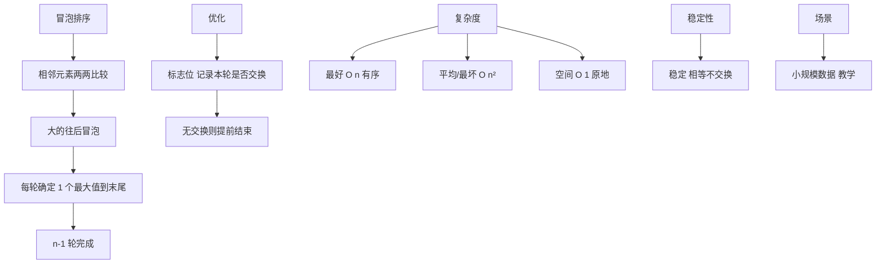
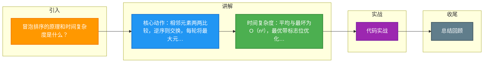

# 冒泡排序的原理和时间复杂度是什么？

## 冒泡排序算法

**原理**
冒泡排序是一种简单的交换排序。它重复地走访过要排序的数列，一次比较两个元素，如果它们的顺序错误就把它们交换过来。
1.  **比较与交换**：比较前后相邻的两个数据，如果前面数据大于后面的数据，就将这两个数据交换。
2.  **沉底效果**：这样对数组的第 0 个数据到 N-1 个数据进行一次遍历后，最大的一个数据就“沉”到数组第 N-1 个位置。
3.  **循环迭代**：N = N-1，如果 N 不为 0 就重复前面两步，否则排序完成。

**代码实现**
```java
public static void bubbleSort1(int [] a, int n){
    int i, j;
    for(i=0; i<n-1; i++){ // 外层循环控制排序趟数
        for(j=0; j<n-1-i; j++){ // 内层循环控制每趟比较次数
            if(a[j] > a[j+1]){ // 交换相邻元素
                int temp = a[j];
                a[j] = a[j+1];
                a[j+1] = temp;
            }
        }
    }
}
```

**图解流程**
```text
原始数组: [5, 3, 8, 4, 2]

第一轮 (i=0): 比较 4 次，最大值 8 沉底
[3, 5, 4, 2, 8] ▲ 8 到位

第二轮 (i=1): 比较 3 次，次大值 5 沉底
[3, 4, 2, 5, 8] ▲ 5 到位

第三轮 (i=2): 比较 2 次
[3, 2, 4, 5, 8] ▲ 4 到位

第四轮 (i=3): 比较 1 次
[2, 3, 4, 5, 8] ▲ 排序完成
```

**时间复杂度与空间复杂度**
*   **时间复杂度**：
    *   **平均情况**：O(n²)
    *   **最坏情况**：O(n²)（数组完全逆序）
    *   **最好情况**：O(n)（如果添加标志位优化，数组本身已经有序，只需一轮遍历）
*   **空间复杂度**：O(1)（仅使用常数级别的额外空间，如 temp 变量）
*   **稳定性**：稳定（相等元素不会发生相对位置改变）

## 常见考点
1.  **优化方式**：如何优化冒泡排序？（答案：设置一个标志位 `flag`，如果某一轮遍历中没有发生交换，说明数组已经有序，直接跳出循环，将最好时间复杂度优化到 O(n)）。
2.  **鸡尾酒排序**：双向冒泡排序，即从左到右和从右到左交替进行，解决特定数据（如[2,3,4,5,1]）中“小数”沉底慢的问题。
3.  **适用场景**：由于时间复杂度较高，冒泡排序通常仅用于教学或数据量极小的情况。


## 核心架构图



## 记忆要点

- 核心动作：相邻元素两两比较，逆序则交换，每轮将最大元素'沉底
- 时间复杂度：平均与最坏为O(n²)，最优带标志位优化可达O(n)
- 空间复杂度：O(1)原地交换，且是稳定排序算法
- 优化考点：可设置标志位，若一轮无交换则提前结束

## 结构化回答

**30 秒电梯演讲：** 相邻元素两两比较，大数下沉，小数上浮。打个比方，像水烧开气泡上升，大的石头沉底，小的浮上来。

**展开框架：**
1. **核心动作** — 相邻元素两两比较，逆序则交换，每轮将最大元素'沉底
2. **时间复杂度** — 平均与最坏为O(n²)，最优带标志位优化可达O(n)
3. **空间复杂度** — O(1)原地交换，且是稳定排序算法

**收尾：** 这三点都能配合实战聊。您想深入聊原理、对比还是避坑？

## 视频脚本

> 预计时长：3 分钟 | 由浅入深

| 时间 | 画面/字幕 | 口播台词 | 讲解要点 |
|------|----------|----------|----------|
| 0:00 | 标题卡：冒泡排序的原理和时间复杂度是什么 | "冒泡排序的原理和时间复杂度是什么？一句话——像水烧开气泡上升，大的石头沉底，小的浮上来。" | 开场钩子 |
| 0:45 | 概念动画/示意图 | "相邻元素两两比较，大数下沉，小数上浮——像水烧开气泡上升，大的石头沉底，小的浮上来" | 核心定义 |
| 1:30 | 核心动作示意 | "相邻元素两两比较，逆序则交换，每轮将最大元素'沉底" | 要点1 |
| 2:15 | 时间复杂度示意 | "平均与最坏为O(n²)，最优带标志位优化可达O(n)" | 要点2 |
| 3:00 | 总结卡 | "记住这几条，面试不慌。下期讲进阶追问。" | 收尾 |

### 视频流程图



