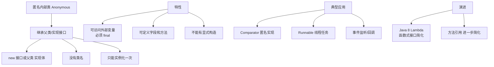

# 匿名内部类（要继承一个父类或者实现一个接口、直接使用new来生成一个对象的引用）是什么？

**匿名内部类**是 Java 中一种特殊的内部类，它没有类名，直接通过 `new` 关键字来定义并实例化。通常用于简化代码，特别是在需要一次性使用的场景（如事件监听器、线程启动）。

### 核心特征
1. **定义方式**：必须继承一个父类或实现一个接口，且二者只能其一。
2. **语法结构**：`new 父类构造器(实参列表) 或 接口() { 类体部分 }`。
3. **无类名**：没有 `class` 关键字，直接生成对象的引用。
4. **访问权限**：可以访问外部类的所有成员（包括私有成员），但在匿名内部类中定义的变量（局部变量）不能被外部直接访问。

### 关键细节与原理
*   **捕获局部变量**：如果匿名内部类使用了外部方法的局部变量，该变量必须隐式声明为 `final`（即事实上的 final，不可二次赋值）。这是因为匿名内部类对象的生命周期可能长于当前方法栈，Java 需要将这些变量的值拷贝一份到堆中。
*   **构造器**：由于没有类名，无法显式定义构造器。但如果继承父类，可以在 `new` 时调用父类的构造器（如 `new Thread("线程名") { ... }`）。如果需要初始化逻辑，可以使用代码块 `{ ... }`。
*   **多接口限制**：匿名内部类不能同时实现多个接口，也不能在继承类的同时实现接口。

### 代码示例（基于题目增强）
```java
// 抽象父类
public abstract class Bird {
    private String name;
    public String getName() { return name; }
    public void setName(String name) { this.name = name; }
    public abstract int fly();
}

public class Test {
    public void test(Bird bird) {
        System.out.println(bird.getName() + " 能够飞 " + bird.fly() + " 米");
    }

    public static void main(String[] args) {
        Test test = new Test();
        
        // 匿名内部类：继承 Bird 类，并实现抽象方法
        // 相当于定义了一个 "Bird 的子类" 并立即 new 出来
        test.test(new Bird() {
            // 可以定义自己的属性
            private String type = "候鸟";
            
            // 实现父类抽象方法
            @Override
            public int fly() {
                return 10000;
            }
            
            // 重写父类方法
            @Override
            public String getName() {
                return "大雁";
            }
        });
    }
}
```

### 编译后原理
Java 编译器在编译匿名内部类时，会生成一个独立的 `.class` 文件。文件名格式为 `外部类名$序号.class`（如 `Test$1.class`）。

## 常见考点
1.  **局部变量为什么必须是 final 的？**
    为了保持数据一致性。匿名内部类拷贝了一份局部变量，如果外部修改了原变量，内部类无法感知，导致数据不同步。
2.  **匿名内部类是否可以继承其他类或实现接口？**
    可以，但只能是一个父类或者一个接口，不能同时继承类又实现接口，也不能实现多个接口。
3.  **匿名内部类中可以使用 `this` 关键字吗？它指的是谁？**
    可以使用。在匿名内部类中，`this` 指向的是匿名内部类自身的实例对象，而不是外部类的对象。若需引用外部类实例，需使用 `外部类名.this`。
4.  **Lambda 表达式与匿名内部类的区别？**
    Lambda 表达式主要针对函数式接口（只有一个抽象方法的接口），代码更简洁；匿名内部类可以用于类、抽象类，且可以在内部定义成员变量，作用域更广。


## 核心架构图



## 记忆要点

- 定义特征：无类名，继承父类或实现接口（不可兼任），new时直接实现
- 局部变量限制：使用的局部变量必须事实final，防止生命周期错乱导致数据不一致
- 构造器限制：无法显式定义构造器，初始化逻辑只能用构造代码块
- 作用域陷阱：内部this指代匿名类自身，引用外部类需用'外部类名.this
- 编译文件：独立生成.class文件，命名格式为'外部类名$序号.class

## 结构化回答

**30 秒电梯演讲：** 无需定义类名，直接用 new 创建接口或抽象类的实例。打个比方，像用一次性餐具，用完即弃，不用专门设计制造。

**展开框架：**
1. **定义特征** — 无类名，继承父类或实现接口（不可兼任），new时直接实现
2. **局部变量限制** — 使用的局部变量必须事实final，防止生命周期错乱导致数据不一致
3. **构造器限制** — 无法显式定义构造器，初始化逻辑只能用构造代码块

**收尾：** 这三点都能配合实战聊。您想深入聊原理、对比还是避坑？

## 视频脚本

> 预计时长：3 分钟 | 由浅入深

| 时间 | 画面/字幕 | 口播台词 | 讲解要点 |
|------|----------|----------|----------|
| 0:00 | 标题卡：匿名内部类（要继承一个父类或者实现一… | "匿名内部类（要继承一个父类或者实现一个接口、直接使用new来生成一个对象的引用）是什么？一句话——像用一次性餐具，用完即弃，不用专门设计制造。" | 开场钩子 |
| 0:45 | 概念动画/示意图 | "无需定义类名，直接用 new 创建接口或抽象类的实例——像用一次性餐具，用完即弃，不用专门设计制造" | 核心定义 |
| 1:30 | 定义特征示意 | "无类名，继承父类或实现接口（不可兼任），new时直接实现" | 要点1 |
| 2:15 | 局部变量限制示意 | "使用的局部变量必须事实final，防止生命周期错乱导致数据不一致" | 要点2 |
| 3:00 | 总结卡 | "记住这几条，面试不慌。下期讲进阶追问。" | 收尾 |
