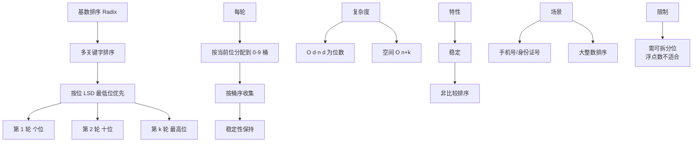

# 基数排序的原理是什么？

### 基数排序原理
基数排序属于“分配式排序”，它是通过键值的各个位的值，将要排序的元素分配至某些“桶”中，从而达到排序的作用。它不是比较排序，时间复杂度可以达到线性 O(nk)。

### 核心思想
1.  **位数优先**：从最低位（个位）开始，按照每一位的值将数据分配到对应的桶中（0-9）。
2.  **收集**：分配完成后，按照桶的顺序（0-9）将数据依次收集起来，形成一个新的序列。
3.  **迭代**：对更高一位（十位、百位...）重复上述过程，直到最高位分配收集完毕，序列即有序。

### 流程图解
假设排序数组: `[170, 45, 75, 90, 802, 24, 2, 66]`

**第一轮：按个位分配**
```text
桶 0: [170, 90]
桶 1: []
桶 2: [802,   2]
桶 3: []
桶 4: [24]
桶 5: [45, 75]
桶 6: [66]
桶 7: []
桶 8: []
桶 9: []
```
收集结果: `[170, 90, 802, 2, 24, 45, 75, 66]`

**第二轮：按十位分配**
```text
桶 0: [802,   2]
桶 1: []
桶 2: [24]
桶 3: []
桶 4: [45]
桶 5: []
桶 6: [66]
桶 7: [170, 75]
桶 8: []
桶 9: [90]
```
收集结果: `[802, 2, 24, 45, 66, 170, 75, 90]`

**第三轮：按百位分配**
```text
桶 0: [2, 24, 45, 66, 75, 90]
桶 1: [170]
...
桶 8: [802]
...
```
收集结果: `[2, 24, 45, 66, 75, 90, 170, 802]` (有序)

### 代码实现
```java
public class RadixSort {
    public void sort(int[] array) {
        if (array == null || array.length < 2) return;

        // 1. 找出最大数，确定最大位数
        int max = array[0];
        for (int i = 1; i < array.length; i++) {
            if (array[i] > max) max = array[i];
        }

        // 2. 从个位开始，对每一位进行排序
        for (int exp = 1; max / exp > 0; exp *= 10) {
            countingSort(array, exp);
        }
    }

    // 使用计数排序对某一位进行排序
    private void countingSort(int[] array, int exp) {
        int[] output = new int[array.length];
        int[] buckets = new int[10]; // 0-9

        // 3. 统计当前位上各数字出现的次数
        for (int i = 0; i < array.length; i++) {
            int digit = (array[i] / exp) % 10;
            buckets[digit]++;
        }

        // 4. 计算累积位置（buckets[i] 存储的是数字 i 在 output 中的结束位置）
        for (int i = 1; i < 10; i++) {
            buckets[i] += buckets[i - 1];
        }

        // 5. 从后向前遍历，保证稳定性
        for (int i = array.length - 1; i >= 0; i--) {
            int digit = (array[i] / exp) % 10;
            output[buckets[digit] - 1] = array[i];
            buckets[digit]--;
        }

        // 6. 将排序好的数据赋值回原数组
        System.arraycopy(output, 0, array, 0, array.length);
    }
}
```

### 实战案例
在**电话号码排序**或**外卖订单按距离（整数后几位）排序**的场景中，基数排序通常比快排更高效且稳定。曾遇到一个案例，在大量千万级手机号码去重前的预处理中，使用基数排序不仅速度快，而且天然保证了相同号码的相邻性，极大简化了后续的去重逻辑。

### 代码片段（稳定性关键）
```java
// 基数排序必须依赖稳定的排序算法（如计数排序）来处理每一位
// 关键点：从后向前遍历原数组，确保相同位的元素相对位置不变
for (int i = n - 1; i >= 0; i--) {
    int digit = (arr[i] / exp) % 10;
    output[count[digit] - 1] = arr[i];
    count[digit]--;
}
```


## 核心架构图


## 记忆要点

- 核心原理：非比较排序，按位分配入桶收集，从低位到高位迭代
- 算法步骤：按当前位分配到0-9桶，按桶顺序收集，重复至最高位
- 复杂度：时间O(nk)，空间O(n+k)，因不交换元素所以是稳定排序
- 底层依赖：分配收集时必须借助稳定排序（如计数排序）处理每一位

## 结构化回答

**30 秒电梯演讲：** 按位数从低到高分配桶，再收集，最终有序。打个比方，像整理扑克牌，先按个位数排，再按十位数排，最后按花色排。

**展开框架：**
1. **核心原理** — 非比较排序，按位分配入桶收集，从低位到高位迭代
2. **算法步骤** — 按当前位分配到0-9桶，按桶顺序收集，重复至最高位
3. **复杂度** — 时间O(nk)，空间O(n+k)，因不交换元素所以是稳定排序

**收尾：** 我在项目里踩过坑——在电话号码排序或外卖订单按距离（整数后几位）排序的场景中，基数排序通常比快排更高效且稳定。您想深入聊哪一段：原理、避坑还是对比选型？

## 视频脚本

> 预计时长：3 分钟 | 由浅入深

| 时间 | 画面/字幕 | 口播台词 | 讲解要点 |
|------|----------|----------|----------|
| 0:00 | 标题卡：基数排序的原理是什么 | "基数排序的原理是什么？一句话——像整理扑克牌，先按个位数排，再按十位数排，最后按花色排。" | 开场钩子 |
| 0:45 | 概念动画/示意图 | "按位数从低到高分配桶，再收集，最终有序——像整理扑克牌，先按个位数排，再按十位数排，最后按花色排" | 核心定义 |
| 1:30 | 核心原理示意 | "非比较排序，按位分配入桶收集，从低位到高位迭代" | 要点1 |
| 2:15 | 算法步骤示意 | "按当前位分配到0-9桶，按桶顺序收集，重复至最高位" | 要点2 |
| 3:00 | 总结卡 | "记住这几条，面试不慌。下期讲进阶追问。" | 收尾 |
