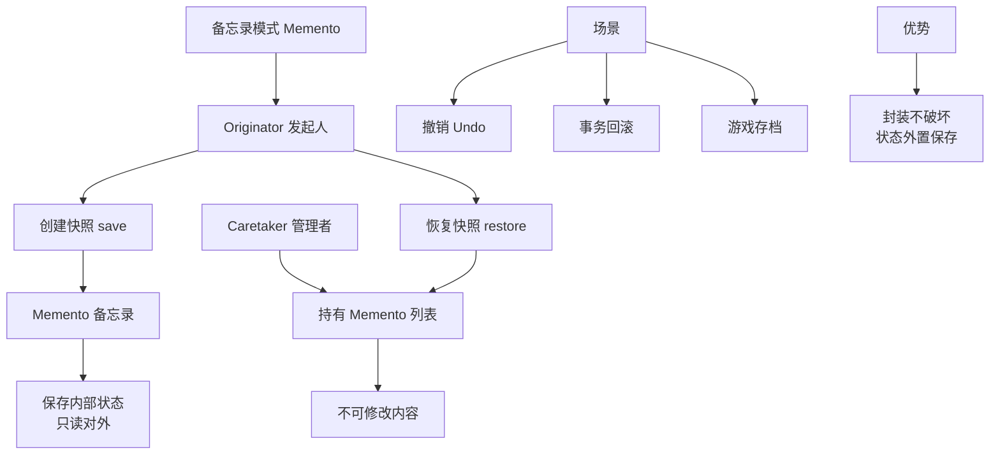

# 备忘录模式的原理是什么？

**备忘录模式（Memento Pattern）**是一种行为型设计模式，在不破坏封装性的前提下，捕获一个对象的内部状态，并在该对象之外保存这个状态，以便以后恢复。

## 定义
保存对象的某个状态，以便在适当的时候恢复。类似于"后悔药"功能。

## 架构图
```text
       +-------------+                  +-----------+
       | Caretaker   |                  |  Client   |
       | (管理者)    |                  |  (客户端) |
       +------+------+                  +-----+-----+
              |                               |
              | save/store                    | uses
              v                               v
       +------+-----------------------------+-------------+
       | Memento                              |             |
       | (备忘录 - 内部状态对外不可见)         |             |
       +-------------------------------------+-------------+
                                                      ^
                                                      | creates/uses
                                      +---------------+--------------+
                                      | Originator                 |
                                      | (发起人 - 状态拥有者)       |
                                      | + setState()               |
                                      | + saveToMemento(): Memento |
                                      | + restore(m: Memento)      |
                                      +---------------------------+
```

## 主要角色
| 角色 | 职责 |
|------|------|
| **Originator（发起人）** | 创建并存储当前状态的备忘录，也能从备忘录恢复状态 |
| **Memento（备忘录）** | 存储 Originator 的内部状态 |
| **Caretaker（管理者）** | 负责保存备忘录，但不能修改或查看其内容 |

## 代码示例
```java
// Memento — 存储状态（建议将类设为包级私有或内部类，仅对 Originator 可见）
class Memento {
    private String state;
    public Memento(String state) { this.state = state; }
    public String getState() { return state; }
}

// Originator — 发起人
public class TextEditor {
    private String content;

    public void write(String text) {
        this.content = text;
    }

    // 创建备忘录
    public Memento save() {
        return new Memento(content);
    }

    // 恢复备忘录
    public void restore(Memento memento) {
        this.content = memento.getState();
    }
    
    public String getContent() { return content; }
}

// Caretaker — 管理者（例如：历史记录管理器）
public class History {
    private Stack<Memento> history = new Stack<>();

    public void push(Memento memento) {
        history.push(memento);
    }

    public Memento pop() {
        return history.pop();
    }
}
```

### 实战案例
在**富文本编辑器**或**游戏存档**功能中，用户可能随时点击"撤销"。如果直接暴露内部对象状态给外部管理，会破坏封装性。使用备忘录模式，`Caretaker` 只负责持有快照，无需知道快照细节，完美实现了状态管理与业务逻辑的解耦。

### 代码片段（宽接口与窄接口）
```java
// 发起人类内部，实现对备忘录的宽接口访问（可读写）
public class Originator {
    // 内部类，确保只有 Originator 能访问其修改方法
    private static class MementoImpl implements Memento {
        private String state;
        public MementoImpl(String state) { this.state = state; }
        public String getState() { return state; }
        public void setState(String state) { this.state = state; }
    }
}
```


## 核心架构图



## 记忆要点

- 一句话定义：不破坏封装的前提下，捕获并外部保存对象内部状态以供恢复
- 核心三角色：发起人(创建/恢复)、备忘录(存状态)、管理者(仅持有不可改)
- 封装性体现：管理者只负责存取快照，完全不知道内部状态的具体细节
- 典型应用场景：文本编辑器的撤销(Ctrl+Z)、游戏存档与回档功能

## 结构化回答

**30 秒电梯演讲：** 在不破坏封装的前提下，保存并恢复对象内部状态。打个比方，像游戏存档，随时保存进度，读档回到原样。

**展开框架：**
1. **一句话定义** — 不破坏封装的前提下，捕获并外部保存对象内部状态以供恢复
2. **核心三角色** — 发起人(创建/恢复)、备忘录(存状态)、管理者(仅持有不可改)
3. **封装性体现** — 管理者只负责存取快照，完全不知道内部状态的具体细节

**收尾：** 我在项目里踩过坑——在富文本编辑器或游戏存档功能中，用户可能随时点击"撤销"。您想深入聊哪一段：原理、避坑还是对比选型？

## 视频脚本

> 预计时长：2 分钟 | 由浅入深

| 时间 | 画面/字幕 | 口播台词 | 讲解要点 |
|------|----------|----------|----------|
| 0:00 | 标题卡：备忘录模式的原理是什么 | "备忘录模式的原理是什么？一句话——像游戏存档，随时保存进度，读档回到原样。" | 开场钩子 |
| 0:40 | 概念动画/示意图 | "在不破坏封装的前提下，保存并恢复对象内部状态——像游戏存档，随时保存进度，读档回到原样" | 核心定义 |
| 1:20 | 一句话定义示意 | "不破坏封装的前提下，捕获并外部保存对象内部状态以供恢复" | 要点1 |
| 2:00 | 总结卡 | "记住这几条，面试不慌。下期讲进阶追问。" | 收尾 |
