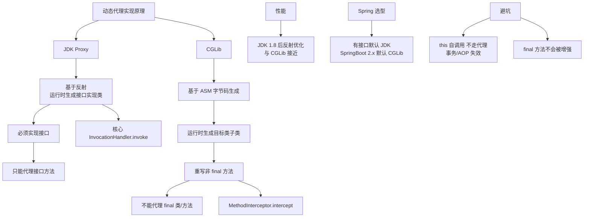

# 实现原理是什么？

### JDK 动态代理 vs CGLib 动态代理

#### 1. JDK 动态代理
*   **原理**：利用反射机制在运行时动态生成一个实现代理接口的匿名类。调用处理器 (`InvocationHandler`) 拦截方法调用。
*   **限制**：**必须实现一个或多个接口**。无法代理类。

#### 2. CGLib 动态代理
*   **原理**：基于 ASM 字节码操作框架。在运行时动态生成一个被代理类的**子类**，并重写父类的方法。
*   **限制**：因为是继承，所以**无法代理 final 修饰的类或方法**。

### 架构对比

**JDK 动态代理结构:**
```text
[Client] -> [Proxy Object (implements Interface)] 
                        |
                        | invoke()
                        v
               [InvocationHandler] 
                        |
                        | logic + method.invoke(target)
                        v
               [Target Object (implements Interface)]
```

**CGLib 动态代理结构:**
```text
[Client] -> [Proxy Subclass (extends Target)] 
                        |
                        | intercept() 
                        v
               [MethodInterceptor]
                        |
                        | logic + methodProxy.invokeSuper(target)
                        v
               [Target Object (Superclass)]
```

### Spring AOP 中的选择策略
Spring AOP 会根据目标对象是否实现接口自动选择代理方式：
1.  如果目标对象实现了接口，默认使用 **JDK 动态代理**。
2.  如果目标对象没有实现接口，必须使用 **CGLib 代理**。
3.  强制使用 CGLib：可以通过配置 `proxy-target-class="true"` 强制使用 CGLib（Spring Boot 2.x 后默认倾向 CGLib）。

### 代码示例（AOP 切面）
```java
@Aspect
public class TransactionDemo {
    // 定义切点：匹配 service 包下所有类的所有方法
    @Pointcut("execution(* com.yangxin.core.service.*.*(..))")
    public void point() {}

    @Before("point()")
    public void before() {
        System.out.println("transaction begin");
    }

    @AfterReturning("point()")
    public void after() {
        System.out.println("transaction commit");
    }

    @Around("point()")
    public Object around(ProceedingJoinPoint joinPoint) throws Throwable {
        System.out.println("transaction begin");
        Object result = joinPoint.proceed(); // 执行目标方法
        System.out.println("transaction commit");
        return result;
    }
}
```

### 实战案例
在**Spring 事务管理** (`@Transactional`) 中，如果是一个没有实现接口的 `@Service` 类，Spring 会自动使用 CGLib 代理。曾遇到一个坑：类内部方法自调用（`this.methodB()`）不会触发 AOP 代理逻辑，导致事务失效。解决方法是注入自身或使用 `AopContext.currentProxy()`。

### 代码片段（代理调用陷阱）
```java
@Service
public class OrderService {
    // 错误：内部调用，不走代理，事务失效
    public void createOrder() {
        this.saveOrder(); 
    }
    
    @Transactional
    public void saveOrder() { ... }
    
    // 正确：通过代理对象调用
    @Autowired
    private OrderService self; // 注入代理对象（需暴露代理）
    
    public void createOrderFixed() {
        self.saveOrder();
    }
}
```

### 性能与选型对比

| 特性 | JDK 动态代理 | CGLib 动态代理 |
| :--- | :--- | :--- |
| **实现原理** | 反射机制，实现接口 | 字节码生成 (ASM)，继承子类 |
| **代理目标** | 只能代理接口 | 代理类（不能是 final 类） |
| **JDK 8+ 性能** | 较高（JDK 8 对反射优化显著） | 略低（生成字节码耗时，执行较快） |
| **初始化速度** | 快 | 慢（需动态生成类） |
| **依赖** | JDK 原生支持 | 需引入 CGLib/ASM 库 |
| **常见限制** | 必须有接口 | 无法代理 private/final 方法 |


## 核心架构图


## 记忆要点

- JDK代理：利用反射生成接口实现类，核心是InvocationHandler，因为基于接口所以类必须实现接口
- CGLib代理：基于ASM生成子类重写方法，因为基于继承所以不能代理final类或方法
- 对比核心：JDK看接口，CGLib看子类，Spring Boot 2.x默认倾向CGLib
- 避坑指南：类内部方法自调用(如this.method())不走代理，会导致AOP或事务失效

## 结构化回答

**30 秒电梯演讲：** 通过生成子类字节码在运行期动态拦截方法。打个比方，JDK代理是找经纪人（接口），CGLib是直接生个替身儿子（子类）。

**展开框架：**
1. **JDK代理** — 利用反射生成接口实现类，核心是InvocationHandler，因为基于接口所以类必须实现接口
2. **CGLib代理** — 基于ASM生成子类重写方法，因为基于继承所以不能代理final类或方法
3. **对比核心** — JDK看接口，CGLib看子类，Spring Boot 2.x默认倾向CGLib

**收尾：** 我在项目里踩过坑——在Spring 事务管理 (`@Transactional`) 中，如果是一个没有实现接口的 `@Service` 类，Spring 会自动使用 CGLib 代理。您想深入聊哪一段：原理、避坑还是对比选型？

## 视频脚本

> 预计时长：3 分钟 | 由浅入深

| 时间 | 画面/字幕 | 口播台词 | 讲解要点 |
|------|----------|----------|----------|
| 0:00 | 标题卡：实现原理是什么 | "实现原理是什么？一句话——JDK代理是找经纪人（接口），CGLib是直接生个替身儿子（子类）。" | 开场钩子 |
| 0:45 | 概念动画/示意图 | "通过生成子类字节码在运行期动态拦截方法——JDK代理是找经纪人（接口），CGLib是直接生个替身儿子（子类）" | 核心定义 |
| 1:30 | JDK代理示意 | "利用反射生成接口实现类，核心是InvocationHandler，因为基于接口所以类必须实现接口" | 要点1 |
| 2:15 | CGLib代理示意 | "基于ASM生成子类重写方法，因为基于继承所以不能代理final类或方法" | 要点2 |
| 3:00 | 总结卡 | "记住这几条，面试不慌。下期讲进阶追问。" | 收尾 |
