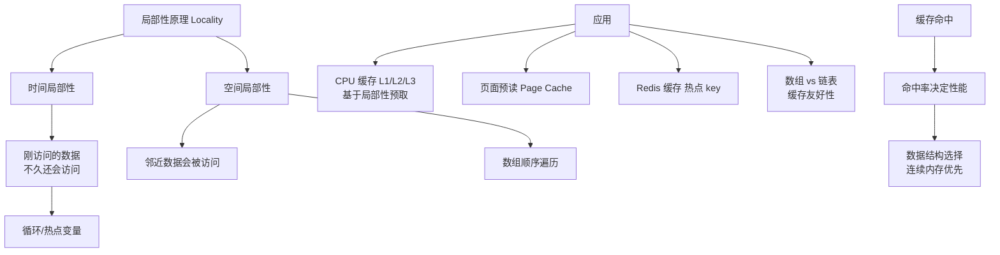

# 局部性原理是什么？

### 局部性原理

局部性原理是指程序在执行时呈现出的一种局部性规律，即在一个较短时间内，程序的执行仅局限于某个部分，或者所访问的存储空间也局限于某个区域。这一原理是计算机体系结构中 Cache、虚拟内存和预取技术设计的基础。

#### 1. 时间局部性
*   **定义**：如果一个信息项正在被访问，那么在近期它很可能还会被再次访问。
*   **原理**：程序中存在大量的循环（如 `for`、`while`）和迭代处理，指令和数据会被反复使用。
*   **典型场景**：循环计数器、频繁调用的函数代码、堆栈操作。
*   **优化**：利用时间局部性，可以将频繁访问的数据存放在高速缓存（Cache）中，利用 LRU（最近最少使用）算法替换冷数据，减少对主存的访问。

#### 2. 空间局部性
*   **定义**：如果一个存储位置被访问，那么其附近的位置（地址相邻）很可能也会被访问。
*   **原理**：数据结构（如数组、结构体）通常在内存中连续存放，指令在代码段中也是顺序存放（除跳转外）。
*   **典型场景**：数组遍历（顺序读取）、顺序执行代码指令。
*   **优化**：
    *   **磁盘预读**：操作系统从磁盘读取数据时，不仅读取目标扇区，还顺带读取相邻的几个扇区（页/块）。
    *   **Cache Line 预取**：CPU 读取主存数据时，会加载一个 Cache Line（通常是 64 字节），包含目标数据及其邻近数据。

#### 3. 原理图示

```text
CPU 访问模式示意：

时间维度: 
指令1(循环头) -> 指令2 -> 指令3 -> ... -> 指令1(再次访问)  <--- 体现了时间局部性

空间维度:
内存布局: [ Data A ] [ Data B ] [ Data C ] [ Data D ]
访问路径: 读取 A 之后，极大可能读取 B、C、D                <--- 体现了空间局部性
```

#### 4. 硬件/软件应用
*   **CPU Cache**：多级缓存（L1/L2/L3）利用局部性掩盖 CPU 和主存的速度差异。
*   **TLB（页表缓存）**：利用空间局部性缓存最近使用的页表项。
*   **预取器**：硬件预取器检测访问模式，提前将数据加载到 Cache。
*   **程序优化**：在编写代码时，遍历二维数组应按行遍历（C语言行优先存储），以利用空间局部性提高命中率。

### 实战案例
在大数据量的**矩阵乘法**运算中，如果按列遍历一个行优先存储的二维数组，会导致大量的 Cache Miss，性能可能下降 5-10 倍。解决方法是调整循环顺序或进行数组转置，确保内存访问是连续的，从而利用空间局部性大幅提升计算吞吐量。

### 代码片段（伪共享优化）
```java
// 利用空间局部性原理避免伪共享
// 通过字节填充，确保不同线程修改的变量位于不同的 Cache Line 中
public class LhsAdder {
    // volatile 保证可见性，加上 7 个 long 填充占位（64位机器 Cache Line 通常 64字节）
    volatile long value;
    protected long p1, p2, p3, p4, p5, p6, p7; 
}
```


## 核心架构图



## 记忆要点

- 核心定义：程序执行和内存访问在短时间内局限于某个局部区域
- 时间局部性：刚被访问的信息近期极可能再次访问（如循环变量、热点数据）
- 空间局部性：被访问地址的邻近区域极可能被访问（如连续数组遍历）
- 系统应用：因为局部性，所以CPU引入多级Cache，OS引入磁盘预读和页表缓存

## 结构化回答

**30 秒电梯演讲：** 程序执行倾向于集中在最近访问过的数据或位置。打个比方，就像看书，读完这页大概率读下页（空间），刚查的词可能马上再查（时间）。

**展开框架：**
1. **核心定义** — 程序执行和内存访问在短时间内局限于某个局部区域
2. **时间局部性** — 刚被访问的信息近期极可能再次访问（如循环变量、热点数据）
3. **空间局部性** — 被访问地址的邻近区域极可能被访问（如连续数组遍历）

**收尾：** 我在项目里踩过坑——在大数据量的矩阵乘法运算中，如果按列遍历一个行优先存储的二维数组，会导致大量的 Cache Miss，性能可能下降 5-10 倍。您想深入聊哪一段：原理、避坑还是对比选型？

## 视频脚本

> 预计时长：3 分钟 | 由浅入深

| 时间 | 画面/字幕 | 口播台词 | 讲解要点 |
|------|----------|----------|----------|
| 0:00 | 标题卡：局部性原理是什么 | "局部性原理是什么？一句话——就像看书，读完这页大概率读下页（空间），刚查的词可能马上再查（时间）。" | 开场钩子 |
| 0:45 | 概念动画/示意图 | "程序执行倾向于集中在最近访问过的数据或位置——就像看书，读完这页大概率读下页（空间），刚查的词可能马上再查（时间）" | 核心定义 |
| 1:30 | 核心定义示意 | "程序执行和内存访问在短时间内局限于某个局部区域" | 要点1 |
| 2:15 | 时间局部性示意 | "刚被访问的信息近期极可能再次访问（如循环变量、热点数据）" | 要点2 |
| 3:00 | 总结卡 | "记住这几条，面试不慌。下期讲进阶追问。" | 收尾 |
