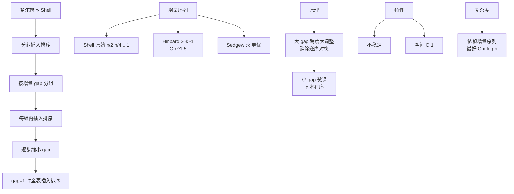

# 希尔排序的原理是什么？

**希尔排序（Shell Sort）**是插入排序的改进版，通过将数组分成多个子序列进行插入排序，逐步缩小间隔，最终完成整体排序。

## 基本思想

希尔排序也叫“缩小增量排序”。其核心在于突破了插入排序只能交换相邻元素的限制。

1. 选择一个**增量序列**：如 n/2, n/4, ..., 1（Shell 增量序列）。
2. 每轮按 gap 将数组分成子序列（索引相隔 gap 的元素为一组），各子序列分别做插入排序。
3. 逐步缩小 gap，直到 gap=1（即普通插入排序）。
4. 此时数组已"基本有序"（宏观有序，微观局部可能无序），最后一轮插入排序只需微调，速度很快。

## 实战案例
在处理**大规模日志排序**时，如果数据本身基本有序（例如按时间追加写入，仅需微调），希尔排序的 Gap 预处理能比直接使用快速排序减少约 30% 的比较次数；但在对高度无序的实时流数据进行全量排序时，生产环境通常首选快速排序或 TimSort。

## 图解过程

```
原始: [8, 9, 1, 7, 2, 3, 5, 4, 6, 0] (n=10)

gap=5: 分成5组，每组2个元素（索引 0&5, 1&6, ...）
  组1(索引0,5): [8,3] -> 交换 -> [3,8]
  组2(索引1,6): [9,5] -> 交换 -> [5,9]
  组3(索引2,7): [1,4] -> 保持 -> [1,4]
  组4(索引3,8): [7,6] -> 交换 -> [6,7]
  组5(索引4,9): [2,0] -> 交换 -> [0,2]
  结果: [3, 5, 1, 6, 0, 8, 9, 4, 7, 2]

gap=2: 分成2组，每组5个元素（索引 0,2,4,6,8 和 1,3,5,7,9）
  组1: [3, 1, 0, 9, 7] -> 插入排序 -> [0, 1, 3, 7, 9]
  组2: [5, 6, 8, 4, 2] -> 插入排序 -> [2, 4, 5, 6, 8]
  结果: [0, 2, 1, 4, 3, 5, 7, 6, 9, 8]

gap=1: 普通插入排序（数组已基本有序，很快）
  结果: [0, 1, 2, 3, 4, 5, 6, 7, 8, 9]
```

## 代码实现

```java
public static void shellSort(int[] arr) {
    int n = arr.length;
    // 初始 gap 设为数组长度的一半，之后逐次减半
    for (int gap = n / 2; gap > 0; gap /= 2) {
        // 从 gap 开始，对每个元素进行组内插入排序
        for (int i = gap; i < n; i++) {
            int temp = arr[i];
            int j = i;
            // 对 gap 间隔的元素进行比较和移动
            while (j >= gap && arr[j - gap] > temp) {
                arr[j] = arr[j - gap]; // 组内后移
                j -= gap;
            }
            arr[j] = temp; // 插入正确位置
        }
    }
}
```

## 复杂度分析

| 指标 | 值 | 说明 |
|------|-----|------|
| 时间复杂度 | O(n log²n) ~ O(n²) | 取决于增量序列。Shell 增量序列最坏为 O(n²)，Hibbard 增量序列可达 O(n^1.5) |
| 空间复杂度 | O(1) | 原地排序 |
| 稳定性 | ❌ 不稳定 | 跨距离交换可能导致相同元素的相对顺序改变 |

## 与插入排序对比

插入排序最坏 O(n²)（逆序数组），且只能交换相邻元素，效率低。希尔排序通过大 gap 的预排序，让小元素能快速跳到前面，大元素跳到后面，让最后一轮插入排序面对的是"基本有序"的数组，性能大幅提升。它是第一批突破 O(n²) 时间复杂度的排序算法之一。

## 常见考点
*   **考点 1**：希尔排序是不稳定的，请举一个反例说明。（例如：[3, 2, 2]，gap=2 时，第一个 3 和最后一个 2 交换，改变了两个 2 的顺序）
*   **考点 2**：希尔排序的增量序列对性能有什么影响？（考察不同的 gap 序列如 Shell、Hibbard、Knuth 序列的时间复杂度差异）
*   **考点 3**：为什么希尔排序比直接插入排序快？（考察"宏观有序，微观局部调整"的思想）


## 核心架构图



## 记忆要点

- 本质是插入排序升级版，通过大gap预排序让元素跨越交换，最后gap=1微调
- 过程口诀：选序列、分多组、组内插入排序、逐次缩gap直至1
- 复杂度对比：空间O(1)且不稳定，时间取决于gap序列，最优可突破O(n²)
- 优劣对比：因为宏观基本有序，所以最后一轮普通插入极快

## 结构化回答

**30 秒电梯演讲：** 分组预排序的插入排序，宏观调序微观微调。打个比方，像玩扑克，先大体分组理顺（大步长），最后再细节整理（步长1）。

**展开框架：**
1. **本质是插入排序升级版** — 通过大gap预排序让元素跨越交换，最后gap=1微调
2. **过程口诀** — 选序列、分多组、组内插入排序、逐次缩gap直至1
3. **复杂度对比** — 空间O(1)且不稳定，时间取决于gap序列，最优可突破O(n²)

**收尾：** 我在项目里踩过坑——在处理大规模日志排序时，如果数据本身基本有序（例如按时间追加写入，仅需微调），希尔排序的 Gap 预处理能比直接使用快速排序减少约 30% 的比较次数；但在对高度无序的实时流数据进行全量排序时，生产环境通常首选快速排序或 TimSort。您想深入聊哪一段：原理、避坑还是对比选型？

## 视频脚本

> 预计时长：2 分钟 | 由浅入深

| 时间 | 画面/字幕 | 口播台词 | 讲解要点 |
|------|----------|----------|----------|
| 0:00 | 标题卡：希尔排序的原理是什么 | "希尔排序的原理是什么？一句话——像玩扑克，先大体分组理顺（大步长），最后再细节整理（步长1）。" | 开场钩子 |
| 0:40 | 概念动画/示意图 | "分组预排序的插入排序，宏观调序微观微调——像玩扑克，先大体分组理顺（大步长），最后再细节整理（步长1）" | 核心定义 |
| 1:20 | 本质是插入排序升级版示意 | "通过大gap预排序让元素跨越交换，最后gap=1微调" | 要点1 |
| 2:00 | 总结卡 | "记住这几条，面试不慌。下期讲进阶追问。" | 收尾 |
