# 序列化（深clone一中实现）是什么？

### 深拷贝与序列化

#### 1. 深拷贝
深拷贝不仅复制对象本身，而且递归复制对象包含的引用指向的所有对象。修改副本不会影响原对象。

**实现方式一：重写 clone() 方法**
需要实现 `Cloneable` 接口，并在 `clone()` 方法中对引用类型的属性也调用 `clone()`。注意 `Object.clone()` 是 protected 的，需要提升访问权限。

```java
class Professor implements Cloneable {
    String name;
    public Object clone() {
        try { return super.clone(); } catch (Exception e) { return null; }
    }
}

class Student implements Cloneable {
    String name;
    Professor p; // 引用类型

    public Object clone() {
        Student o = null;
        try {
            o = (Student) super.clone(); // 浅拷贝：基本类型 name 已复制，引用 p 仅复制地址
            o.p = (Professor) p.clone();  // 深拷贝关键：单独拷贝引用对象
        } catch (CloneNotSupportedException e) {
            e.printStackTrace();
        }
        return o;
    }
}
```

#### 2. 利用序列化实现深拷贝
如果对象层级很深，手动 `clone` 会很麻烦且容易遗漏。可以将对象序列化为字节流（写入流），再反序列化（读回流），从而在内存中重建一个全新的对象。由于序列化是把整个对象图转成字节，反序列化时会在堆中重新分配内存，因此天然实现了深拷贝。

**前提**：对象及其所有引用的对象必须实现 `Serializable` 接口。`transient` 修饰的字段不会被复制。

```java
import java.io.*;

public class DeepCopyUtil {
    @SuppressWarnings("unchecked")
    public static  T deepCopy(T obj) throws IOException, ClassNotFoundException {
        // 1. 写入字节流（序列化）
        ByteArrayOutputStream bos = new ByteArrayOutputStream();
        ObjectOutputStream oos = new ObjectOutputStream(bos);
        oos.writeObject(obj);
        oos.flush();

        // 2. 从字节流读出（反序列化）
        // ByteArrayInputStream bis = new ByteArrayInputStream(bos.toByteArray());
        // ObjectInputStream ois = new ObjectInputStream(bis);
        // return (T) ois.readObject();
        
        // 简写：
        try (ObjectInputStream ois = new ObjectInputStream(new ByteArrayInputStream(bos.toByteArray()))) {
            return (T) ois.readObject();
        }
    }
}
```

#### 3. 序列化深拷贝原理图示

```text
内存堆
+---------------------+          序列化          +---------------------+
|  Original Object    |  --------(ObjectOutputStream)---->  |  Byte Stream (IO)   |
|  (ref -> SubObj)    |                       |
+---------------------+                       |
         ^                                    |
         |          反序列化                 |
         |    <------------|  +---------------------+
         |                 |  |
+---------------------+   v  v
|  Cloned Object      | <-------|
|  (new ref -> NewObj)|        |
+---------------------+ <------+
```

## 实战案例
在使用**Hibernate/JPA**缓存实体进行业务计算时，直接修改缓存实体可能会导致脏数据写入数据库。推荐在 Service 层入口使用序列化方式对 Entity 进行深拷贝，后续操作均在副本上进行，既隔离了风险，又避免了为所有复杂实体编写繁琐的 `clone()` 方法。注意：性能比内存拷贝低约 10-100 倍，仅适用于非高频路径。

## 方案对比

| 方式 | 优点 | 缺点 | 性能 | 适用场景 |
| :--- | :--- | :--- | :--- | :--- |
| **重写 clone()** | 速度快，无 IO 开销 | 代码侵入性强，深拷贝需层层覆盖 | 高 | 对象结构简单，对性能敏感 |
| **序列化** | 无需侵入代码，自动处理引用图 | 性能差，需实现 Serializable，transient 丢失 | 低 | 对象结构复杂，通用工具类 |

## 常见考点
*   **考点 1**：为什么说序列化是实现深拷贝的一种“偷懒”但有效的方式？（考察其图遍历机制）
*   **考点 2**：序列化深拷贝的性能瓶颈在哪里？（考察 IO 流操作和反射开销）
*   **考点 3**：如果对象中包含不可序列化的字段（如 Thread, Socket），如何实现深拷贝？（考察 transient 关键字或混合拷贝策略）


## 核心架构图

```mermaid
flowchart TD
    classDef start fill:#4CAF50,color:#fff
    classDef process fill:#2196F3,color:#fff
    classDef decision fill:#FF9800,color:#fff
    classDef special fill:#9C27B0,color:#fff
    classDef error fill:#f44336,color:#fff
    classDef info fill:#607D8B,color:#fff
    class A start
    class B process
    class B1 decision
    class B2 special
    class B3 error
    class B4 info
    class C start
    class C1 process
    class C2 decision
    class C3 special
    class Cloneable error
    class D info
    class D1 start
    class Deep process
    class E decision
    class F special
    class G error
    class H info
    class I start
    class J process
    class JSON decision
    class K special
    class Object error
    class Protobuf info
    class Reference start
    class Shallow process
    class br decision
    class clone special
    A[对象拷贝] --> B[浅拷贝 Shallow]
    A --> C[深拷贝 Deep]
    A --> D[引用拷贝 Reference]
    D --> D1[只复制引用<br/>指向同一对象]
    B --> B1[新建对象]
    B --> B2[基本类型复制值]
    B --> B3[引用类型复制引用<br/>共享内部对象]
    B --> B4["Object.clone 默认浅拷贝"]
    C --> C1[新建对象]
    C --> C2[递归拷贝所有引用对象]
    C --> C3[完全独立 互不影响]
    E[深拷贝实现] --> F[实现 Cloneable 递归 clone]
    E --> G[序列化/反序列化<br/>JSON/Protobuf]
    E --> H["拷贝构造器"]
    I[场景] --> J[不可变对象 配置快照]
    I --> K[事件回放]
```



## 记忆要点

- 核心思想口诀：先分后治再合，核心在于两个有序子序列的合并
- 性能数据：时间复杂度稳定在O(n log n)，空间复杂度为O(n)
- 特性对比：因为合并时元素相等不换位，所以它是稳定排序
- 适用场景：因需O(n)额外空间，常用于外部排序或对稳定性要求高的场景

## 结构化回答

**30 秒电梯演讲：** 通过序列化流彻底复制对象图。打个比方，把乐高模型拆了装箱发快递，收件人按图纸重拼出一个一模一样的。

**展开框架：**
1. **核心思想口诀** — 先分后治再合，核心在于两个有序子序列的合并
2. **性能数据** — 时间复杂度稳定在O(n log n)，空间复杂度为O(n)
3. **特性对比** — 因为合并时元素相等不换位，所以它是稳定排序

**收尾：** 我在项目里踩过坑——在使用Hibernate/JPA缓存实体进行业务计算时，直接修改缓存实体可能会导致脏数据写入数据库。您想深入聊哪一段：原理、避坑还是对比选型？

## 视频脚本

> 预计时长：3 分钟 | 由浅入深

| 时间 | 画面/字幕 | 口播台词 | 讲解要点 |
|------|----------|----------|----------|
| 0:00 | 标题卡：序列化（深clone一中实现）是什么 | "序列化（深clone一中实现）是什么？一句话——把乐高模型拆了装箱发快递，收件人按图纸重拼出一个一模一样的。" | 开场钩子 |
| 0:45 | 概念动画/示意图 | "通过序列化流彻底复制对象图——把乐高模型拆了装箱发快递，收件人按图纸重拼出一个一模一样的" | 核心定义 |
| 1:30 | 核心思想口诀示意 | "先分后治再合，核心在于两个有序子序列的合并" | 要点1 |
| 2:15 | 性能数据示意 | "时间复杂度稳定在O(n log n)，空间复杂度为O(n)" | 要点2 |
| 3:00 | 总结卡 | "记住这几条，面试不慌。下期讲进阶追问。" | 收尾 |
