# 快速排序的原理和最坏时间复杂度是什么？

### 快速排序

#### 基本原理
快速排序也采用**分治法**策略：
1.  **选基准**：从数列中取出一个元素作为基准值。
2.  **分区**：重新排序数列，所有比基准值小的元素摆放在基准前面，所有比基准值大的元素摆在基准后面。该操作结束后，基准值处于最终位置。
3.  **递归**：递归地把小于基准值元素的子数列和大于基准值元素的子数列排序。

#### 分区操作流程图

```text
初始状态 (key = 4):
[4, 7, 2, 9, 5, 3]
 L                 R

1. j从右找比4小的(3): [3, 7, 2, 9, 5, 4] (交换)
2. i从左找比4大的(7): [3, 4, 2, 9, 5, 7] (交换)
3. j从右找比4小的(2): [3, 2, 4, 9, 5, 7] (交换)
4. i从左找比4大的(9): 此时 i >= j，停止

分区结果:
左子序列 < 4 | 4 (基准) | 右子序列 > 4
[3, 2]       | [4]     | [9, 5, 7]
```

#### 代码实现

```java
public class QuickSort {
    public void sort(int[] a, int low, int high) {
        if (low >= high) return;
        
        int index = partition(a, low, high); // 获取基准值最终位置
        sort(a, low, index - 1);
        sort(a, index + 1, high);
    }

    private int partition(int[] a, int low, int high) {
        int key = a[low]; // 取第一个元素作为基准（优化：可随机选取或三数取中）
        int start = low;
        int end = high;

        while (end > start) {
            // 从后往前比较，找比key小的
            while (end > start && a[end] >= key) end--;
            // 从前往后比较，找比key大的
            while (end > start && a[start] <= key) start++;
            
            if (end > start) {
                // 交换两个不符合条件的值
                int temp = a[start];
                a[start] = a[end];
                a[end] = temp;
            }
        }
        // 此时 start == end，将基准值归位
        a[low] = a[start];
        a[start] = key;
        return start;
    }
}
```

## 实战案例
在**Java `Arrays.sort()`** 中，对于基本数据类型（int, double等）使用的是双轴快速排序，因为基本类型不涉及稳定性问题，追求极致速度；而对于对象类型使用的是 TimSort（归并排序的优化版），因为归并排序是稳定的，而快速排序是不稳定的。在处理包含大量重复元素的数组时，快排若不优化（如三路切分），效率会显著退化。

## 复杂度分析
*   **平均时间复杂度**：O(n log n)。
*   **最坏时间复杂度**：**O(n²)**。当数组已经是正序或逆序时，每次分区只能减少一个元素，递归树退化为链表，退化为冒泡排序。
*   **空间复杂度**：O(log n)（递归栈深度）。最坏情况 O(n)。
*   **稳定性**：**不稳定**。存在跨距离的交换。

## 常见考点
1.  **优化方案**：如何避免最坏情况？（**三数取中法**：取左端、右端、中点三个数的中位数作为基准；或随机选取基准）。
2.  **与堆排序对比**：都是 O(n log n)，但快排常数因子更小，实际运行更快；堆排序空间 O(1) 且最坏也是 O(n log n)。
3.  **Partition 实现**：除了挖坑填数，还可以用双指针交换法，熟悉如何写 Partition 函数是得分关键。
4.  **小数组优化**：当递归到小区间（如 length < 7）时，可切换为插入排序，减少递归开销。


## 核心架构图

```mermaid
flowchart TD
    classDef start fill:#4CAF50,color:#fff
    classDef process fill:#2196F3,color:#fff
    classDef decision fill:#FF9800,color:#fff
    classDef special fill:#9C27B0,color:#fff
    classDef error fill:#f44336,color:#fff
    classDef info fill:#607D8B,color:#fff
    class A start
    class Arrays process
    class B decision
    class C special
    class D error
    class E info
    class F start
    class G process
    class H decision
    class Hoare special
    class I error
    class J info
    class JDK start
    class K process
    class L decision
    class Lomuto special
    class M error
    class N info
    class O start
    class P process
    class Partition decision
    class Q special
    class Quick error
    class R info
    class S start
    class Sort process
    class Step1 decision
    class Step2 special
    class Step3 error
    class T info
    class U start
    class V process
    class br decision
    class log special
    class n error
    class pivot info
    class sort start
    A[快速排序 Quick Sort] --> B[分治策略]
    B --> C[Step1 选基准 pivot]
    B --> D["Step2 分区 Partition<br/>小左大右"]
    B --> E[Step3 递归处理左右子序列]
    F[基准选择] --> G[首元素/末元素]
    G --> H[三数取中 优化]
    G --> I[随机选择]
    J[分区方法] --> K[挖坑填数法 Hoare]
    J --> L[双指针交换法 Lomuto]
    M[复杂度] --> N["平均 O n log n<br/>空间 O log n 递归栈"]
    M --> O["最坏 O n²<br/>已排序+首元素 pivot"]
    P[特性] --> Q[不稳定排序]
    P --> R[常数因子小 实测最快]
    S[优化] --> T["小数组切插入排序 n<7"]
    S --> U[三路切分处理重复元素]
    S --> V["JDK Arrays.sort 双轴快排"]
```



## 记忆要点

- 核心三步曲：选基准、分区排列、递归调用左右子序列
- 最坏情况O(n²)：当数组完全正序或逆序时，递归树退化为链表
- 特性对比：平均效率极高但为不稳定排序，空间复杂度取决于递归深度为O(log n)
- 常考优化：三数取中选基准、小区间切换插入排序

## 结构化回答


**30 秒电梯演讲：** 整理书架，随便抽本书做标准，比它薄的放左边，厚的放右边，再分别整理左右两边。

**展开框架：**
1. **分治法策略** — 分治法策略（核心概念）
2. **通过基准值进** — 通过基准值进行分区
3. **平均O(n** — 平均O(n log n)

**收尾：** 这是我实战中的理解，您想深入哪一段？


## 视频脚本

> 预计时长：3 分钟 | 由浅入深

| 时间 | 画面/字幕 | 口播台词 | 讲解要点 |
|------|----------|----------|----------|
| 0:00 | 标题卡：快速排序的原理和最坏时间复杂度是什么 | "快速排序的原理和最坏时间复杂度是什么？一句话——整理书架，随便抽本书做标准，比它薄的放左边，厚的放右边，再分别整理左右两边。" | 开场钩子 |
| 0:45 | 概念动画/示意图 | "选基准值分区，小左大右递归排序——整理书架，随便抽本书做标准，比它薄的放左边，厚的放右边，再分别整理左右两边" | 核心定义 |
| 1:30 | 核心三步曲示意 | "选基准、分区排列、递归调用左右子序列" | 要点1 |
| 2:15 | 最坏情况O(n²)示意 | "当数组完全正序或逆序时，递归树退化为链表" | 要点2 |
| 3:00 | 总结卡 | "记住这几条，面试不慌。下期讲进阶追问。" | 收尾 |
