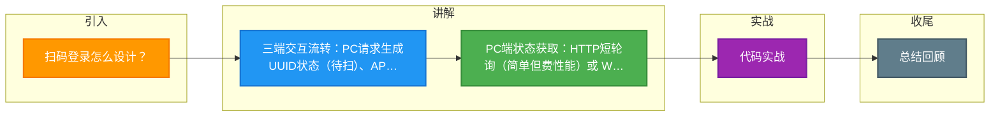

# 扫码登录怎么设计？

### 扫码登录设计

扫码登录是 Web 端与移动端配合的一种无密码认证方式，核心流程如下：

#### 核心角色
1.  **浏览器（PC端）**：显示二维码，维持轮询或长连接检测状态。
2.  **手机 APP（移动端）**：扫码确认身份。
3.  **服务端**：协调 Token 生成与状态流转，通常使用 Redis 存储临时状态。

#### 整体架构图

```text
   PC端浏览器               服务端                手机APP
      │                      │                      │
      │  1.请求二维码         │                      │
      ├─────────────────────>│                      │
      │                      │ 生成UUID, 状态=WAITING│
      │<─────────────────────┤ 返回二维码内容        │
      │ 显示二维码            │                      │
      │                      │                      │
      │  2.轮询状态(1s/次)    │                      │
      ├─────────────────────>│                      │
      │<─────────────────────┤ 状态: WAITING        │
      │                      │                      │
      │                      │  3.扫码确认           │
      │                      │<─────────────────────┤ (UUID + AuthToken)
      │                      │ 校验身份, 状态=SCANNED│
      │<─────────────────────┤ 状态: SCANNED (头像)  │
      │ 显示已扫描头像        │                      │
      │                      │                      │
      │                      │  4.用户点击确认       │
      │                      │<─────────────────────┤
      │                      │ 生成PC Token         │
      │                      │ 状态=CONFIRMED       │
      │<─────────────────────┤ 返回PC Token & 跳转   │
      │ 登录成功              │                      │
```

#### 详细流程
1.  **请求二维码**：
    *   PC 端向服务端请求登录二维码。
    *   服务端生成一个唯一的 `token_id`（或 UUID），将其状态设为"待扫描"（WAITING），存入 Redis 并设置过期时间（如 5 分钟）。
    *   服务端返回带 `token_id` 的二维码图片给 PC 端。

2.  **PC 端状态检测**：
    *   PC 端展示二维码后，通过 `token_id` 向服务端查询状态。
    *   **方式 A (HTTP 短轮询)**：每隔 1-2 秒请求一次，简单但 server 压力大，有延迟。
    *   **方式 B (WebSocket)**：建立长连接，服务端主动推送，实时性高，资源消耗低（推荐）。

3.  **手机扫码与确认**：
    *   用户打开 APP 扫描二维码，解析出 `token_id` 和服务端地址。
    *   APP 向服务端发送确认登录请求，携带 `token_id` 和手机端的登录凭证。
    *   **状态变更**：服务端校验 APP 身份合法后，将 `token_id` 状态更新为"已扫描/待确认"（SCANNED）。若用 WebSocket，此时推送 PC 端更新界面（显示头像）。
    *   用户点击手机上的"确认"按钮，APP 再次通知服务端。
    *   **状态变更**：服务端生成正式的 PC 端登录态（如 `pc_auth_token`），将状态更新为"已确认"（CONFIRMED）。

4.  **PC 端登录成功**：
    *   PC 端收到"已确认"状态及 `pc_auth_token`。
    *   PC 端存储 Token，跳转至登录成功页面。

#### 关键点
*   **安全性**：二维码需包含随机 Token，防重放；HTTPS 传输；Token 绑定设备信息。
*   **防刷**：限制 IP 请求频率。
*   **数据一致性**：高并发下 Redis 状态机变更需原子性操作。

#### ## 常见考点
1.  **轮询 vs 长连接**：为什么有些大厂还在用轮询？（兼容性更好，实现简单）。长连接的优势是什么？（实时性，节省服务器资源）。
2.  **二维码失效**：过期怎么处理？（PC 端轮询收到 Expired 状态，前端刷新二维码）。
3.  **状态机设计**：完整的状态流转包含哪些？（WAITING -> SCANNED -> CONFIRMED / EXPIRED / CANCELED）。
4.  **安全性**：如果二维码被截图发给别人怎么办？（通常扫码后会显示具体 APP 的头像和信息，防止盲扫；或者 Token 极短时间失效）。


## 核心流程图

```mermaid
sequenceDiagram
    classDef start fill:#4CAF50,color:#fff
    classDef process fill:#2196F3,color:#fff
    classDef decision fill:#FF9800,color:#fff
    classDef special fill:#9C27B0,color:#fff
    classDef error fill:#f44336,color:#fff
    classDef info fill:#607D8B,color:#fff
    class D start
    class PC process
    class S decision
    class TTL special
    class W error
    class as info
    class br start
    class uuid process
    autonumber
    participant W as Web浏览器 PC
    participant S as 服务端
    participant D as 手机APP
    W->>S: 1. 访问登录页 请求二维码
    S->>S: 2. 生成临时token(uuid) 存Redis<br/>状态:待扫描 TTL:5min
    S->>W: 3. 返回二维码图片 含token
    Note over W: 显示二维码 等待扫描
    D->>S: 4. APP扫描二维码 提交token+登录态
    S->>S: 5. 验证token 存APP的用户ID<br/>状态:已确认待登录
    S->>D: 6. 返回确认 提示授权登录
    D->>S: 7. 用户点击确认授权
    S->>S: 8. 生成PC端会话token<br/>状态:已登录
    Note over W,D: 轮询或WebSocket
    W->>S: 9. 轮询查token状态
    S->>W: 10. 返回登录成功+会话凭证
    W->>W: 11. 写Cookie 跳转主页
```
## 记忆要点

- 三端交互流转：PC请求生成UUID状态(待扫)、APP扫码改状态(已扫)、APP确认发Token(已确认)
- PC端状态获取：HTTP短轮询（简单但费性能）或 WebSocket长连接（实时推荐）
- 因为临时票据需自动过期且高频读写，所以用Redis保存状态机并设置过期时间
- 核心安全点：二维码绑定随机UUID防重放，服务端校验APP的授权Token

## 结构化回答

**30 秒电梯演讲：** 利用二维码作为Token令牌，手机端确认身份授权。打个比方，像开锁，PC端展示锁孔（二维码），手机拿着钥匙（身份）去拧一下。

**展开框架：**
1. **三端交互流转** — PC请求生成UUID状态(待扫)、APP扫码改状态(已扫)、APP确认发Token(已确认)
2. **PC端状态获取** — HTTP短轮询（简单但费性能）或 WebSocket长连接（实时推荐）
3. **用Redis保存状态机并设置过期时间** — 因为临时票据需自动过期且高频读写，所以用Redis保存状态机并设置过期时间。

**收尾：** 这三点都能配合实战聊。您想深入聊原理、对比还是避坑？

## 视频脚本

> 预计时长：3 分钟 | 由浅入深

| 时间 | 画面/字幕 | 口播台词 | 讲解要点 |
|------|----------|----------|----------|
| 0:00 | 标题卡：扫码登录怎么设计 | "扫码登录怎么设计？一句话——像开锁，PC端展示锁孔（二维码），手机拿着钥匙（身份）去拧一下。" | 开场钩子 |
| 0:45 | 概念动画/示意图 | "利用二维码作为Token令牌，手机端确认身份授权——像开锁，PC端展示锁孔（二维码），手机拿着钥匙（身份）去拧一下" | 核心定义 |
| 1:30 | 三端交互流转示意 | "PC请求生成UUID状态(待扫)、APP扫码改状态(已扫)、APP确认发Token(已确认)" | 要点1 |
| 2:15 | PC端状态获取示意 | "HTTP短轮询（简单但费性能）或 WebSocket长连接（实时推荐）" | 要点2 |
| 3:00 | 总结卡 | "记住这几条，面试不慌。下期讲进阶追问。" | 收尾 |

### 视频流程图



