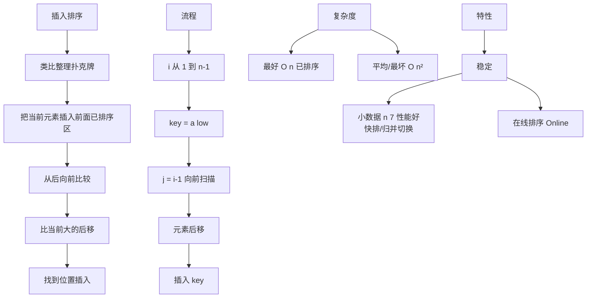

# 插入排序的原理和时间复杂度是什么？

### 插入排序

#### 基本原理
插入排序的工作方式像整理扑克牌。它将数组分为"已排序"和"未排序"两部分。初始时，第一个元素视为已排序。然后依次取出未排序部分的元素，在已排序序列中从后向前扫描，找到相应位置并插入。

#### 排序过程演示

```text
初始: [4, 2, 7, 1]

第1轮 (i=1, 插入2):
  已排序: [4], 取出2
  2 < 4, 4后移 -> [_, 4]
  插入2 -> [2, 4, 7, 1]

第2轮 (i=2, 插入7):
  已排序: [2, 4], 取出7
  7 > 4, 不需移动
  -> [2, 4, 7, 1]

第3轮 (i=3, 插入1):
  已排序: [2, 4, 7], 取出1
  1 < 7, 7后移 -> [2, 4, _, 7]
  1 < 4, 4后移 -> [2, _, 4, 7]
  1 < 2, 2后移 -> [_, 2, 4, 7]
  插入1 -> [1, 2, 4, 7]
```

#### 代码实现

```java
public void sort(int[] arr) {
    if (arr == null || arr.length < 2) return;
    // 从第二个元素开始，默认第一个元素已排序
    for (int i = 1; i < arr.length; i++) {
        int insertVal = arr[i]; // 待插入的元素（哨兵）
        int index = i - 1;      // 准备和前一个元素比较的位置

        // 如果插入的数比被插入的数小，则将前面的数后移
        // 边界条件：index >= 0 防止数组越界
        while (index >= 0 && insertVal < arr[index]) {
            arr[index + 1] = arr[index]; // 后移
            index--;
        }
        // 将插入的数放入合适位置 (index + 1)
        // 注意：即使没进入while循环，这里也是 self-assignment，不影响结果
        arr[index + 1] = insertVal;
    }
}
```

#### 复杂度分析
*   **时间复杂度**：
    *   **最坏情况**（逆序）：O(n²)。每次都要移动所有已排序元素，比较次数 1+2+...+(n-1) = n(n-1)/2。
    *   **最好情况**（已排序）：O(n)。内层循环条件始终不满足，只需遍历一次，无需移动。
    *   **平均情况**：O(n²)。
*   **空间复杂度**：O(1)。原地排序，仅使用常数个辅助变量。
*   **稳定性**：**稳定**排序。当 `insertVal == arr[index]` 时，循环停止，插入在相等元素之后，保持了相对顺序。
*   **适用场景**：数据量小、部分有序的数组效率很高。常作为高级排序算法（如快速排序、归并排序）的子过程，用于处理小规模数据。

#### ## 常见考点
1.  **相比冒泡/选择排序**：在基本有序时，插入排序效率极高（接近 O(n)），这是它独特的优势。
2.  **二分插入排序**：如何在查找插入位置时优化？（使用二分查找寻找位置，减少比较次数至 O(n log n)，但移动次数仍为 O(n²)）。
3.  **希尔排序**：插入排序的变种，通过引入增量将数组分组，先粗排再细排，突破 O(n²) 限制。
4.  **应用**：Java 的 `DualPivotQuicksort` 在处理小数组（长度 < 47）时会切换到插入排序。


## 核心架构图



## 记忆要点

- 核心口诀：分已排序和未排序两区，将未排序元素依次插入到已排序区的正确位置
- 性能对比：最好O(n)对基本有序数据极快，最坏和平均为O(n²)
- 特性结论：空间O(1)且为稳定排序，是高级算法处理小规模数据的利器

## 结构化回答

**30 秒电梯演讲：** 逐个取出元素插入已排序序列的适当位置。打个比方，斗地主理牌，摸一张牌，插到手里已有牌的合适位置。

**展开框架：**
1. **核心口诀** — 分已排序和未排序两区，将未排序元素依次插入到已排序区的正确位置
2. **性能对比** — 最好O(n)对基本有序数据极快，最坏和平均为O(n²)
3. **特性结论** — 空间O(1)且为稳定排序，是高级算法处理小规模数据的利器

**收尾：** 这三点都能配合实战聊。您想深入聊原理、对比还是避坑？

## 视频脚本

> 预计时长：3 分钟 | 由浅入深

| 时间 | 画面/字幕 | 口播台词 | 讲解要点 |
|------|----------|----------|----------|
| 0:00 | 标题卡：插入排序的原理和时间复杂度是什么 | "插入排序的原理和时间复杂度是什么？一句话——斗地主理牌，摸一张牌，插到手里已有牌的合适位置。" | 开场钩子 |
| 0:45 | 概念动画/示意图 | "逐个取出元素插入已排序序列的适当位置——斗地主理牌，摸一张牌，插到手里已有牌的合适位置" | 核心定义 |
| 1:30 | 核心口诀示意 | "分已排序和未排序两区，将未排序元素依次插入到已排序区的正确位置" | 要点1 |
| 2:15 | 性能对比示意 | "最好O(n)对基本有序数据极快，最坏和平均为O(n²)" | 要点2 |
| 3:00 | 总结卡 | "记住这几条，面试不慌。下期讲进阶追问。" | 收尾 |
