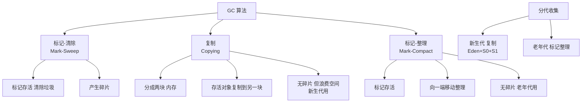
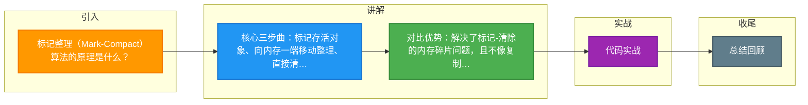

# 标记整理（Mark-Compact）算法的原理是什么？

### 标记-整理算法

#### 核心原理
标记-整理算法是 JVM 老年代常用的垃圾回收算法。它是标记-清除算法的改进版，主要解决了“标记-清除”算法产生的内存碎片问题。它的核心思想是将所有存活的对象向内存空间的一端移动（整理），然后直接清理掉端边界以外的内存。

#### 工作步骤
1. **标记**：
   - 从 GC Roots 开始遍历引用图，标记出所有存活的对象。
2. **整理**：
   - 将所有存活的对象向一端移动（通常向内存起始位置），使得存活对象在物理内存上是连续排列的。
3. **清除**：
   - 清理掉存活对象边界之外的所有内存区域（即清理掉端点后面的全部死对象）。

#### 内存状态变化 ASCII 流程图

```text
+-----------------------+          +-----------------------+          +-----------------------+
|        整理前         |   整理    |        整理中         |   清理    |        整理后         |
|-----------------------|  (移动)   |-----------------------|  (回收)   |-----------------------+
| [存活][死][存活][死] | --------> | [存活][存活]..[死][死]| --------> | [存活][存活].....[空]|
| [死][存活][死][存活] |          | ..[死][死][死][死]... |          | ........................|
+-----------------------+          +-----------------------+          +-----------------------+
``` 
*(注：.. 代表为了移动对象而产生的临时覆盖或空隙)*

#### 算法对比

| 算法 | 过程 | 内存碎片 | 效率 | 适用区域 | 移动对象 |
|------|------|----------|------|----------|----------|
| **标记-清除** | 标记→清除 | ❌ 有碎片 | 较快（不移动） | CMS老年代 | 否 |
| **复制** | 存活→复制到另一半→清空 | ✅ 无碎片 | 高（存活少时） | 新生代 | 是 |
| **标记-整理** | 标记→移动整理→清除 | ✅ 无碎片 | 较低（移动开销） | ⭐ 老年代 | 是 |

#### 优缺点
**优点**：
- **消除内存碎片**：对象紧凑排列，分配内存时只需移动指针，效率极高（Bump Pointer 算法）。
- **空间利用率高**：不像复制算法那样浪费 50% 的空间。

**缺点**：
- **性能开销大**：整理阶段需要更新所有存活对象的引用地址，如果存活对象多，这一步非常耗时。
- **STW 停顿较长**：由于涉及对象移动，通常需要完全暂停用户线程，不适合对低延迟要求极高的场景（这也是 CMS 最初选择标记-清除的原因）。

#### 适用场景
- **老年代**：对象存活率高，复制算法效率太低，标记-整理是折中选择。
- **Serial Old / Parallel Old** 收集器：关注吞吐量，允许较长时间的 STW。
- **G1 的 Mixed GC**：虽然 G1 主要是基于复制，但其回收后的空间也涉及整理概念。

---

### ## 常见考点

1. **为什么 CMS 采用标记-清除而不采用标记-整理？**
   - 因为 CMS 的设计目标是追求最短的回收停顿时间。标记-整理需要移动对象，移动对象必须暂停用户线程且耗时较长，这与 CMS 的目标背道而驰。

2. **标记-整理 vs 复制算法的权衡？**
   - 复制算法适合新生代（存活率低），只需复制少量对象；标记-整理适合老年代（存活率高），若用复制算法会浪费一半空间且复制大量对象。

3. **对象移动后，引用如何更新？**
   - JVM 中的“OopMap”或类似结构会记录对象引用关系，整理阶段 JVM 会修正所有指向旧位置的引用指针，使其指向新位置。


## 核心架构图



## 记忆要点

- 核心三步曲：标记存活对象、向内存一端移动整理、直接清理边界外的垃圾
- 对比优势：解决了标记-清除的内存碎片问题，且不像复制算法浪费一半空间
- 适用场景：因移动对象开销大，专用于存活率高的老年代（如Serial Old收集器）
- 劣势对比：因为整理过程需要修改引用且耗时，必须STW（停顿长）所以低延迟CMS不用它

## 结构化回答

**30 秒电梯演讲：** 标记存活后移动对象紧凑排列，消除内存碎片。打个比方，书架整理后，把所有留下的书挤到一端，腾出整块空地。

**展开框架：**
1. **核心三步曲** — 标记存活对象、向内存一端移动整理、直接清理边界外的垃圾
2. **对比优势** — 解决了标记-清除的内存碎片问题，且不像复制算法浪费一半空间
3. **适用场景** — 因移动对象开销大，专用于存活率高的老年代（如Serial Old收集器）

**收尾：** 这三点都能配合实战聊。您想深入聊原理、对比还是避坑？

## 视频脚本

> 预计时长：2 分钟 | 由浅入深

| 时间 | 画面/字幕 | 口播台词 | 讲解要点 |
|------|----------|----------|----------|
| 0:00 | 标题卡：标记整理（Mark-Compact）… | "标记整理（Mark-Compact）算法的原理是什么？一句话——书架整理后，把所有留下的书挤到一端，腾出整块空地。" | 开场钩子 |
| 0:40 | 概念动画/示意图 | "标记存活后移动对象紧凑排列，消除内存碎片——书架整理后，把所有留下的书挤到一端，腾出整块空地" | 核心定义 |
| 1:20 | 核心三步曲示意 | "标记存活对象、向内存一端移动整理、直接清理边界外的垃圾" | 要点1 |
| 2:00 | 总结卡 | "记住这几条，面试不慌。下期讲进阶追问。" | 收尾 |

### 视频流程图



