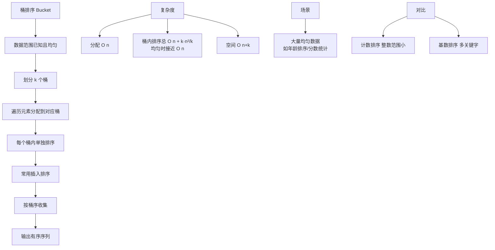

# 桶排序的原理和使用场景是什么？

### 桶排序

#### 基本原理
桶排序的核心思想是**分治法**。将待排序数组分到有限数量的桶里，每个桶再个别排序。桶排序是**稳定的排序算法**（取决于桶内排序算法是否稳定）。其时间复杂度取决于桶的数量和桶内排序的效率，理想情况下可达到 O(n)。

#### 算法流程 ASCII 图示

```text
原始数据: [29, 25, 3, 49, 9, 37, 21, 43]
范围: 0-49, 分5个桶 (每个桶范围10)

步骤1: 分桶 (映射函数 f(x) = x / 10)
+-----------------------+
| 桶0 (0-9)  | 桶1 (10-19)|
| [3, 9]     | []         |
|-----------------------|
| 桶2 (20-29)| 桶3 (30-39)|
| [25, 29, 21]| [37]     |
|-----------------------|
| 桶4 (40-49)|           |
| [49, 43]   |           |
+-----------------------+

步骤2: 桶内排序 (这里假设使用插入排序或快速排序)
桶0 -> [3, 9]
桶2 -> [21, 25, 29]
桶4 -> [43, 49]

步骤3: 合并输出
[3, 9] + [] + [21, 25, 29] + [37] + [43, 49]
结果: [3, 9, 21, 25, 29, 37, 43, 49]
```

#### 算法步骤详解
1. **确定范围**：遍历找出数组最大值 `max` 和最小值 `min`。
2. **创建桶**：确定桶的数量 `bucketCount`。通常策略为 `(max - min) / arr.length + 1` 或者自定义固定数量。初始化桶（通常用 `ArrayList<ArrayList<Integer>>`）。
3. **元素入桶**：遍历数组，通过映射函数计算索引。常用的映射逻辑是 `(num - min) / (单个桶的范围)`。
4. **桶内排序**：对每个非空桶进行排序。**优化点**：如果桶内元素少，通常使用插入排序；如果多，使用递归桶排序或快速排序。
5. **合并输出**：按顺序遍历所有桶，将桶内元素依次放回原数组。

#### 适用场景
- **数据分布均匀**：这是最理想的情况，能保证每个桶的数据量大致相同，时间复杂度接近 O(n)。
- **输入范围大但数据量较小**：避免了非比较排序（如计数排序）需要开辟极大辅助数组的问题。
- **外部排序**：当数据量太大无法全部加载到内存时，可以将数据分桶存储在文件中，针对每个文件分别排序后再合并。

#### 实战案例
- **海量数据 Top K**：曾处理 10 亿个用户 ID（32位整数）的排序，利用分桶策略将数据拆分到 1000 个小文件中，每个文件单独排序后再归并，极大降低了内存压力。
- **踩坑经验**：如果数据分布极端不均（如 99% 的数都在一个区间），桶排序会退化为 O(n^2)。曾遇到对小数排序时因浮点数精度问题导致映射索引计算错误，需用 `(int)((num - min) * count / range)` 替代除法规避。

#### 代码示例 (Java)
```java
// 桶内排序及合并逻辑补充
for (int i = 0; i < bucketCount; i++) {
    if (bucketArr.get(i).size() > 0) {
        // 桶内使用 Collections.sort (TimSort) 或插入排序
        Collections.sort(bucketArr.get(i));
        
        // 将排序后的桶写回原数组
        for (Integer val : bucketArr.get(i)) {
            arr[index++] = val;
        }
    }
}
```

#### 对比表格：桶排序 vs 计数排序 vs 基数排序
| 特性 | 桶排序 | 计数排序 | 基数排序 |
| :--- | :--- | :--- | :--- |
| **核心思想** | 分桶 + 桶内独立排序 | 统计元素频次 + 前缀和 | 分配 + 收集 (按位/关键字) |
| **数据要求** | 最好数据分布均匀 | 必须是整数且范围较小 | 数据可以表示为整数或字符串 |
| **空间复杂度** | O(n + k) (k为桶数) | O(k) (k为数据范围) | O(n + k) (k为基数/桶数) |
| **稳定性** | 稳定 (取决于桶内算法) | 稳定 | 稳定 |
| **典型场景** | 外部排序、浮点数排序 | 年龄分桶、成绩统计 | 电话号码排序、字符串字典序 |


## 核心架构图


## 核心知识点图


## 记忆要点

- 核心思想是分治：元素均匀分桶、桶内独立排序、按序合并输出。
- 时间复杂度：因数据分布均匀，所以理想可达 O(n)；因倾斜退化为链表，所以最差 O(n^2)。
- 适用场景对比：数据分布均匀用桶排，范围小整数用计数排，海量数据可做外部排序。
- 计算映射索引极易踩坑：因为浮点除法有精度损失，所以推荐转为乘法计算。

## 结构化回答

**30 秒电梯演讲：** 分桶归类，桶内排序，最后合并。打个比方，把一堆乱牌按花色分到几个篮子里，每个篮子理好再倒出来。

**展开框架：**
1. **核心思想是分治** — 元素均匀分桶、桶内独立排序、按序合并输出。
2. **时间复杂度** — 因数据分布均匀，所以理想可达 O(n)；因倾斜退化为链表，所以最差 O(n^2)。
3. **适用场景对比** — 数据分布均匀用桶排，范围小整数用计数排，海量数据可做外部排序。

**收尾：** 我在项目里踩过坑——海量数据 Top K：曾处理 10 亿个用户 ID（32位整数）的排序，利用分桶策略将数据拆分到 1000 个小文件中，每个文件单独排序后再归并，极大降低了内存压力。您想深入聊哪一段：原理、避坑还是对比选型？

## 视频脚本

> 预计时长：3 分钟 | 由浅入深

| 时间 | 画面/字幕 | 口播台词 | 讲解要点 |
|------|----------|----------|----------|
| 0:00 | 标题卡：桶排序的原理和使用场景是什么 | "桶排序的原理和使用场景是什么？一句话——把一堆乱牌按花色分到几个篮子里，每个篮子理好再倒出来。" | 开场钩子 |
| 0:45 | 概念动画/示意图 | "分桶归类，桶内排序，最后合并——把一堆乱牌按花色分到几个篮子里，每个篮子理好再倒出来" | 核心定义 |
| 1:30 | 核心思想是分治示意 | "元素均匀分桶、桶内独立排序、按序合并输出。" | 要点1 |
| 2:15 | 时间复杂度示意 | "因数据分布均匀，所以理想可达 O(n)；因倾斜退化为链表，所以最差 O(n^2)。" | 要点2 |
| 3:00 | 总结卡 | "记住这几条，面试不慌。下期讲进阶追问。" | 收尾 |
