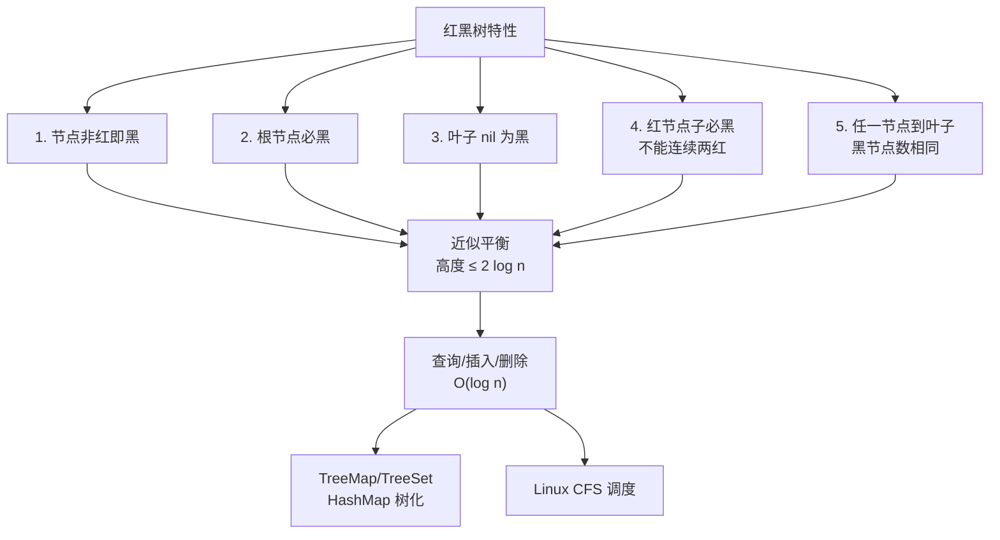

# 红黑树的特性是什么？它在Java中的哪些地方被使用？

### 红黑树

#### 定义
红黑树是一种自平衡二叉查找树。它通过在节点上增加颜色位（Red/Black）和满足特定的 5 条规则，确保**从根节点到叶子的最长路径不会超过最短路径的 2 倍**，从而保证近似平衡，避免了普通二叉搜索树退化为链表的最差情况。

#### 五大特性
1. **节点颜色**：每个节点不是红色就是黑色。
2. **根节点**：根节点必须是黑色。
3. **叶节点（NIL）**：所有叶子节点（NIL 空节点，通常是哨兵节点）都是黑色。
4. **红色限制**：如果一个节点是红色的，则它的两个子节点必须是黑色的（即**不能出现连续的两个红节点**）。
5. **黑高一致**：从任一节点到其每个叶子的所有简单路径都包含相同数目的黑色节点。

#### 核心操作：旋转与变色
当插入或删除节点破坏上述规则时，通过**左旋**、**右旋**和**变色**来恢复平衡。

**1. 左旋**：
```text
      P                        P
      |                        |
      S              ->        D
     / \                      / \
    L   D                    S   R3
       / \                  / \
      R1 R2                L   R1
                          |
                          R2
*(S 绕 D 向左旋转，D 成为新的子树根)*
```

**2. 右旋**：左旋的镜像操作。

**3. 变色**：将红节点变黑，或黑节点变红，通常配合旋转使用。

#### Java 中的应用

1. **java.util.TreeMap**：
   - 底层完全依赖红黑树实现 Key-Value 的有序存储。所有操作（put, get, remove）时间复杂度为 O(logN)。

2. **java.util.TreeSet**：
   - 内部封装了一个 `TreeMap`，Value 是一个固定的 `PRESENT` 对象。

3. **java.util.HashMap (JDK 1.8+)**：
   - **转换条件**：当桶中的链表长度超过 **8** 且数组长度（容量）超过 **64** 时，该链表会转换为红黑树。
   - **退化条件**：当红黑树节点数量减少到 **6** 时，会退化为链表。
   - **目的**：解决哈希冲突严重时，链表查询效率 O(n) 过低的问题，提升到 O(logN)。

4. **java.util.concurrent.ConcurrentHashMap (JDK 1.8+)**：
   - 同样在链表过长（>8）时转换为红黑树，实现高并发下的高效读写。

5. **java.util.PriorityQueue**：
   - *注意*：PriorityQueue 使用的是**二叉堆**（小顶堆），不是红黑树。不要混淆。

#### 实战案例
- **超时排查**：在高并发电商系统中，曾因 HashMap 的 Key 计算哈希值分布极不均匀，导致大量数据落入同一个桶，链表过长，查询操作从 O(1) 退化到 O(n)，引发 CPU 飙升和响应超时。JDK 1.8 升级后红黑树机制自动缓解了此问题。
- **踩坑经验**：不要依赖 TreeMap 进行并发读写。由于它不是线程安全的，在多线程环境下直接使用会导致数据结构破坏甚至死循环（在 JDK 7 以前的 HashMap 中常见，TreeMap 操作复杂更易出错），并发场景请使用 `ConcurrentSkipListMap` 或加锁。

#### 代码示例 (红黑树插入变色逻辑简化版)
```java
// 伪代码：Java HashMap.TreeNode putVal 中的平衡操作逻辑
// 插入节点默认为红色
if (parent == null) {
    root = x; // x 为新节点
    x.color = BLACK; // 根节点必须为黑
} else {
    x.red = true; // 新节点默认红色
    // 如果父节点是红色，则违反特性4，需要修复
    while (x != null && x != root && x.parent.color == RED) {
        if (parentOf(x) == leftOf(parentOf(parentOf(x)))) {
            // 叔叔节点逻辑...
            // 情况1：叔叔是红色 -> 变色
            // 情况2：叔叔是黑色 -> 旋转
        } else {
            // 对称逻辑
        }
    }
    root.color = BLACK; // 确保根节点黑色
}
```

#### 对比表格：红黑树 vs AVL 树
| 维度 | 红黑树 | AVL 树 |
| :--- | :--- | :--- |
| **平衡度** | 近似平衡 (最长路径 <= 2 * 最短路径) | 严格平衡 (高度差 <= 1) |
| **查找性能** | O(logN)，常数因子略大 | O(logN)，常数因子较小，查找更快 |
| **插入/删除** | 最多 2 次旋转 (O(logN)) | 最多 logN 次旋转，维护成本高 |
| **应用场景** | 广泛用于语言库 (HashMap, TreeMap, C++ STL) | 读多写少场景 (如数据库索引) |
| **实现复杂度** | 相对复杂 (逻辑分支多) | 相对简单 |

### 常见考点
1. **为什么 HashMap 链表转红黑树的阈值是 8？**
   - 理想情况下，哈希分布服从泊松分布。根据泊松分布计算，链表长度达到 8 的概率极低（约 0.00000006），只有当哈希冲突非常严重（Hash 算法设计糟糕或恶意攻击）时才会触发。这是一个**权衡**的选择，避免在正常情况下维护红黑树的开销。

2. **红黑树如何保证查找效率？**
   - 通过黑高规则，保证树的最大深度为 `2 * log(n+1)`，所以查找操作的时间复杂度稳定在 O(logN)。


## 核心架构图


## 记忆要点

- 红黑树是自平衡二叉查找树，保证最长路径不超过最短路径的2倍。
- 五大特性口诀：根黑叶黑(NIL)，红不连续，黑高一致。
- 修复手段：破坏规则时，通过左旋、右旋和变色来恢复平衡。
- Java 应用重点：JDK 1.8 中 HashMap 链表大于 8 且数组大于 64 转红黑树，小于等于 6 退化为链表。
- 对比 AVL 树：红黑树非严格平衡所以增删最多2次旋转，常用于写多场景。

## 结构化回答

**30 秒电梯演讲：** 通过颜色规则和旋转保持平衡的二叉查找树。打个比方，一种特殊的家谱树，通过规则保证任一分支都不会比其他分支长太多。

**展开框架：**
1. **红黑树是自平衡二叉查找树** — 保证最长路径不超过最短路径的2倍。
2. **五大特性口诀** — 根黑叶黑(NIL)，红不连续，黑高一致。
3. **修复手段** — 破坏规则时，通过左旋、右旋和变色来恢复平衡。

**收尾：** 我在项目里踩过坑——超时排查：在高并发电商系统中，曾因 HashMap 的 Key 计算哈希值分布极不均匀，导致大量数据落入同一个桶，链表过长，查询操作从 O(1) 退化到 O(n)，引发 CPU 飙升和响应超时。您想深入聊哪一段：原理、避坑还是对比选型？

## 视频脚本

> 预计时长：3 分钟 | 由浅入深

| 时间 | 画面/字幕 | 口播台词 | 讲解要点 |
|------|----------|----------|----------|
| 0:00 | 标题卡：红黑树的特性是什么？它在Java中的… | "红黑树的特性是什么？它在Java中的哪些地方被使用？一句话——一种特殊的家谱树，通过规则保证任一分支都不会比其他分支长太多。" | 开场钩子 |
| 0:45 | 概念动画/示意图 | "通过颜色规则和旋转保持平衡的二叉查找树——一种特殊的家谱树，通过规则保证任一分支都不会比其他分支长太多" | 核心定义 |
| 1:30 | 红黑树是自平衡二叉查找树示意 | "保证最长路径不超过最短路径的2倍。" | 要点1 |
| 2:15 | 五大特性口诀示意 | "根黑叶黑(NIL)，红不连续，黑高一致。" | 要点2 |
| 3:00 | 总结卡 | "记住这几条，面试不慌。下期讲进阶追问。" | 收尾 |
