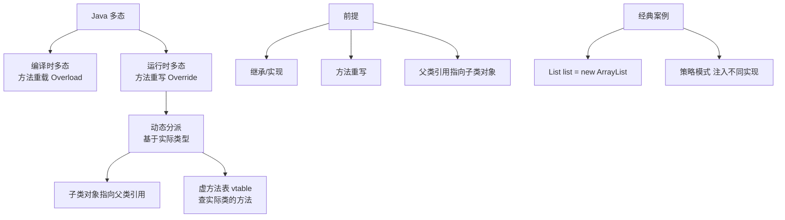

# 编译时多态和运行时多态的区别？

### 编译时多态 vs 运行时多态

#### 1. 编译时多态（静态多态）
- **定义**：在编译阶段，编译器根据参数的类型和数量（方法签名）确定具体调用哪个方法。
- **实现机制**：**方法重载**。
- **特点**：
  - 绑定发生在编译期（早期绑定）。
  - 不涉及运行期对象的实际类型。
  - 仅对同一个类内的多个同名方法有效。

#### 2. 运行时多态（动态多态）
- **定义**：在程序运行时，根据堆内存中对象的实际类型来决定调用哪个方法。
- **实现机制**：**方法重写** + **向上转型** + **动态调用**。
- **实现原理**：
  - Java 对象在内存中包含一个指向**方法表** 的指针。
  - 方法表中存储了该类实际声明的所有方法。
  - 调用非静态、非 final 方法时，JVM 会在运行时通过查找方法表来确定执行父类还是子类的方法。
- **特点**：
  - 绑定发生在运行期（晚期绑定）。
  - 必须满足三个条件：继承、重写、父类引用指向子类对象。

#### 调用流程 ASCII 图

```text
代码: Animal a = new Dog(); a.makeSound();

编译阶段:              运行阶段:
+----------------+      +-----------------------------+
|  变量 a (引用)  | ---> |  堆内存对象 (Dog 实例)       |
|  类型: Animal   |      +-----------------------------+
+----------------+      | Class: Dog                  |
                         | - 方法表:                     |
                         |   makeSound() { ...bark... } |
                         +-----------------------------+
                           
                           调用逻辑: a.makeSound()
                           1. 编译器检查 Animal 类有 makeSound() (通过)
                           2. JVM 运行时发现实际对象是 Dog
                           3. 查 Dog 的方法表
                           4. 执行 Dog.makeSound()
```

#### 3. 代码示例

```java
// --- 场景一：编译时多态（方法重载）---
class Calculator {
    public int add(int a, int b) {
        return a + b;
    }
    // 方法名相同，参数列表不同（重载）
    public double add(double a, double b) {
        return a + b;
    }
}

// --- 场景二：运行时多态（方法重写）---
class Animal {
    public void makeSound() {
        System.out.println("Animal makes sound");
    }
}

class Dog extends Animal {
    @Override
    public void makeSound() {
        System.out.println("Dog barks"); // 重写父类方法
    }
}

public class PolymorphismDemo {
    public static void main(String[] args) {
        // 编译时多态演示
        Calculator calc = new Calculator();
        // 编译器在编译时根据参数类型 (2, 3) 绑定到 add(int, int)
        System.out.println(calc.add(2, 3)); 

        // 运行时多态演示
        Animal myPet = new Dog();
        // 编译时检查 Animal 类有 makeSound
        // 运行时执行 Dog 类的 makeSound
        myPet.makeSound(); 
        
        // --- 实战坑点：重载中的类型提升 ---
        method(null); // 输出 "Object" 还是 "String"?
    }
    
    public static void method(String s) {
        System.out.println("String");
    }
    
    public static method(Object o) {
        System.out.println("Object");
    }
}
```

#### 实战案例
- **代码重构陷阱**：在重构父类代码时，曾将一个 `public void execute(Task task)` 方法重载为 `public void execute(Task task, Config config)`。结果系统中原有的 `execute(null)` 调用因为模糊匹配（匹配到更具体的 Object 类型或编译报错）导致了 NPE 或编译错误。**教训**：尽量避免重载，或者重载方法参数数量必须不同，不要仅依赖类型。
- **性能调优**：在极度性能敏感的循环中（如高频交易），发现虚方法调用（运行时多态）的开销比直接方法调用略高（虽然 JVM 会内联优化，但在未预热阶段存在开销）。曾通过将核心热路径代码改为 `final` 或静态方法来强制编译时绑定，降低了微秒级的延迟。

#### 对比表格：编译时多态 vs 运行时多态
| 特性 | 编译时多态 (静态) | 运行时多态 (动态) |
| :--- | :--- | :--- |
| **实现方式** | 方法重载 | 方法重写 (继承) |
| **绑定时机** | 编译期 | 运行期 |
| **实现机制** | 静态绑定 (符号引用解析) | 动态分派 (虚方法表 vtable) |
| **性能** | 极高 (直接调用) | 较高 (有查表开销，JIT 可内联优化) |
| **灵活性** | 低 (类型需在编译期确定) | 高 (可动态扩展子类) |
| **常见坑点** | 自动装箱与重载混淆 | 只有非 private/非 final/static 方法才生效 |


## 核心架构图



## 记忆要点

- 编译时多态靠重载：因为编译期看参数类型，所以叫静态绑定。
- 运行时多态靠重写：因为运行期看实际对象，所以叫动态绑定。
- 多态触发条件口诀：继承、重写、父类引用指向子类对象。
- 动态调用原理：JVM 运行时通过查找堆内存对象的方法表，执行实际子类的方法。

## 结构化回答

**30 秒电梯演讲：** 编译时看参数类型定方法，运行时看实际对象定方法。打个比方，编译时多态是根据菜单点菜（参数），运行时多态是服务员按你实际身份上菜（对象类型）。

**展开框架：**
1. **编译时多态靠重载** — 因为编译期看参数类型，所以叫静态绑定。
2. **运行时多态靠重写** — 因为运行期看实际对象，所以叫动态绑定。
3. **多态触发条件口诀** — 继承、重写、父类引用指向子类对象。

**收尾：** 我在项目里踩过坑——性能调优：在极度性能敏感的循环中（如高频交易），发现虚方法调用（运行时多态）的开销比直接方法调用略高（虽然 JVM 会内联优化，但在未预热阶段存在开销）。您想深入聊哪一段：原理、避坑还是对比选型？

## 视频脚本

> 预计时长：3 分钟 | 由浅入深

| 时间 | 画面/字幕 | 口播台词 | 讲解要点 |
|------|----------|----------|----------|
| 0:00 | 标题卡：编译时多态和运行时多态的区别 | "编译时多态和运行时多态的区别？一句话——编译时多态是根据菜单点菜（参数），运行时多态是服务员按你实际身份上菜（对象类型）。" | 开场钩子 |
| 0:45 | 概念动画/示意图 | "编译时看参数类型定方法，运行时看实际对象定方法——编译时多态是根据菜单点菜（参数），运行时多态是服务员按你实际身份上菜（对象类型）" | 核心定义 |
| 1:30 | 编译时多态靠重载示意 | "因为编译期看参数类型，所以叫静态绑定。" | 要点1 |
| 2:15 | 运行时多态靠重写示意 | "因为运行期看实际对象，所以叫动态绑定。" | 要点2 |
| 3:00 | 总结卡 | "记住这几条，面试不慌。下期讲进阶追问。" | 收尾 |
