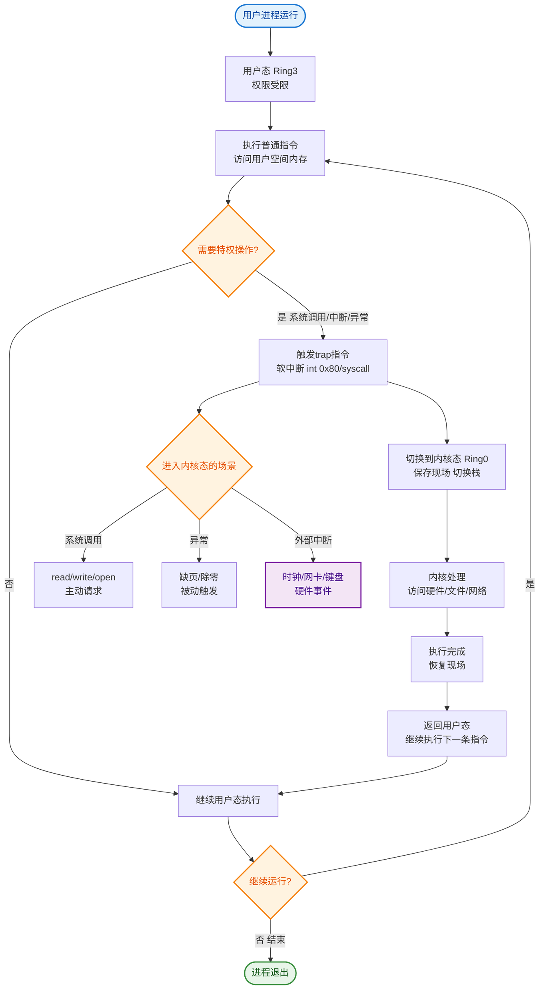
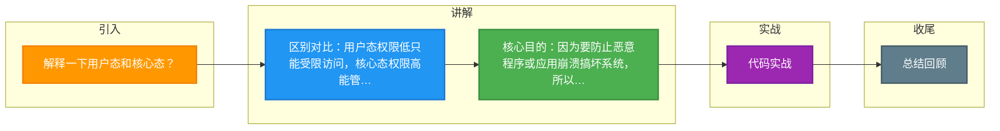

# 解释一下用户态和核心态？

**用户态和核心态**

### 基本概念
现代操作系统的内存空间被划分为内核空间和用户空间，对应的 CPU 执行状态分为**核心态**和**用户态**。

- **用户态**：
  - 应用程序运行的状态。
  - 权限较低，只能访问受限的资源，不能直接访问内存或硬件设备。
  - 如果需要访问系统资源（如读写文件、网络通信），必须通过“系统调用”切换到核心态。

- **核心态**：
  - 操作系统内核运行的状态。
  - 拥有最高权限，可以执行 CPU 的所有指令，访问所有内存和硬件资源。
  - 主要负责管理硬件、分配资源、处理中断等。

### 为什么需要区分？
1. **保护系统安全**：防止应用程序崩溃或恶意代码破坏操作系统或访问其他进程的数据。
2. **稳定性**：隔离用户程序和底层硬件，避免用户程序错误导致系统宕机。
3. **资源管理**：由操作系统统一调度资源，公平高效。

### 切换方式
用户态切换到核心态主要通过以下三种途径：
1. **系统调用**：用户程序主动请求操作系统服务（如 read, open）。
2. **异常**：程序运行出错（如除零错误、缺页异常）。
3. **外围设备中断**：硬件设备完成任务（如网卡收到数据包）向 CPU 发送信号。

### 切换流程图
```text
┌──────────────┐   系统调用/异常/中断   ┌──────────────┐
│   用户态      │ ────────────────────> │   核心态      │
│ (User Mode)  │                        │(Kernel Mode) │
│              │ <──────────────────── │              │
│              │     执行完/处理完      │              │
└──────────────┘                        └──────────────┘
```

### 性能损耗
- **开销**：态切换不是免费的，需要保存用户上下文（寄存器、程序计数器等）并加载内核上下文。
- **优化方向**：减少系统调用次数（如批量 IO、用户态驱动、零拷贝技术）。

### 实战案例：高性能网络编程中的上下文切换陷阱
在即时通讯（IM）场景中，若使用传统的阻塞式 IO（每个连接一个线程），并发连接上万时，CPU 大量时间损耗在用户态与核心态的切换以及线程上下文切换上，导致系统吞吐量骤降。采用 Netty（基于 Java NIO 的 epoll）可以利用 IO 多路复用，仅在数据真正就绪时触发中断切换，大幅减少无效的态切换。

### 代码示例：系统调用的开销模拟（C语言）
```c
#include <unistd.h>
#include <sys/syscall.h>

// 高频系统调用（ getpid() 需要陷入内核态）
void heavy_syscall() {
    for (int i = 0; i < 1000000; i++) {
        getpid(); // 触发用户态 -> 核心态切换
    }
}

// 纯用户态计算（无上下文切换）
void pure_user_calc() {
    int i = 0;
    for (int i = 0; i < 1000000; i++) {
        i++; // 仅在用户态寄存器操作
    }
}
```

---

## 常见考点
1. **系统调用的过程**：用户态陷入内核态的具体步骤（软中断/陷阱指令 -> 保存现场 -> 执行内核代码 -> 恢复现场）。
2. **哪些操作需要内核态**：IO 操作、进程管理、内存管理、网络通信等。
3. **零拷贝与上下文切换**：为什么 mmap 和 sendfile 能减少上下文切换次数？


## 核心流程图


## 记忆要点

- 区别对比：用户态权限低只能受限访问，核心态权限高能管硬件和所有内存。
- 核心目的：因为要防止恶意程序或应用崩溃搞坏系统，所以必须做权限隔离。
- 切换途径只有三种：系统调用、异常、外围设备中断。
- 性能损耗：因为切换需保存恢复上下文，所以高频系统调用极耗性能。
- 高频考点：传统 BIO 性能差是因为频繁上下文切换，IO多路复用(如epoll)可大幅减少切换。

## 结构化回答

**30 秒电梯演讲：** CPU的两种运行模式，限制应用直接操作底层硬件。打个比方，用户态是只能点餐的顾客，核心态是能进后厨操作的经理。

**展开框架：**
1. **区别对比** — 用户态权限低只能受限访问，核心态权限高能管硬件和所有内存。
2. **核心目的** — 因为要防止恶意程序或应用崩溃搞坏系统，所以必须做权限隔离。
3. **切换途径只有三种** — 系统调用、异常、外围设备中断。

**收尾：** 我在项目里踩过坑——实战案例：高性能网络编程中的上下文切换陷阱。您想深入聊哪一段：原理、避坑还是对比选型？

## 视频脚本

> 预计时长：3 分钟 | 由浅入深

| 时间 | 画面/字幕 | 口播台词 | 讲解要点 |
|------|----------|----------|----------|
| 0:00 | 标题卡：解释一下用户态和核心态 | "解释一下用户态和核心态？一句话——用户态是只能点餐的顾客，核心态是能进后厨操作的经理。" | 开场钩子 |
| 0:45 | 概念动画/示意图 | "CPU的两种运行模式，限制应用直接操作底层硬件——用户态是只能点餐的顾客，核心态是能进后厨操作的经理" | 核心定义 |
| 1:30 | 区别对比示意 | "用户态权限低只能受限访问，核心态权限高能管硬件和所有内存。" | 要点1 |
| 2:15 | 核心目的示意 | "因为要防止恶意程序或应用崩溃搞坏系统，所以必须做权限隔离。" | 要点2 |
| 3:00 | 总结卡 | "记住这几条，面试不慌。下期讲进阶追问。" | 收尾 |

### 视频流程图



