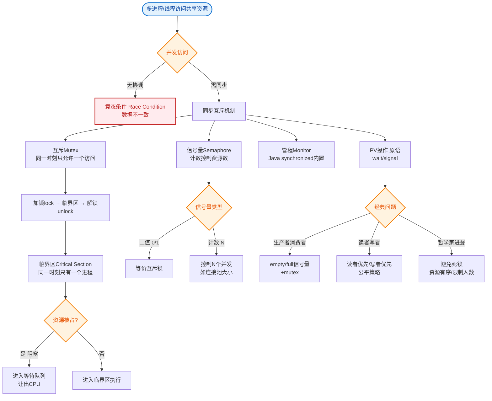
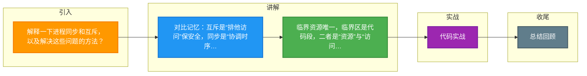

# 解释一下进程同步和互斥，以及解决这些问题的方法？

**进程同步与互斥**

### 1. 临界资源与临界区
- **临界资源**：一次仅允许一个进程使用的资源（如打印机、共享变量）。
- **临界区**：进程中访问临界资源的那段代码。

### 2. 互斥
- **定义**：当一个进程进入临界区访问临界资源时，其他想访问该资源的进程必须等待。
- **目的**：保证临界资源在同一时刻只被一个进程使用，避免数据混乱。

### 3. 同步
- **定义**：指多个进程中发生的事件存在某种时序关系，需要等待或协调。
- **目的**：让进程按照预定的先后次序执行（如生产者-消费者模型：缓冲区满时生产者等待，空时消费者等待）。

### 4. 解决问题的机制（信号量与锁）
- **信号量**：一个整型变量，只能通过两个原子操作 P（wait，申请资源）和 V（signal，释放资源）来访问。可用于解决互斥和同步。
- **互斥锁**：用于保证互斥，加锁后其他线程无法获得锁。
- **管程**：高级同步原语，封装了共享变量和操作过程，自动处理互斥（如 Java 的 synchronized）。

### 信号量 PV 操作流程图
```text
       进程 A (P操作)                    进程 B (V操作)
            │                               │
            ▼                               │
    ┌───────────────┐                       │
    │   S.value > 0?│──No──▶ 阻塞(入等待队列) │
    └───────┬───────┘                       │
      Yes   │                               │
            ▼                               │
    ┌───────────────┐                       │
    │  S.value --   │                       │
    └───────────────┘                       │
            │                               ▼
            │                    ┌───────────────┐
            │                    │  S.value ++  │
            │                    └───────┬───────┘
            │                            │
            │                            ▼
            │                    ┌───────────────┐
            │                    │ 唤醒等待队列  │
            │                    └───────────────┘
```

### 5. 经典问题
- 生产者-消费者问题
- 哲学家进餐问题
- 读者-写者问题

### 实战案例：生产者消费者模型中的“虚假唤醒”
在开发高性能阻塞队列时，若仅使用 `if` 判断条件等待，当被中断或虚假唤醒时，消费者会在没有资源的情况下继续执行，导致空指针异常或数据错乱。解决方法是必须将条件判断放在 `while` 循环中（ReentrantLock Condition 或 synchronized wait/notify 标准写法），确保被唤醒后再次检查条件。

### 代码示例：Java ReentrantLock 实现简单的生产者消费者
```java
import java.util.concurrent.locks.*;

class BoundedBuffer {
    final Lock lock = new ReentrantLock();
    final Condition notFull = lock.newCondition();
    final Condition notEmpty = lock.newCondition();
    final Object[] items = new Object[100];
    int putptr, takeptr, count;

    public void put(Object x) throws InterruptedException {
        lock.lock();
        try {
            while (count == items.length) notFull.await(); // 防止虚假唤醒
            items[putptr] = x;
            if (++putptr == items.length) putptr = 0;
            ++count;
            notEmpty.signal();
        } finally { lock.unlock(); }
    }
}
```

### 对比表格：互斥锁 vs 信号量 vs 读写锁
| 特性 | 互斥锁 | 信号量 | 读写锁 |
| :--- | :--- | :--- | :--- |
| **核心作用** | 保证排他性访问 | 控制并发访问资源的数量 | 区分读/写操作，允许多读单写 |
| **状态值** | 0 或 1 (二元) | 任意非负整数 | 读锁共享，写锁独占 |
| **持有者释放** | 必须由加锁者释放 | 可由任意进程释放 | 必须由加锁者释放 |
| **典型场景** | 保护临界区代码 | 连接池限流 | 缓存系统配置更新 |

---

## 常见考点
1. **信号量与互斥锁的区别**：信号量可以管理多份资源（计数），互斥锁通常只有 0/1 状态；信号量支持在不持有锁的情况下释放，而锁必须由持有者释放。
2. **死锁产生的四个必要条件**：互斥、请求与保持、不剥夺、循环等待。
3. **管程的优势**：为什么 Java 选择管程（synchronized）而不是信号量？（因为管程将同步逻辑封装，降低了编程出错概率，自动处理互斥进入）。
4. **乐观锁与悲观锁**：在数据库或并发包中的应用场景。


## 核心流程图


## 记忆要点

- 对比记忆：互斥是“排他访问”保安全，同步是“协调时序”防混乱
- 临界资源唯一，临界区是代码段，二者是“资源”与“访问路径”的关系
- 互斥靠锁，同步靠信号量PV操作，管程则将锁与变量自动封装
- 防虚假唤醒必考点：条件判断必须用while而非if，否则会越权执行

## 结构化回答

**30 秒电梯演讲：** 互斥是争抢厕所，同步是接力赛跑。打个比方，互斥是单行道只许一辆车过，同步是发令枪响后大家一起跑。

**展开框架：**
1. **对比记忆** — 互斥是“排他访问”保安全，同步是“协调时序”防混乱
2. **临界资源唯一** — 临界区是代码段，二者是“资源”与“访问路径”的关系
3. **互斥靠锁** — 同步靠信号量PV操作，管程则将锁与变量自动封装

**收尾：** 我在项目里踩过坑——实战案例：生产者消费者模型中的“虚假唤醒”。您想深入聊哪一段：原理、避坑还是对比选型？

## 视频脚本

> 预计时长：3 分钟 | 由浅入深

| 时间 | 画面/字幕 | 口播台词 | 讲解要点 |
|------|----------|----------|----------|
| 0:00 | 标题卡：解释一下进程同步和互斥，以及解决这些… | "解释一下进程同步和互斥，以及解决这些问题的方法？一句话——互斥是单行道只许一辆车过，同步是发令枪响后大家一起跑。" | 开场钩子 |
| 0:45 | 概念动画/示意图 | "互斥是争抢厕所，同步是接力赛跑——互斥是单行道只许一辆车过，同步是发令枪响后大家一起跑" | 核心定义 |
| 1:30 | 对比记忆示意 | "互斥是“排他访问”保安全，同步是“协调时序”防混乱" | 要点1 |
| 2:15 | 临界资源唯一示意 | "临界区是代码段，二者是“资源”与“访问路径”的关系" | 要点2 |
| 3:00 | 总结卡 | "记住这几条，面试不慌。下期讲进阶追问。" | 收尾 |

### 视频流程图



