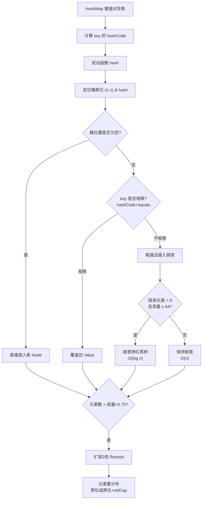

# HashMap的JDK7和JDK8有什么区别？

**HashMap 在 JDK7 和 JDK8 中的核心区别：**

## 核心区别

| 对比项 | JDK7 | JDK8 |
|--------|------|------|
| **数据结构** | 数组 + 链表 | 数组 + 链表 + **红黑树** |
| **插入方式** | **头插法** | **尾插法** |
| **扩容计算** | 重新计算hash | 傅里叶位运算（原位置或原位置+oldCap） |
| **并发死循环** | ❌ 会发生 | ✅ 已修复 |
| **链表→树阈值** | 无此机制 | 链表长度≥8 且数组≥64 → 转红黑树 |
| **树→链表阈值** | 无此机制 | 节点数≤6 → 退化回链表 |

## 头插法 vs 尾插法

```
JDK7 头插法（扩容时链表反转 → 并发环形链表 → 死循环）:
  原链表: A → B → C
  扩容后: C → B → A  （顺序反转）

JDK8 尾插法（保持原顺序 → 不产生环）:
  原链表: A → B → C
  扩容后: A → B → C  （顺序不变）
```

## 为什么 JDK8 引入红黑树？

- JDK7 链表查找 O(n)，hash碰撞严重时性能退化
- JDK8 链表长度 ≥8 时转红黑树，查找 O(log n)
- 退化阈值 6（留缓冲，避免频繁转换）

## 扩容优化

```java
// JDK8 扩容时不用重新计算hash
// 而是用位运算判断新位置：
if ((e.hash & oldCap) == 0) {
    // 原位置不变
} else {
    // 原位置 + oldCap
}
// 这避免了JDK7重新计算所有元素位置的开销
```

### 实战案例：OOM 排查中的 HashMap 碰撞攻击
曾遇到线上服务 OOM，导出堆内存发现一个 `HashMap` 占用 90% 内存。原因是恶意攻击者利用已知 JDK7/8 的 hash 算法漏洞，构造了大量 hashcode 相同的 Key（如 "Aa" 和 "BB" 的 hash 相同），导致 HashMap 退化成链表或树，且不断 put 数据撑爆内存。解决方法是升级 JDK 版本或使用 `TreeMap`（平衡树）替代，或初始化时设置较大容量。

### 代码示例：JDK8 红黑树转化的关键源码模拟
```java
// putVal 操作中的简化逻辑
final V putVal(int hash, K key, V value) {
    Node<K,V>[] tab; Node<K,V> p; int n, i;
    // ... 初始化 ...
    
    // 1. 链表处理
    for (int binCount = 0; ; ++binCount) {
        if ((e = p.next) == null) {
            p.next = newNode(hash, key, value, null);
            // 关键点：当链表长度达到 8 时，尝试树化
            if (binCount >= TREEIFY_THRESHOLD - 1) 
                treeifyBin(tab, hash);
            break;
        }
        p = e;
    }
    // ... 
}

// treeifyBin 会检查 table 长度，若 < 64 则选择扩容而不是树化
// 避免初期数据量小时因为 hash 碰撞直接转为树（树节点占用空间大）
```

## 面试要点

1. **为什么阈值是8？** 红黑树节点大小是链表的2倍，泊松分布下链表长度达8概率极低（0.00000006），选择8是时空权衡
2. **HashMap线程安全吗？** 不安全！JDK8虽修复了死循环，但仍有数据丢失风险，并发用 ConcurrentHashMap


## 核心架构图



## 记忆要点

- 结构大升级：JDK7是数组加链表，JDK8引入红黑树解决哈希碰撞退化
- 插入方式对比：JDK7头插法致并发死循环，JDK8改尾插法保持顺序保安全
- 树化双条件：链表长度到达8且数组容量达到64才转树，退化为链表的阈值是6
- 扩容位运算优化：JDK8抛弃重算Hash，判断原位置加0或加oldCap实现快速定位

## 结构化回答

**30 秒电梯演讲：** 由数组链表升级为数组链表红黑树，头插改为尾插解决并发死循环。打个比方，像座位管理：JDK7来人插队最前排（头插）易乱，JDK8排到队尾（尾插）；人太多时（链表长）把排队的换成梯形座位（红黑树）找得快。

**展开框架：**
1. **结构大升级** — JDK7是数组加链表，JDK8引入红黑树解决哈希碰撞退化
2. **插入方式对比** — JDK7头插法致并发死循环，JDK8改尾插法保持顺序保安全
3. **树化双条件** — 链表长度到达8且数组容量达到64才转树，退化为链表的阈值是6

**收尾：** 我在项目里踩过坑——实战案例：OOM 排查中的 HashMap 碰撞攻击。您想深入聊哪一段：原理、避坑还是对比选型？

## 视频脚本

> 预计时长：2 分钟 | 由浅入深

| 时间 | 画面/字幕 | 口播台词 | 讲解要点 |
|------|----------|----------|----------|
| 0:00 | 标题卡：HashMap的JDK7和JDK8有… | "HashMap的JDK7和JDK8有什么区别？一句话——像座位管理：JDK7来人插队最前排（头插）易乱，JDK8排到队尾（尾插）；人太多时（链表长）把排队的换成梯形座位（红黑树）找得快。" | 开场钩子 |
| 0:40 | 概念动画/示意图 | "由数组链表升级为数组链表红黑树，头插改为尾插解决并发死循环——像座位管理：JDK7来人插队最前排（头插）易乱，JDK8排到队尾（尾插）；人太多时（链表长）把排队的换成梯形座位（红黑树）找得快" | 核心定义 |
| 1:20 | 结构大升级示意 | "JDK7是数组加链表，JDK8引入红黑树解决哈希碰撞退化" | 要点1 |
| 2:00 | 总结卡 | "记住这几条，面试不慌。下期讲进阶追问。" | 收尾 |

---

## 延伸：JDK7和JDK8中的HashMap有什么区别？

> 合并自 `core-156`（相似度 73%）

JDK 7 与 JDK 8 中的 HashMap 有显著区别，主要体现在底层数据结构、扩容机制和性能优化上。

### 1. 底层数据结构
- **JDK 7**：数组 + 链表（拉链法）。链表过长时，查询效率为 O(n)。
- **JDK 8**：数组 + 链表 + 红黑树。当链表长度超过 **8** 且数组长度大于 **64** 时，链表会转换为红黑树（树化），查询效率提升至 O(log n)。

### 2. 扩容机制
- **JDK 7**：
  - 扩容时需重新计算每个元素的下标（`index = hash & (length - 1)` 相当于取模）。
  - 转移数据时采用**头插法**。多线程下扩容可能导致链表死循环（环形链表），因为新链表的顺序与旧链表相反，可能导致 A 节点指向 B，B 又指向 A。
- **JDK 8**：
  - 优化了下标计算。扩容后容量为原来的 2 倍，n-1 在二进制高位多了一个 1。
  - 通过 `(e.hash & oldCap) == 0` 判断元素位置是否变动：
    - 结果为 0：索引不变（仍在原位置）。
    - 结果为 1：索引变为 `原索引 + oldCap`。
  - 改为**尾插法**，保持了链表元素的相对顺序，避免了多线程死循环问题（但仍非线程安全，数据可能覆盖）。

**JDK 8 扩容下标计算原理图：**
```text
假设 oldCap = 16 (10000), newCap = 32 (100000)
元素的 hash 值第 5 位（从0开始）决定位置

hash:    1xxxx xxxxx (第5位为0) -> index = xxxx (原位置)
hash:    1xxxx xxxxx (第5位为1) -> index = xxxx + 10000 (原位置 + 16)
             ^
        (这一位是新扩容出来的 mask 位)
```

### 3. 红黑树阈值
- **树化阈值**：链表长度 > 8 且 数组长度 >= 64。如果数组长度小于 64，只会优先扩容数组，而不是树化（因为扩容能减少冲突，树化成本高）。
- **退化阈值**：当红黑树节点数减少到 6 时，红黑树会退化回链表。

### 4. 性能优化
- JDK 8 对哈希碰撞处理进行了优化，减少了链表遍历的时间。
- 引入红黑树，极端情况下性能从 O(n) 提升到 O(log n)。

### 5. 其他
- **Hash 计算优化**：JDK 7 进行了 4 次位运算 + 5 次异或运算；JDK 8 简化为 `(h = key.hashCode()) ^ (h >>> 16)`，仅 1 次异或，计算效率更高。

### 对比表格
| 特性 | JDK 7 HashMap | JDK 8 HashMap |
| :--- | :--- | :--- |
| **底层结构** | 数组 + 链表 | 数组 + 链表 + 红黑树 |
| **链表插入方式** | 头插法 | 尾插法 |
| **扩容后位置** | 全部重新计算 | 原位置 或 原位置+旧容量 |
| **多线程扩容** | 易死循环 | 数据覆盖，不死循环 |
| **Hash扰动** | 4次位运算+5次异或 | 高16位异或低16位 |
| **红黑树阈值** | 无 | 链表>8且表>64 |

### 实战案例
在 JDK 7 环境下进行高并发压测时，服务器 CPU 飙升至 100% 且无法处理请求。Dump 线程发现大量线程阻塞在 HashMap 的 `transfer` 方法中，形成死循环。升级到 JDK 8 后，该死循环问题消失（虽然仍需改用 ConcurrentHashMap 保证数据安全）。

## 常见考点
1. **JDK 7 HashMap 死循环是如何产生的？**
   - 发生在多线程并发扩容时。JDK 7 使用头插法转移元素，导致链表反转。如果线程 A 刚处理完节点 A.next = B，被挂起，线程 B 完成了扩容（顺序变为 B -> A），线程 A 恢复执行将 A.next = B，形成 A -> B -> A 的死循环。JDK 8 改用尾插法解决了此问题。
2. **为什么 JDK 8 转为红黑树需要同时满足“链表长度 > 8”和“数组长度 > 64”？**
   - 避免一开始数组极小时，少量冲突就构建复杂的树结构。如果数组很小（如 16），直接扩容数组就可以打散哈希冲突，树化的维护成本（TreeNode 占用空间是 Node 的 2 倍）不划算。
3. **JDK 8 中 HashMap 的扩容为什么比 JDK 7 快？**
   - 因为不需要重新计算每个元素的 hash，只需要判断 hash 的某一个比特位（对应 newCap 的最高位）是 0 还是 1，即可决定位置是“原索引”还是“原索引+原容量”。

## 记忆要点

- 结构对比：1.7数组+链表，1.8增加红黑树解决长链表查询退化O(n)问题
- 插入反转：1.7采用头插法，1.8改为尾插法保持链表顺序不变
- 并发差异：1.7扩容头插易致链表成环死循环，1.8改尾插解决了死循环但仍有数据覆盖
- 高效扩容：1.8不需要重算hash，仅判断hash&(oldCap)==0，结果0留原位，非0变原位+旧容量
- 树化门槛：1.8要求链表>8且表>=64才转树，退化阈值设为6防止频发转换

## 结构化回答

**30 秒电梯演讲：** 由数组链表升级为数组链表红黑树，解决链表过长查询慢的问题。打个比方，像体检排队，人少直接排（链表），人多时换成多窗口叫号（红黑树）。

**展开框架：**
1. **结构对比** — 1.7数组+链表，1.8增加红黑树解决长链表查询退化O(n)问题
2. **插入反转** — 1.7采用头插法，1.8改为尾插法保持链表顺序不变
3. **并发差异** — 1.7扩容头插易致链表成环死循环，1.8改尾插解决了死循环但仍有数据覆盖

**收尾：** 我在项目里踩过坑——在 JDK 7 环境下进行高并发压测时，服务器 CPU 飙升至 100% 且无法处理请求。您想深入聊哪一段：原理、避坑还是对比选型？

## 视频脚本

> 预计时长：3 分钟 | 由浅入深

| 时间 | 画面/字幕 | 口播台词 | 讲解要点 |
|------|----------|----------|----------|
| 0:00 | 标题卡：JDK7和JDK8中的HashMap… | "JDK7和JDK8中的HashMap有什么区别？一句话——像体检排队，人少直接排（链表），人多时换成多窗口叫号（红黑树）。" | 开场钩子 |
| 0:45 | 概念动画/示意图 | "由数组链表升级为数组链表红黑树，解决链表过长查询慢的问题——像体检排队，人少直接排（链表），人多时换成多窗口叫号（红黑树）" | 核心定义 |
| 1:30 | 结构对比示意 | "1.7数组+链表，1.8增加红黑树解决长链表查询退化O(n)问题" | 要点1 |
| 2:15 | 插入反转示意 | "1.7采用头插法，1.8改为尾插法保持链表顺序不变" | 要点2 |
| 3:00 | 总结卡 | "记住这几条，面试不慌。下期讲进阶追问。" | 收尾 |
