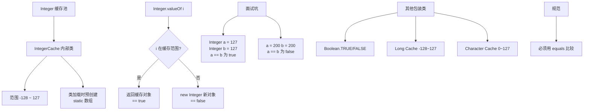
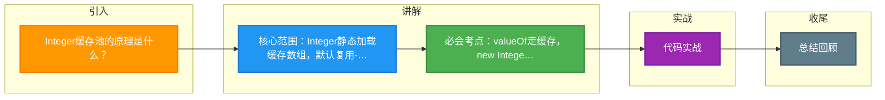

# Integer缓存池的原理是什么？

IntegerCache是Integer的静态内部类，在类加载时创建了一个Integer数组，缓存了-128到127的Integer对象。

```java
// Integer.valueOf的源码逻辑
public static Integer valueOf(int i) {
    if (i >= IntegerCache.low && i <= IntegerCache.high)
        return IntegerCache.cache[i + (-IntegerCache.low)];
    return new Integer(i);
}
```

**原理与内存结构图解：**

```
JVM 堆内存
┌──────────────────────────────────────┐
│  IntegerCache (静态内部类)            │
│  ┌────────────────────────────────┐  │
│  │ cache[] (Integer数组)          │  │
│  │ [0] => Integer(-128)           │  │
│  │ [1] => Integer(-127)           │  │
│  │ ...                             │  │
│  │ [128] => Integer(0)            │  │
│  │ ...                             │  │
│  │ [255] => Integer(127)          │  │
│  └────────────────────────────────┘  │
│           ▲                          │
│           │ 引用                     │
  Integer a = 127; ────────────────────┘
  Integer b = 127; ────────────────────┘ (指向同一地址)
  Integer c = 128; ──> new Integer(128) (堆中新对象)
└──────────────────────────────────────┘
```

**结果：**
- Integer a = 127; Integer b = 127; a == b → true（同一缓存对象）
- Integer a = 128; Integer b = 128; a == b → false（不同对象）

**其他包装类缓存范围：**
- **Byte**：全部缓存 (-128 ~ 127)
- **Short**：-128 ~ 127
- **Long**：-128 ~ 127
- **Character**：0 ~ 127
- **Boolean**：全部缓存 (TRUE, FALSE)
- **Float / Double**：无缓存

**JVM 参数配置：**
- `-XX:AutoBoxCacheMax=<size>`：可以调整Integer缓存的上限（仅Integer有效，需设置在high值之上）。
- 原理：JVM 启动时通过 `sun.misc.VM.getSavedProperty` 读取该参数并初始化 cache 数组。

## 常见考点
1. **为什么 Integer.valueOf(127) == new Integer(127) 是 false？**
   - `valueOf` 走缓存返回对象引用，`new` 强制在堆开辟新内存，地址不同。
2. **在比较包装类数值时有什么注意事项？**
   - 所有包装类对象之间值的比较，**全部使用 `equals` 方法**。对于 -128 到 127 之外的数值，使用 `==` 比较极其容易出错（如Integer 130的缓存失效）。
3. **Integer缓存是在什么时候加载的？**
   - IntegerCache 是 Integer 的静态内部类，其静态代码块在 Integer 类首次被主动使用时加载并初始化缓存数组。

---

### 1. 实战案例
在高并发场景下的计数器代码中，曾出现将 `Integer` 作为局部变量在多线程间通过 `ThreadLocal` 共享，并在循环中执行 `count++` 操作。由于 `count` 值超过 127 后缓存失效，每次 `++` 实际上都创建了新的 `Integer` 对象，导致 Young GC 频繁飙升。解决方案是将基本数据类型 `int` 存入 `ThreadLocal`，避免不必要的自动装箱。

### 2. 代码示例
在排查生产环境偶发的数据一致性问题时，使用反射验证 Integer 缓存机制是否受 JVM 参数影响：
```java
import java.lang.reflect.Field;

public class IntegerCacheTest {
    public static void main(String[] args) throws Exception {
        // 假设启动参数设置了 -XX:AutoBoxCacheMax=1000
        Class<?> cache = Integer.class.getDeclaredClasses()[0];
        Field myCache = cache.getDeclaredField("cache");
        myCache.setAccessible(true);
        Integer[] array = (Integer[]) myCache.get(cache);
        // 验证缓存上限是否扩展
        System.out.println("Max cached value: " + array[array.length - 1]); 
    }
}
```

### 3. 对比表格：包装类缓存与对象创建性能对比
| 特性 | 使用 Integer.valueOf(int) | 使用 new Integer(int) |
| :--- | :--- | :--- |
| **内存占用** | 低 (范围 [-128, 127] 或 [-128, High] 复用对象) | 高 (每次都在堆中新分配) |
| **计算速度** | 快 (无内存分配开销) | 慢 (涉及对象创建与 GC 压力) |
| **== 比较结果** | 范围内相等，范围外不等 | 永远不等 (除非引用同一对象) |
| **适用场景** | 一般业务逻辑、数值计算、IO 解析 | 极其特殊的场景 (如需要强制独立对象) |
| **推荐程度** | **强烈推荐** (编译器自动装箱亦采用此法) | **不推荐** (Java 9+ 已标记为 Deprecated) |


## 核心架构图



## 记忆要点

- 核心范围：Integer静态加载缓存数组，默认复用-128到127的对象
- 必会考点：valueOf走缓存，new Integer强制堆内开辟新内存，导致==比较失效
- 避坑指南：包装类比较必须用equals，超出127的缓存失效极易导致空指针或逻辑错乱
- 扩展对比：Byte全缓存，Character为0到127，而Float和Double无缓存机制

## 结构化回答

**30 秒电梯演讲：** 自动装箱时复用常用数值范围的Integer对象。打个比方，像工具箱里的常用螺丝钉（-128到127），大家都拿公用这批，不常用的才重新造。

**展开框架：**
1. **核心范围** — Integer静态加载缓存数组，默认复用-128到127的对象
2. **必会考点** — valueOf走缓存，new Integer强制堆内开辟新内存，导致==比较失效
3. **避坑指南** — 包装类比较必须用equals，超出127的缓存失效极易导致空指针或逻辑错乱

**收尾：** 我在项目里踩过坑——在排查生产环境偶发的数据一致性问题时，使用反射验证 Integer 缓存机制是否受 JVM 参数影响：。您想深入聊哪一段：原理、避坑还是对比选型？

## 视频脚本

> 预计时长：2 分钟 | 由浅入深

| 时间 | 画面/字幕 | 口播台词 | 讲解要点 |
|------|----------|----------|----------|
| 0:00 | 标题卡：Integer缓存池的原理是什么 | "Integer缓存池的原理是什么？一句话——像工具箱里的常用螺丝钉（-128到127），大家都拿公用这批，不常用的才重新造。" | 开场钩子 |
| 0:40 | 概念动画/示意图 | "自动装箱时复用常用数值范围的Integer对象——像工具箱里的常用螺丝钉（-128到127），大家都拿公用这批，不常用的才重新造" | 核心定义 |
| 1:20 | 核心范围示意 | "Integer静态加载缓存数组，默认复用-128到127的对象" | 要点1 |
| 2:00 | 总结卡 | "记住这几条，面试不慌。下期讲进阶追问。" | 收尾 |

### 视频流程图



