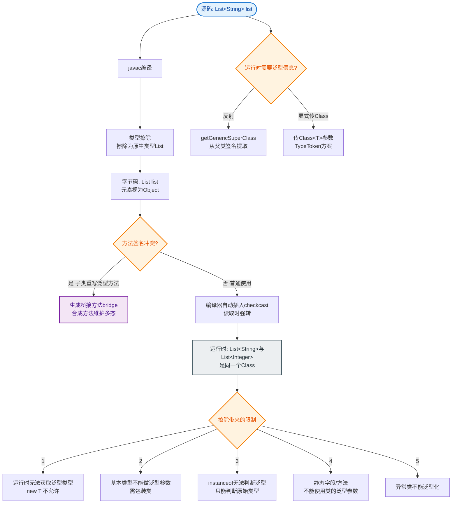

# Java泛型擦除的原理和影响是什么？

类型擦除：Java泛型是编译期特性，编译后泛型类型信息被擦除。

- List<String>和List<Integer>在运行时都是List
- T会被擦除为Object（或上界）
- 桥接方法保证多态正确性

**编译期与运行期转换流程：**

```
源代码 (.java)                  字节码 (.class)
─────────────────              ─────────────────
List<String> list       ──▶    List list  (原始类型)
list.add("Hello");       ──▶    list.add("Hello"); 
                             // 插入 checkcast 检查类型
String s = list.get(0);  ──▶    String s = (String)list.get(0);
```

**原理细节：**
1. **擦除规则**：
   - 无限制类型擦除（`<T>`）变为 `Object`。
   - 有限制类型擦除（`<T extends Number>`）变为 `Number`。
2. **桥接方法**：为了保持泛型多态，编译器会自动生成合成方法。
   ```java
   // 代码
   class Node<T> { public T data; public void setData(T data) { ... } }
   class MyNode extends Node<Integer> { public void setData(Integer data) { ... } }
   // 编译后生成的桥接方法
   public void setData(Object data) { setData((Integer) data); }
   ```
3. **基于擦除的限制原因**：
   - **不能 new T()**：运行时 `T` 被擦除为 `Object`，无法确定具体创建哪个类的实例，也拿不到构造函数。
   - **不能创建泛型数组**：数组协变（`String[]` 是 `Object[]`）与泛型不可变冲突，且运行时无法检查数组元素类型。
   - **基本类型不支持**：泛型擦除后变为 Object，而 int 等基本类型不是 Object，必须用包装类 Integer。

**影响：**
1. 不能 new T()（运行时不知道T是什么类型）
2. 不能 new T[]（数组协变与泛型不兼容）
3. 基本类型不能作为泛型参数（List<int>不行）
4. 不能用instanceof判断泛型类型（如 `list instanceof List<String>` 编译不通过，只能用 `list instanceof List<?>`）
5. 静态方法/字段不能使用类的泛型参数（静态属于类，不随实例化参数 `T` 变化）
6. 运行时无法直接获取泛型类型（但可以通过反射获取父类或成员变量声明的泛型签名，即 Type）

**对比：**
- Kotlin的泛型是 `reified`（具体化的），配合 `inline` 函数可以在运行时获取泛型类型（如 `inline fun <reified T> ...`）。

## 常见考点
1. **如何绕过泛型擦除，在运行时获取泛型类型？**
   - 利用 `ParameterizedType`。如果泛型定义在父类或字段声明上，可以通过 `getGenericSuperclass()` 或 `getGenericType()` 反射获取完整的泛型类型信息。例如 Spring 经常这样做来实现泛型依赖注入。
2. **什么是泛型通配符 `? extends` 和 `? super`？（PECS原则）**
   - `? extends T`（上界）：只能读取数据，不能写入（除了 null）。
   - `? super T`（下界）：只能写入数据，读取只能是 Object。
   - **PECS**: Producer Extends, Consumer Super。
3. **为什么不能重载泛型方法 `void list(List<String> list)` 和 `void list(List<Integer> list)`？**
   - 因为编译后两者都擦除为 `void list(List list)`，方法签名冲突。

---

### 深化内容

**实战案例**：
在对接第三方支付（如支付宝）时，为了解耦支付类型，我们设计了泛型基类 `PaymentService<T extends Request>`。但在运行时通过 Spring 容器查找实现类时，发现无法直接按 `T` 的具体类型（如 `AlipayRequest`）定位 Bean，必须显式重写方法并利用 `ParameterizedType` 反射解析，这曾导致初始化阶段报 `NoSuchBeanDefinitionException`。

**代码示例（绕过擦除获取类型）**：
```java
public abstract class BaseDao<T> {
    private Class<?> entityClass;
    public BaseDao() {
        // 通过反射获取父类泛型参数的实际类型
        Type type = this.getClass().getGenericSuperclass();
        this.entityClass = (Class<?>) ((ParameterizedType) type).getActualTypeArguments()[0];
    }
}
```

**对比表格（Java vs Kotlin 泛型）**：

| 特性 | Java Generics | Kotlin Generics (Reified) |
| :--- | :--- | :--- |
| 类型信息保留 | 仅编译期（运行时擦除） | 编译期 + 运行时（需 inline 修饰） |
| 运行时类型检查 | 不能 `obj is T` | 可以 `obj is T` (inline reified T) |
| 获取 Class 对象 | 需显式传递 `Class clazz` | 直接 `T::class.java` 获取 |
| 性能开销 | 无额外开销 | inline 函数可能导致代码量增加 |


## 核心流程图


## 记忆要点

- 核心原理：编译期生效，运行时擦除。无界变Object，有界变上界。
- 六大限制：因为运行时无类型，所以不能new T()、不能new T[]、不能用instanceof判断带泛型类型。
- 反射绕过：可通过ParameterizedType获取父类或字段的泛型真实类型（如Spring的泛型注入）。
- 通配符口诀：PECS（Producer Extends, Consumer Super），即上界只读，下界只写。

## 结构化回答

**30 秒电梯演讲：** 泛型仅存在于编译期，运行时类型参数被擦除为Object或上界。打个比方，像快递打包清单（编译期），写清楚里面是什么，但打包后（运行期）贴的标签都变成了“包裹”，看不出具体内容。

**展开框架：**
1. **核心原理** — 编译期生效，运行时擦除。无界变Object，有界变上界。
2. **六大限制** — 因为运行时无类型，所以不能new T()、不能new T[]、不能用instanceof判断带泛型类型。
3. **反射绕过** — 可通过ParameterizedType获取父类或字段的泛型真实类型（如Spring的泛型注入）。

**收尾：** 这三点都能配合实战聊。您想深入聊原理、对比还是避坑？

## 视频脚本

> 预计时长：3 分钟 | 由浅入深

| 时间 | 画面/字幕 | 口播台词 | 讲解要点 |
|------|----------|----------|----------|
| 0:00 | 标题卡：Java泛型擦除的原理和影响是什么 | "Java泛型擦除的原理和影响是什么？一句话——像快递打包清单（编译期），写清楚里面是什么，但打包后（运行期）贴的标签都变成了“包裹”，看不出具体内容。" | 开场钩子 |
| 0:45 | 概念动画/示意图 | "泛型仅存在于编译期，运行时类型参数被擦除为Object或上界——像快递打包清单（编译期），写清楚里面是什么，但打包后（运行期）贴的标签都变成了“包裹”，看不出具体内容" | 核心定义 |
| 1:30 | 核心原理示意 | "编译期生效，运行时擦除。无界变Object，有界变上界。" | 要点1 |
| 2:15 | 六大限制示意 | "因为运行时无类型，所以不能new T()、不能new T[]、不能用instanceof判断带泛型类型。" | 要点2 |
| 3:00 | 总结卡 | "记住这几条，面试不慌。下期讲进阶追问。" | 收尾 |

### 视频流程图


