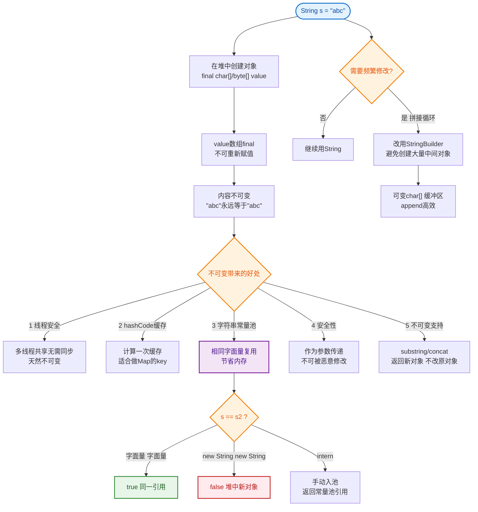

# String为什么设计为不可变？有什么好处？

**不可变实现：**
- String类用final修饰（不能被继承）
- 内部char数组（JDK9后byte数组）用private final修饰
- 没有提供修改字符的方法

**内部结构演变（JDK 8 vs JDK 9）：**

```
JDK 8 (String):
┌─────────────────────┐
│ final class String  │
├─────────────────────┤
│ final char[] value  │  (UTF-16, 2字节/字符, 纯Latin1浪费1半空间)
│ final int hash      │
└─────────────────────┘

JDK 9+ (String):
┌─────────────────────┐
│ final class String  │
├─────────────────────┤
│ final byte[] value  │  (1字节Latin1 或 2字节UTF-16, 省内存)
│ final byte coder    │  (编码标识: 0=Latin1, 1=UTF-16)
│ final int hash      │
└─────────────────────┘
```

**不可变性的好处与机制：**

1. **线程安全**：
   - 不可变对象天然线程安全，可在多线程中自由共享，无需同步。
   - **机制**：数据成员 `value` 是 `final` 的，引用不可变；且没有 `setter` 方法，内容不可变。

2. **安全性**：
   - String常被用作HashMap的key、参数传递。不可变防止被恶意修改，避免类加载错误、SQL注入、路径穿越等问题。
   - **机制**：反射可以破坏不可变性（通过 `field.setAccessible(true)`），但在安全管理的环境下会报错。

3. **性能优化（核心优势）**：
   - **字符串常量池**：
     - JVM 在堆中开辟一个常量池区域，字面量相同的字符串共享同一个对象。
     - 不可变性保证了引用共享的安全性，如果String可变，一个引用修改会影响所有引用者。
   - **hashCode缓存**：
     - 计算一次后缓存（`private int hash`），因对象不变，hashCode永远有效，HashMap查询更快。
     - **机制**：String的 `hashCode()` 方法会判断 `hash == 0` 时才重新计算，否则直接返回缓存。
   - **Substring优化（历史变更）**：
     - JDK6中 `substring` 共享原数组（范围偏移），可能导致内存泄漏。
     - JDK7+ 实现了真正的不可变，`substring` 会复制一份新数组，虽牺牲了 substring 的速度，但解决了内存泄漏且逻辑更纯粹。

**对比：**
- **StringBuilder**：可变，非线程安全，性能高（无synchronized）。
- **StringBuffer**：可变，线程安全（方法加synchronized），性能稍低。

## 常见考点
1. **既然String是不可变的，为什么可以用 `str = "new value"` 修改它？**
   - `str` 只是栈中的一个引用变量，指向堆中的String对象。`str = ...` 只是改变了引用的指向，原本的对象在堆中并未被修改（除非没人引用了被GC回收）。
2. **switch 语句对 String 的支持原理是什么？**
   - Java 7 开始支持。底层是通过 `hashCode()` 和 `equals()` 进行 case 匹配。先匹配 hash（快），再 equals（防碰撞）。
3. **JDK 9 为什么要将 char[] 改为 byte[]？**
   - 节省内存。大部分程序中的字符串只包含拉丁字符（ASCII/Latin-1），用 byte 存储（1字节）比 char（2字节）节省一半空间。coder 字段标识编码格式。

---

### 深化内容

**实战案例**：
某报表系统在导出大表时，为了拼接 CSV 字符串，习惯性使用 `String` 进行 `+=` 操作。结果在百万级数据导出时频繁 Full GC。复盘发现每次拼接都产生新的 `char[]` 对象（旧对象成为垃圾），不仅占用大量 CPU 还导致内存抖动，后改为 `StringBuilder` 后内存回收率下降了 90%。

**代码示例（反射破坏不可变性）**：
```java
String s = "Hello World";
System.out.println(s); // Hello World

// 利用反射破坏不可变（仅在非安全管理器下生效）
Field valueField = String.class.getDeclaredField("value");
valueField.setAccessible(true);
char[] value = (char[]) valueField.get(s);
value[5] = '_'; 

System.out.println(s); // Hello_World
```

**对比表格（String vs StringBuilder vs StringBuffer）**：

| 特性 | String | StringBuilder | StringBuffer |
| :--- | :--- | :--- | :--- |
| 可变性 | 不可变 | 可变 | 可变 |
| 线程安全 | 安全（只读） | 不安全 | 安全（synchronized） |
| 性能 | 低（涉及对象创建） | 高 | 较低（锁开销） |
| 适用场景 | 少量操作、常量、Map Key | 大量单线程字符串操作 | 大量多线程字符串操作 |


## 核心流程图


## 记忆要点

- 底层实现：类用final修饰防继承，核心数组(byte[]/char[])用private final修饰防修改。
- 核心好处：因为不可变，所以天然线程安全、绝对适合做HashMap的Key、能安全复用实现常量池。
- 性能优化：不可变保证hashCode只算一次就能被永久缓存，大幅提升Map查询速度。
- 易混对比：String不可变，而StringBuilder（非线程安全）与StringBuffer（加锁安全）均可变。

## 结构化回答

**30 秒电梯演讲：** 通过final修饰和私有数组确保对象创建后状态不可修改。打个比方，像刻好的石碑，一旦写好就不能改，谁都可以拿去读，不用担心被涂改。

**展开框架：**
1. **底层实现** — 类用final修饰防继承，核心数组(byte[]/char[])用private final修饰防修改。
2. **核心好处** — 因为不可变，所以天然线程安全、绝对适合做HashMap的Key、能安全复用实现常量池。
3. **性能优化** — 不可变保证hashCode只算一次就能被永久缓存，大幅提升Map查询速度。

**收尾：** 我在项目里踩过坑——某报表系统在导出大表时，为了拼接 CSV 字符串，习惯性使用 `String` 进行 `+=` 操作。您想深入聊哪一段：原理、避坑还是对比选型？

## 视频脚本

> 预计时长：2 分钟 | 由浅入深

| 时间 | 画面/字幕 | 口播台词 | 讲解要点 |
|------|----------|----------|----------|
| 0:00 | 标题卡：String为什么设计为不可变？有什… | "String为什么设计为不可变？有什么好处？一句话——像刻好的石碑，一旦写好就不能改，谁都可以拿去读，不用担心被涂改。" | 开场钩子 |
| 0:40 | 概念动画/示意图 | "通过final修饰和私有数组确保对象创建后状态不可修改——像刻好的石碑，一旦写好就不能改，谁都可以拿去读，不用担心被涂改" | 核心定义 |
| 1:20 | 底层实现示意 | "类用final修饰防继承，核心数组(byte[]/char[])用private final修饰防修改。" | 要点1 |
| 2:00 | 总结卡 | "记住这几条，面试不慌。下期讲进阶追问。" | 收尾 |
