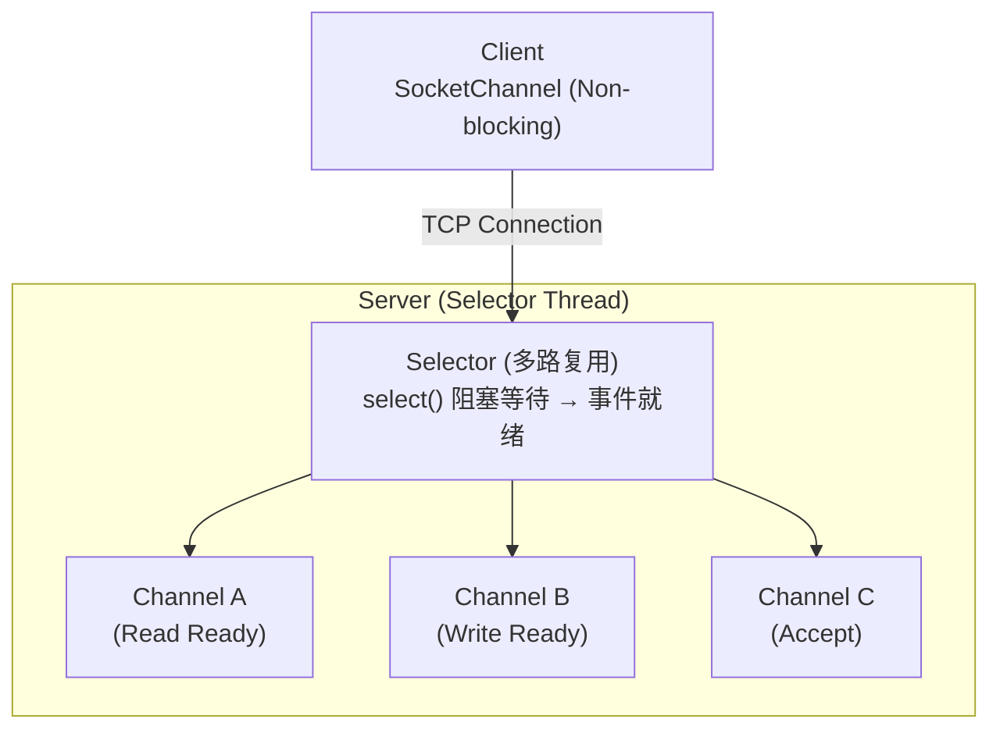

# NIO的三大核心组件是什么？

NIO 的三大核心组件是 Buffer（缓冲区）、Channel（通道）和 Selector（选择器）。

**1. Buffer（缓冲区）：**
- **作用**：容器，用于 Channel 读写数据。数据必须从 Channel 读入 Buffer，或从 Buffer 写入 Channel。
- **核心属性**：
  - `capacity`：容量，不可变。
  - `position`：当前位置（下一个读写索引）。
  - `limit`：限制（可读写的最大边界）。
  - `mark`：标记位（用于记录 position，以便 reset 恢复）。
- **关键方法**：
  - `flip()`：写模式 → 读模式（limit设为position，position设为0）。
  - `clear()`：清空缓冲区（position=0, limit=capacity），准备写入。
  - `compact()`：压缩缓冲区，将未读完的数据移到头部，准备写入。
- **核心Buffer**：ByteBuffer（最常用）、CharBuffer、IntBuffer 等。

**2. Channel（通道）：**
- **作用**：双向数据传输管道（不同于InputStream单向），可以异步读写。
- **核心Channel**：
  - `FileChannel`：文件读写（无法设置为非阻塞模式）。
  - `SocketChannel`：TCP网络读写（支持非阻塞）。
  - `ServerSocketChannel`：TCP服务端监听（支持非阻塞）。
  - `DatagramChannel`：UDP协议读写。

**3. Selector（选择器）：**
- **作用**：多路复用器，单线程管理多个 Channel。
- **机制**：只有 Channel 配置为非阻塞模式才能注册到 Selector。
- **事件类型**：
  - `SelectionKey.OP_ACCEPT`：连接接受
  - `SelectionKey.OP_CONNECT`：连接完成
  - `SelectionKey.OP_READ`：读就绪
  - `SelectionKey.OP_WRITE`：写就绪

**NIO 通信架构流程图：**



---

### 深化内容

**实战案例**：
在开发即时通讯推送服务时，早期的 BIO 模型（一连接一线程）在连接数达到 1W 后 CPU 上下文切换极其严重。切换到 NIO Selector 模型后，单线程轻松支撑 5W+ 连接，但在高并发写网络 Buffer 时曾出现“写半包”问题（即发送方认为发了，接收方只收到一半），必须配合 Buffer 的 compact 机制处理残留数据。

**代码示例（NIO 服务端核心循环）**：
```java
Selector selector = Selector.open();
ServerSocketChannel server = ServerSocketChannel.open();
server.bind(new InetSocketAddress(8080));
server.configureBlocking(false);
server.register(selector, SelectionKey.OP_ACCEPT);

while (true) {
    // 阻塞直到有事件发生
    selector.select(); 
    Set<SelectionKey> keys = selector.selectedKeys();
    Iterator<SelectionKey> it = keys.iterator();
    while (it.hasNext()) {
        SelectionKey key = it.next();
        if (key.isAcceptable()) handleAccept(key);
        if (key.isReadable()) handleRead(key);
        it.remove(); // 必须手动移除，避免重复处理
    }
}
```

**对比表格（NIO vs BIO）**：

| 维度 | BIO (Blocking IO) | NIO (Non-blocking IO) |
| :--- | :--- | :--- |
| 线程模型 | 每连接对应一线程 | 单线程（或少量）多路复用 |
| IO 操作 | 阻塞直到完成 | 非阻塞，立即返回（就绪才操作） |
| 数据流向 | 字节流/字符流 | Channel + Buffer |
| 适用场景 | 连接数少、高延迟 | 连接数多、高并发（聊天、推送） |
| 复杂度 | 简单 | 复杂（需处理 Buffer 状态、拆包粘包） |


## 记忆要点

- 三大组件：Buffer（缓冲区）、Channel（双向通道）、Selector（多路复用器）。
- Buffer核心：靠flip()切换读写模式，靠三个指针（position/limit/capacity）控制边界。
- Channel特性：区别于流的单向性，通道支持双向读写且可设为非阻塞模式。
- Selector原理：单线程管理多Channel，事件驱动（OP_ACCEPT/READ等），解决BIO的线程爆炸问题。

## 结构化回答

**30 秒电梯演讲：** 基于通道和缓冲区的IO模型，利用选择器实现单线程多路复用。打个比方，餐厅服务员（Selector）同时照看多桌客人（Channel），客人有招手（事件）才去处理，不用一直傻站着。

**展开框架：**
1. **三大组件** — Buffer（缓冲区）、Channel（双向通道）、Selector（多路复用器）。
2. **Buffer核心** — 靠flip()切换读写模式，靠三个指针（position/limit/capacity）控制边界。
3. **Channel特性** — 区别于流的单向性，通道支持双向读写且可设为非阻塞模式。

**收尾：** 我在项目里踩过坑——在开发即时通讯推送服务时，早期的 BIO 模型（一连接一线程）在连接数达到 1W 后 CPU 上下文切换极其严重。您想深入聊哪一段：原理、避坑还是对比选型？

## 视频脚本

> 预计时长：2 分钟 | 由浅入深

| 时间 | 画面/字幕 | 口播台词 | 讲解要点 |
|------|----------|----------|----------|
| 0:00 | 标题卡：NIO的三大核心组件是什么 | "NIO的三大核心组件是什么？一句话——餐厅服务员（Selector）同时照看多桌客人（Channel），客人有招手（事件）才去处理，不用一直傻站着。" | 开场钩子 |
| 0:40 | 概念动画/示意图 | "基于通道和缓冲区的IO模型，利用选择器实现单线程多路复用——餐厅服务员（Selector）同时照看多桌客人（Channel），客人有招手（事件）才去处理，不用一直傻站着" | 核心定义 |
| 1:20 | 三大组件示意 | "Buffer（缓冲区）、Channel（双向通道）、Selector（多路复用器）。" | 要点1 |
| 2:00 | 总结卡 | "记住这几条，面试不慌。下期讲进阶追问。" | 收尾 |
