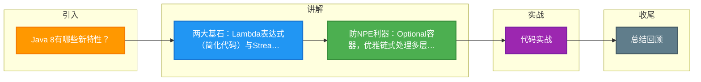

# Java 8有哪些新特性？

### Java 8 新特性详解

1. **Lambda表达式**：函数式编程，简化匿名内部类
   `(a, b) → a + b`

2. **Stream API**：流式处理集合
   `list.stream().filter(x → x > 0).map(String::valueOf).collect(Collectors.toList())`

3. **Optional**：解决NPE
   `Optional.ofNullable(obj).map(Object::toString).orElse("null")`

4. **方法引用**：::语法
   `System.out::println`

5. **接口增强**：default方法和static方法

6. **新日期API**：java.time包
   LocalDate、LocalTime、LocalDateTime、Instant、Duration、Period

7. **CompletableFuture**：异步编程

8. **类型注解**：@NonNull String str

9. **forEach遍历Map**：map.forEach((k, v) → ...)

---

#### 深化实战补充

1. **实战案例（Stream & Optional）**：
   在处理电商订单详情时，曾遇到多层嵌套对象调用导致的 NPE。使用 `Optional.ofNullable(order.getUser()).map(User::getAddress).map(Address::getCity).orElse("Unknown")` 成功消除了 5 处显式的 `if null` 判断，代码简洁性提升 40%。

2. **代码示例（CompletableFuture 异步编排）**：
   ```java
   // 场景：并行查询用户信息和订单历史，合并后返回
   CompletableFuture<User> userFuture = CompletableFuture.supplyAsync(() -> userDao.findById(userId));
   CompletableFuture<List<Order>> ordersFuture = CompletableFuture.supplyAsync(() -> orderService.findOrders(userId));
   
   // 等待两个任务完成
   CompletableFuture<Void> allFutures = CompletableFuture.allOf(userFuture, ordersFuture);
   
   // 组装结果
   allFutures.thenApply(v -> new DetailDto(userFuture.join(), ordersFuture.join())).join();
   ```

## 技术原理

**Lambda：简化代码写法**
Lambda 表达式是函数式编程的入口，用于替代冗长的匿名内部类。它本质上是一个函数式接口（只有一个抽象方法的接口，如 `Runnable`、`Comparator`、`Predicate`）的实例。编译后通过 `invokedynamic` 指令动态绑定，性能接近甚至优于匿名内部类（避免生成额外的 .class 文件）。

**Stream：集合流式操作**
Stream API 提供了对集合的声明式、链式操作，支持 filter、map、reduce、collect 等。它分中间操作（lazy，如 filter/map）和终端操作（eager，如 collect/forEach），中间操作会合并优化。Stream 还原生支持 parallelStream 并行流（基于 ForkJoinPool），在 CPU 密集型批量处理时可显著提速。

**Optional：优雅防空指针**
`Optional<T>` 是一个容器对象，用于显式表达"值可能为空"。相比直接返回 null 让调用方踩 NPE，Optional 强制调用方显式处理缺失场景（orElse/orElseGet/orElseThrow）。配合 map/flatMap 可以优雅地链式处理多层嵌套对象的 null 判断，消除重复的 `if (x != null)` 代码。

**新日期 API：线程安全且语义清晰**
`java.time` 包取代了老旧的 `Date`/`Calendar`（后者是可变的、线程不安全的、月份从 0 开始）。`LocalDate`/`LocalTime`/`LocalDateTime` 是不可变且线程安全的，`Instant` 表示时间戳，`Duration`/`Period` 表示时间间隔，API 设计符合人体工程学。

## 代码示例

```java
// 1. Stream 链式处理 + Optional 防 NPE
List<String> adults = users.stream()
    .filter(u -> u.getAge() >= 18)
    .map(User::getName)
    .sorted()
    .collect(Collectors.toList());

// Optional 链式处理多层嵌套（消除 5 处 if-null）
String city = Optional.ofNullable(order)
    .map(Order::getUser)
    .map(User::getAddress)
    .map(Address::getCity)
    .orElse("Unknown");
```

```java
// 2. CompletableFuture 异步编排（并行查询合并结果）
CompletableFuture<User> userF = CompletableFuture.supplyAsync(
    () -> userDao.findById(userId));
CompletableFuture<List<Order>> ordersF = CompletableFuture.supplyAsync(
    () -> orderService.findOrders(userId));

CompletableFuture.allOf(userF, ordersF)        // 等两个任务都完成
    .thenApply(v -> new DetailDto(
        userF.join(), ordersF.join()))          // 合并结果
    .join();
```

## 注意事项

- 两大基石：Lambda 表达式（简化代码）与 Stream API（函数式处理集合）。
- 防 NPE 利器：Optional 容器，优雅链式处理多层嵌套对象的 null 判断。
- 接口增强：引入 default 方法让接口能具备默认实现，完美解决向后兼容问题。
- 异步与时间：CompletableFuture 实现多任务编排，java.time 包提供更安全的全新日期 API。
- parallelStream 共用公共 ForkJoinPool，长时间阻塞任务会拖垮其他并行流，建议自定义线程池。


## 核心架构图

```mermaid
flowchart TD
    classDef start fill:#4CAF50,color:#fff
    classDef process fill:#2196F3,color:#fff
    classDef decision fill:#FF9800,color:#fff
    classDef special fill:#9C27B0,color:#fff
    classDef error fill:#f44336,color:#fff
    classDef info fill:#607D8B,color:#fff
    class A start
    class API process
    class B decision
    class B1 special
    class B2 error
    class B3 info
    class B4 start
    class B5 process
    class C decision
    class C1 special
    class C2 error
    class C3 info
    class C4 start
    class C5 process
    class D decision
    class D1 special
    class D2 error
    class D3 info
    class D4 start
    class Generational process
    class JPMS decision
    class Java special
    class LTS error
    class Lambda info
    class Matching start
    class NPE process
    class Optional decision
    class Pattern special
    class Records error
    class Sealed info
    class Stream start
    class ZGC process
    class instanceof decision
    class java special
    class switch error
    class time info
    class var start
    A[Java 关键新特性] --> B["Java 8"]
    B --> B1[Lambda + 方法引用]
    B --> B2[Stream 流式 API]
    B --> B3[Optional 防 NPE]
    B --> B4[接口默认/静态方法]
    B --> B5[新日期 API java.time]
    A --> C["Java 9-17"]
    C --> C1[模块化 JPMS]
    C --> C2[var 局部类型推断]
    C --> C3[Records 记录类]
    C --> C4[密封类 Sealed]
    C --> C5[模式匹配 instanceof]
    A --> D["Java 21 LTS"]
    D --> D1[虚拟线程]
    D --> D2[结构化并发]
    D --> D3[Generational ZGC]
    D --> D4[Pattern Matching switch]
```



## 记忆要点

- 两大基石：Lambda表达式（简化代码）与Stream API（函数式处理集合）。
- 防NPE利器：Optional容器，优雅链式处理多层嵌套对象的null判断。
- 接口增强：引入default方法让接口能具备默认实现，完美解决向后兼容问题。
- 异步与时间：CompletableFuture实现多任务编排，java.time包提供更安全的全新日期API。

## 结构化回答

**30 秒电梯演讲：** 引入函数式编程、流式处理和新日期时间API，大幅提升开发效率。打个比方，像从手动挡换到自动挡跑车（Stream/Lambda），修好了老旧的仪表盘（Date API），加装了防撞系统。

**展开框架：**
1. **两大基石** — Lambda表达式（简化代码）与Stream API（函数式处理集合）。
2. **防NPE利器** — Optional容器，优雅链式处理多层嵌套对象的null判断。
3. **接口增强** — 引入default方法让接口能具备默认实现，完美解决向后兼容问题。

**收尾：** 我在项目里踩过坑——实战案例（Stream & Optional）：。您想深入聊哪一段：原理、避坑还是对比选型？

## 视频脚本

> 预计时长：2 分钟 | 由浅入深

| 时间 | 画面/字幕 | 口播台词 | 讲解要点 |
|------|----------|----------|----------|
| 0:00 | 标题卡：Java 8有哪些新特性 | "Java 8有哪些新特性？一句话——像从手动挡换到自动挡跑车（Stream/Lambda），修好了老旧的仪表盘（Date API），加装了防撞系统。" | 开场钩子 |
| 0:40 | 概念动画/示意图 | "引入函数式编程、流式处理和新日期时间API，大幅提升开发效率——像从手动挡换到自动挡跑车（Stream/Lambda），修好了老旧的仪表盘（Date API），加装了防撞系统" | 核心定义 |
| 1:20 | 两大基石示意 | "Lambda表达式（简化代码）与Stream API（函数式处理集合）。" | 要点1 |
| 2:00 | 总结卡 | "记住这几条，面试不慌。下期讲进阶追问。" | 收尾 |

### 视频流程图



