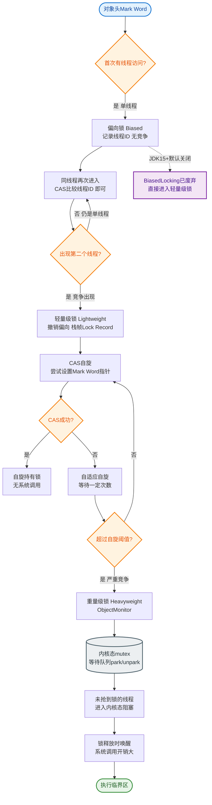
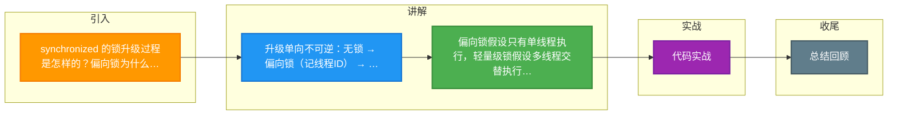

# synchronized 的锁升级过程是怎样的？偏向锁为什么在 JDK 15 后默认关闭？

【锁升级过程（JDK 1.6+）】
无锁 → 偏向锁 → 轻量级锁 → 重量级锁（不可逆）。

**## 锁状态转换与 Mark Word 结构**
```text
Mark Word (32位 JVM) 布局随锁状态变化：

┌──────────────────────────────────────────────────────┐
│ State (2bits) │    Lock Info (剩余 bits)             │
├──────────────────────────────────────────────────────┤
│   00 (Light)   │  指向栈中 Lock Record 的指针         │
├──────────────────────────────────────────────────────┤
│   01 (Biased)  │  线程ID + Epoch + 分代年龄 (1 bit)  │
├──────────────────────────────────────────────────────┤
│   00 (Heavy)   │  指向堆中 ObjectMonitor 的指针       │
├──────────────────────────────────────────────────────┤
│   01 (Normal)  │  对象 HashCode (25 bits) + 分代年龄 │
└──────────────────────────────────────────────────────┘

升级流程图：

[新对象] (Normal/101)
    │
    ├── Thread A 访问 ──▶ [偏向锁] (Biased/01) 记录 ThreadID
    │                              │
    │                              ├── Thread A 再次进入：零开销
    │                              │
    │                              └── Thread B 竞争 ──▶ [撤销偏向锁] (STW) ──▶ [轻量级锁]
    │                                                             │
    │                                                             ├── CAS 成功：Thread B 获锁
    │                                                             │
    │                                                             ├── CAS 失败：自旋 (Adaptive Spin)
    │                                                             │
    │                                                             └── 自旋失败/竞争激烈 ──▶ [重量级锁] (Heavy/10)
    │                                                                        │
    │                                                                        └── OS Mutex, 线程阻塞
```

【各阶段详解】
1. **无锁**：对象刚创建，Mark Word 存储对象的 HashCode。
2. **偏向锁**：
   - 假设锁主要由同一线程多次获得。
   - 当线程第一次获取锁时，CAS 替换 Mark Word 中的 Thread ID。
   - 后续该线程进入/退出同步块只需检查 Thread ID，无需系统调用。
   - **撤销代价**：一旦有第二个线程尝试获取锁，偏向模式宣告结束，撤销需要到达全局安全点，有一定开销。
3. **轻量级锁**：
   - 假设锁存在竞争但很短（交替执行）。
   - 线程在栈帧创建 Lock Record，尝试用 CAS 将 Mark Word 替换为指向 L

---

#### 深化实战补充

1. **实战案例（批量处理与锁争用）**：
   在一个批量数据同步服务中，由于使用了 `synchronized` 保护共享计数器，当并发量上升时，Monitor 对象膨胀为重量级锁，导致大量线程阻塞。通过将粒度拆分（分段计数）或改用 `LongAdder`（CAS 优化），吞吐量提升了 3 倍。

2. **代码示例（偏向锁撤销演示）**：
   ```java
   // JVM 参数开启偏向锁日志：-XX:+PrintBiasedLockingStatistics -XX:BiasedLockingStartupDelay=0
   public class LockDemo {
       static Object lock = new Object();
       public static void main(String[] args) throws InterruptedException {
           synchronized (lock) { /* Thread 1 获取偏向锁 */ }
           Thread t2 = new Thread(() -> {
               synchronized (lock) { /* Thread 2 竞争，触发偏向锁撤销，升级为轻量级锁 */ }
           });
           t2.start();
           t2.join();
       }
   }
   ```

3. **对比表格（JDK 锁机制选型）**
   | 锁类型 | 适用场景 | 优势 | 劣势 | 复杂度 |
   | :--- | :--- | :--- | :--- | :--- |
   | **偏向锁** | 单线程重复执行同步块 | 几乎无额外开销 | 多线程竞争时撤销有 STW 开销 | O(1) (CAS) |
   | **轻量级锁** | 线程交替执行，无激烈竞争 | 避免内核态切换 | 竞争激烈时自旋消耗 CPU | O(N) (自旋) |
   | **重量级锁** | 猛烈竞争，长时间持有 | 稳定，不消耗 CPU | 线程挂起/唤醒，性能损耗大 | O(OS Context Switch) |

4. **为什么 JDK 15 后默认关闭偏向锁？**
   - **撤销成本不可控**：偏向锁撤销需要到达 Safepoint，如果程序中出现了大量并发竞争（例如使用了线程池、并发容器等），偏向锁的撤销会导致长时间的 STW（Stop The World），反而降低性能。
   - **收益下降**：现代 Java 程序普遍使用并发库，锁的竞争模式比早期更复杂，偏向锁“锁通常由一个线程持有”的假设在复杂系统中往往不成立。


## 核心流程图


## 记忆要点

- 升级单向不可逆：无锁 → 偏向锁(记线程ID) → 轻量级锁(CAS+自旋) → 重量级锁(OS互斥量阻塞)
- 偏向锁假设只有单线程执行，轻量级锁假设多线程交替执行且无激烈竞争
- 轻量级锁 CAS 失败引发自旋，自旋失败或竞争激烈膨胀为重量级锁，线程进入阻塞
- JDK15默认关闭偏向锁：因多核高并发场景下撤销偏向锁需STW，维护代价远超带来的性能收益

## 结构化回答

**30 秒电梯演讲：** 锁状态随竞争激烈程度逐步升级，从偏向锁到重量级锁。打个比方，像进门：独占时贴你名字（偏向）直接进；有人争了就改排队叫号（轻量级自旋）；人太多时换保安把守（重量级阻塞）。

**展开框架：**
1. **升级单向不可逆** — 无锁 → 偏向锁(记线程ID) → 轻量级锁(CAS+自旋) → 重量级锁(OS互斥量阻塞)
2. **偏向锁假设只有单线程执行** — 轻量级锁假设多线程交替执行且无激烈竞争
3. **轻量级锁 CAS 失败引发自旋** — 自旋失败或竞争激烈膨胀为重量级锁，线程进入阻塞

**收尾：** 我在项目里踩过坑——实战案例（批量处理与锁争用）：。您想深入聊哪一段：原理、避坑还是对比选型？

## 视频脚本

> 预计时长：3 分钟 | 由浅入深

| 时间 | 画面/字幕 | 口播台词 | 讲解要点 |
|------|----------|----------|----------|
| 0:00 | 标题卡：synchronized 的锁升级过… | "synchronized 的锁升级过程是怎样的？偏向锁为什么在 JDK 15 后默认关闭？一句话——像进门：独占时贴你名字（偏向）直接进；有人争了就改排队叫号（轻量级自旋）；人太多时换保安把守（重量级阻塞）。" | 开场钩子 |
| 0:45 | 概念动画/示意图 | "锁状态随竞争激烈程度逐步升级，从偏向锁到重量级锁——像进门：独占时贴你名字（偏向）直接进；有人争了就改排队叫号（轻量级自旋）；人太多时换保安把守（重量级阻塞）" | 核心定义 |
| 1:30 | 升级单向不可逆示意 | "无锁 → 偏向锁(记线程ID) → 轻量级锁(CAS+自旋) → 重量级锁(OS互斥量阻塞)" | 要点1 |
| 2:15 | 偏向锁假设只有单线程执行示意 | "轻量级锁假设多线程交替执行且无激烈竞争" | 要点2 |
| 3:00 | 总结卡 | "记住这几条，面试不慌。下期讲进阶追问。" | 收尾 |

### 视频流程图



