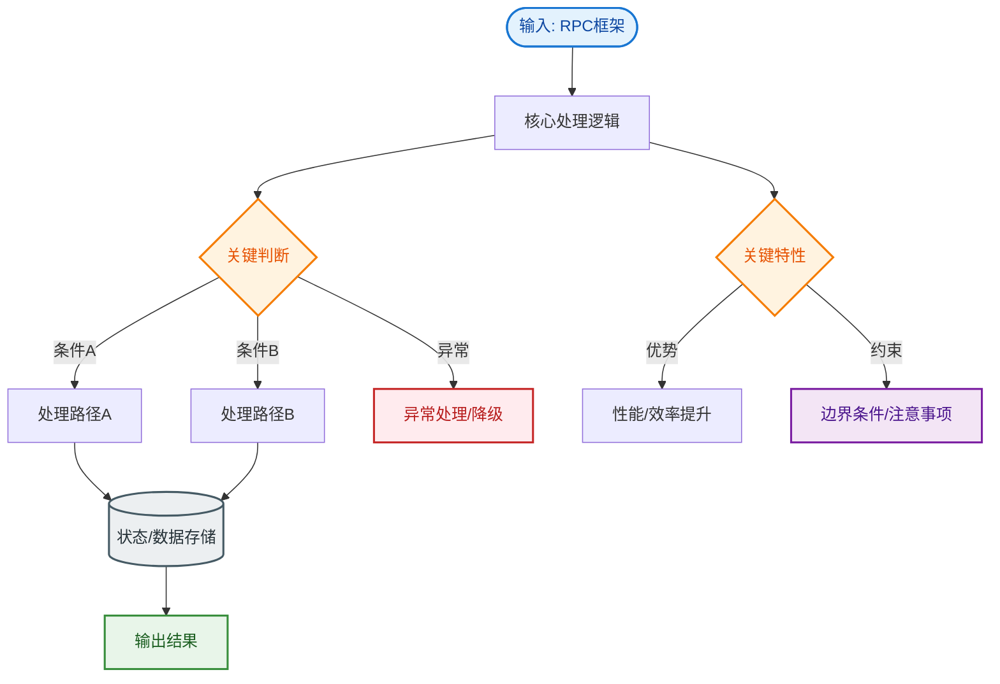

# RPC框架

### Dubbo 工作流程
```text
     Consumer                           Provider
       │                                  │
1. 引用服务 │                                  │
       ├──────────(生成代理对象)───────────>│
2. 发起调用 │                                  │
       ├─────[Proxy]──[Cluster]──[Invoker]──┤
3. 负载均衡 │             (选择具体地址)        │
       │                                  │
4. 序列化  │                                  │
       ├────────[Protocol]────────────────>│
5. 网络传输│             (Netty)               │
6. 反序列化│                                  ├────[Exchange]
7. 业务调用│                                  ├────[Invoker]
       │                                  │
8. 返回结果│ <────────[序列化+网络]─────────────┤
       │                                  │
```
1.  **服务消费者** 调用本地接口（实际是代理对象 Proxy）。
2.  **客户端存根** 将请求序列化，通过网络发送。
3.  **服务端存根** 接收消息，反序列化后调用本地服务。
4.  **本地服务** 执行逻辑，返回结果。
5.  **服务端存根** 序列化结果，返回给消费者。
6.  **客户端存根** 反序列化结果，返回给业务层。

### Dubbo 支持的协议
1.  **dubbo**（默认）：
    - **特点**：单一长连接，NIO 异步通信，Hessian2 序列化。
    - **场景**：大并发小数据量，消费者远多于提供者。
    - **优点**：连接复用，减少握手开销。
2.  **rmi**：
    - **特点**：JDK 标准 RMI，阻塞短连接，Java 标准序列化。
    - **场景**：常规远程调用，可与原生 RMI 互操作。
    - **缺点**：依赖旧版包时存在安全漏洞，性能一般。
3.  **rest**：
    - **特点**：基于 HTTP 协议，可接入标准 Swagger 工具。
    - **场景**：需要跨语言、对接外部系统时。

#### 实战案例
在高并发大流量场景下（如秒杀），若使用默认 `dubbo` 协议且单一长连接带宽被打满，会导致队列积压。曾遇某核心服务因线程池满触发拒绝，后调整为 `triple`（基于 HTTP/2）协议有效利用多路复用解决瓶颈。

### 注册中心与负载均衡
- **注册中心**：负责服务地址的注册与发现。支持 Zookeeper（推荐，支持监听机制）、Nacos、Redis 等。
- **负载均衡策略**：
  - `Random`：加权随机（默认）。
  - `RoundRobin`：加权轮询。
  - `LeastActive`：最小活跃数（响应快的提供者处理更多请求）。
  - `ConsistentHash`：一致性哈希（相同参数请求总是发同一提供者）。

#### 代码示例：自定义负载均衡 (Java)
```java
public class MyLoadBalance extends AbstractLoadBalance {
    @Override
    protected <T> Invoker<T> doSelect(List<Invoker<T>> invokers, URL url, Invocation invocation) {
        // 实现自定义逻辑，例如基于地理位置的路由
        return invokers.get(0); 
    }
}
// 在 resources/META-INF/dubbo/org.apache.dubbo.rpc.cluster.LoadBalance 文件中声明
// myLoadBalance=com.example.MyLoadBalance
```

### 服务容错（集群容错模式）
- **Failover（默认）**：失败自动切换，重试其他服务器（通常用于读操作）。
- **Failfast**：快速失败，只发起一次调用，失败立即报错（用于写操作）。
- **Failsafe**：失败安全，出现异常时直接忽略（用于日志记录等）。
- **Failback**：失败自动恢复，后台记录失败请求，定时重发。

#### 对比表格：Dubbo 协议选型
| 特性 | Dubbo 协议 | REST 协议 | Triple (gRPC) 协议 |
| :--- | :--- | :--- | :--- |
| **传输层** | TCP (单长连接) | HTTP | HTTP/2 (多路复用) |
| **序列化** | Hessian2 | JSON/Jackson | Protobuf |
| **性能** | 极高 (内部系统) | 一般 | 高 (跨语言高性能) |
| **适用场景** | 内部微服务互通 | 对接外部/OpenAPI | 云原生/跨语言调用 |

## 常见考点
1.  **Dubbo 和 Spring Cloud 的区别**：Dubbo 基于 Netty 传输（性能高），偏 RPC；Spring Cloud 基于 HTTP REST（通用性强），偏全栈微服务生态。
2.  **SPI（Service Provider Interface）**：Dubbo 大量使用 JDK SPI 进行扩展，实现了依赖倒置，增强了扩展性（如协议扩展、负载均衡扩展）。
3.  **异步调用**：Dubbo 默认同步，可配置 `return="false"` 实现纯异步，或使用 `CompletableFuture` 接收回调。


## 核心流程图


## 记忆要点

- 核心流程：消费者调用代理→网络序列化传输→提供者反序列化执行→原路返回结果
- Dubbo默认协议：单一长连接+同步异步NIO，适合并发高且数据量小的场景
- 负载策略：默认随机，另有轮询、最小活跃数、一致性哈希
- 容错策略：默认失败切换，读写区分明确(如Failfast用于非幂等写，Failsafe用于写日志)

## 结构化回答

**30 秒电梯演讲：** Dubbo通过序列化与网络传输实现远程服务调用，支持多种协议。打个比方，像打电话（RPC），客户端存根是翻译官，把需求打包发过去，服务端翻译官解包找本地服务干活，再把结果发回来。

**展开框架：**
1. **核心流程** — 消费者调用代理→网络序列化传输→提供者反序列化执行→原路返回结果
2. **Dubbo默认协议** — 单一长连接+同步异步NIO，适合并发高且数据量小的场景
3. **负载策略** — 默认随机，另有轮询、最小活跃数、一致性哈希

**收尾：** 我在项目里踩过坑——在高并发大流量场景下（如秒杀），若使用默认 `dubbo` 协议且单一长连接带宽被打满，会导致队列积压。您想深入聊哪一段：原理、避坑还是对比选型？

## 视频脚本

> 预计时长：3 分钟 | 由浅入深

| 时间 | 画面/字幕 | 口播台词 | 讲解要点 |
|------|----------|----------|----------|
| 0:00 | 标题卡：RPC框架 | "RPC框架？一句话——像打电话（RPC），客户端存根是翻译官，把需求打包发过去，服务端翻译官解包找本地服务干活，再把结果发回来。" | 开场钩子 |
| 0:45 | 概念动画/示意图 | "Dubbo通过序列化与网络传输实现远程服务调用，支持多种协议——像打电话（RPC），客户端存根是翻译官，把需求打包发过去，服务端翻译官解包找本地服务干活，再把结果发回来" | 核心定义 |
| 1:30 | 核心流程示意 | "消费者调用代理→网络序列化传输→提供者反序列化执行→原路返回结果" | 要点1 |
| 2:15 | Dubbo默认协议示意 | "单一长连接+同步异步NIO，适合并发高且数据量小的场景" | 要点2 |
| 3:00 | 总结卡 | "记住这几条，面试不慌。下期讲进阶追问。" | 收尾 |
