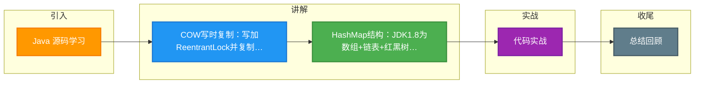

# Java 源码学习

### LinkedList
- **结构**：双向链表，实现了 List 和 Deque 接口。节点包含 `prev`, `item`, `next`。
- **特点**：插入删除快 O(1)（仅需移动指针），随机访问慢 O(n)。
- **查找优化**：`get(int index)` 方法会判断 index 靠近头还是尾，决定从头结点还是尾结点开始遍历，复杂度约 O(n/2)。
- **注意**：非线程安全。

### CopyOnWriteArrayList
- **原理**：写操作（add/set）时，先通过 `ReentrantLock` 加锁，复制一份新数组进行修改，修改完成后将引用指向新数组；读操作无锁，直接读取原数组。
- **特点**：读写分离，读操作性能极高，适合读多写少（如白名单、配置中心）。
- **缺陷**：
    1.  **数据实时性差**：写操作期间，读到的可能是旧数据（最终一致性）。
    2.  **内存开销大**：每次写操作都要复制整个底层数组，容易触发 Full GC。

**实战案例**：
在动态规则引擎中，使用 CopyOnWriteArrayList 存储规则集合。当运营人员更新规则（低频写）时，不影响正在进行的业务计算（高频读），但在规则列表过大（>10万条）时引发了频繁 Young GC。

**代码示例（COWAL 写时复制原理）**：
```java
public boolean add(E e) {
    final ReentrantLock lock = this.lock;
    lock.lock();
    try {
        Object[] elements = getArray();
        int len = elements.length;
        Object[] newElements = Arrays.copyOf(elements, len + 1); // 复制数组
        newElements[len] = e;
        setArray(newElements); // 原子引用替换
        return true;
    } finally {
        lock.unlock();
    }
}
```

### TreeMap
- **结构**：红黑树（自平衡二叉查找树）。
- **特点**：Key 有序（自然排序或定制排序），查询/插入/删除时间复杂度均为 O(log n)。
- **比较**：Key 必须实现 `Comparable` 接口或在构造时传入 `Comparator`，否则抛出 `ClassCastException`。

### PriorityQueue
- **结构**：优先级队列，底层通过**二叉小顶堆**（默认）实现，物理结构是数组。
- **特点**：
    - 保证堆顶元素最小（或最大，取决于 Comparator）。
    - 不保证其他元素的顺序。
    - 不允许 `null` 元素。
    - **非线程安全**，并发场景可用 `PriorityBlockingQueue`。

**实战案例**：
在定时任务调度系统中，使用 `PriorityBlockingQueue` 存储待执行任务。每次 `take()` 操作直接获取最近需要执行的任务，无需遍历，极大降低了调度延迟。

### HashMap
- **结构**：JDK 1.8 采用 **数组 + 链表 + 红黑树**。
- **关键参数**：
    - `initialCapacity`：初始容量（默认 16），需尽量设置为 2 的幂次方。
    - `loadFactor`：负载因子（默认 0.75），决定扩容阈值。
- **JDK 1.8 优化**：
    - **红黑树化**：当链表长度 > 8 且数组长度 > 64 时，链表转为红黑树（查询 O(n) -> O(log n)）。
    - **链表化**：当红黑树节点 < 6 时，退化为链表。
    - **插入方式**：由头插法改为**尾插法**，解决并发扩容时的死循环问题（但在并发下仍需使用 ConcurrentHashMap）。
    - **Hash 扰动**：高 16 位异或低 16 位，降低 Hash 碰撞概率。
- **扩容**：容量变为 2 倍，元素下标计算简化：要么在原位置，要么移动到 `原位置 + 原容量`。

**代码示例（JDK 1.8 扰动函数）**：
```java
static final int hash(Object key) {
    int h;
    // h = key.hashCode() 
    // (h >>> 16) 高16位异或低16位，保证高低位特征参与运算
    return (key == null) ? 0 : (h = key.hashCode()) ^ (h >>> 16);
}
```

### ConcurrentHashMap (JDK 1.8)
- **结构**：摒弃了 JDK 1.7 的 Segment 分段锁，采用 **Node 数组 + 链表 + 红黑树**。
- **锁机制**：使用 `CAS` + `synchronized`。
    - 如果是插入新节点（空桶），使用 CAS 无锁插入。
    - 如果发生 Hash 冲突，使用 `synchronized` 锁住当前桶的头节点（锁粒度更细）。

**实战案例**：
高并发统计服务中，JDK 1.7 的 ConcurrentHashMap 在数据量千万级时，因分段锁数量固定导致竞争加剧。升级到 JDK 1.8 后，锁粒度从 Segment 级别降低到 Node（链表头）级别，吞吐量提升 30%。

## 常见考点
1.  **HashMap 扩容为什么是 2 的幂次**：为了利用位运算 `(n - 1) & hash` 高效计算下标，且保证分布均匀。
2.  **HashMap 线程安全问题**：JDK 1.7 并发扩容死循环（头插法导致链表环），1.8 虽修复死循环但仍存在数据覆盖问题（多线程 put 同一个桶），需使用 `ConcurrentHashMap`。
3.  **HashMap 链表转红黑树阈值为什么是 8**：根据泊松分布计算，Hash 碰撞导致链表长度达到 8 的概率极低（千万分之一），此时转为树是为了防御极端情况。

### 结构对比：List/Set 常见实现类

| 实现类 | 底层结构 | 查询效率 | 插入删除效率 | 线程安全 | 适用场景 |
| :--- | :--- | :--- | :--- | :--- | :--- |
| **ArrayList** | 动态数组 | O(1) | O(n) (涉及扩容/移动) | 不安全 | 频繁随机访问，读多写少 |
| **LinkedList** | 双向链表 | O(n) | O(1) (已知节点位置) | 不安全 | 频繁插入删除，头部/尾部操作 |
| **HashMap** | 数组+链表+红黑树 | O(1) ~ O(n) | O(1) ~ O(n) | 不安全 | 键值对存储，无序，高频查询 |
| **TreeMap** | 红黑树 | O(log n) | O(log n) | 不安全 | 需要排序，范围查找 |
| **ConcurrentHashMap** | CAS+Sync+Node数组 | O(1) ~ O(n) | O(1) ~ O(n) | 安全 | 高并发键值对存储 |
| **CopyOnWriteArrayList** | 数组 | O(1) | O(n) (复制全量数组) | 安全 | 读多写极少（如黑名单） |


## 核心架构图

```mermaid
flowchart TD
    classDef start fill:#4CAF50,color:#fff
    classDef process fill:#2196F3,color:#fff
    classDef decision fill:#FF9800,color:#fff
    classDef special fill:#9C27B0,color:#fff
    classDef error fill:#f44336,color:#fff
    classDef info fill:#607D8B,color:#fff
    class A start
    class AQS process
    class B decision
    class B1 special
    class B2 error
    class B3 info
    class C start
    class C1 process
    class C2 decision
    class C3 special
    class D error
    class D1 info
    class D2 start
    class E process
    class E1 decision
    class E2 special
    class E3 error
    class F info
    class G start
    class GC process
    class IO decision
    class JIT special
    class JMM error
    class JUC info
    class JVM start
    class Java process
    class Lambda decision
    class NIO special
    class Optional error
    class Pattern info
    class Records start
    class Sealed process
    class Stream decision
    class Thread special
    class Virtual error
    class ZGC info
    A[Java 核心知识体系] --> B[基础语法]
    B --> B1[面向对象/接口/枚举]
    B --> B2[集合/泛型/反射/注解]
    B --> B3[IO/NIO/异常/序列化]
    A --> C[并发]
    C --> C1[线程/锁/AQS/JUC]
    C --> C2[内存模型 JMM]
    C --> C3[线程池/并发容器]
    A --> D[JVM]
    D --> D1[内存结构/GC/类加载]
    D --> D2[JIT/逃逸分析/调优]
    A --> E[新特性]
    E --> E1[Lambda/Stream/Optional]
    E --> E2[Records/Sealed/Pattern]
    E --> E3[Virtual Thread/ZGC]
    F[设计模式] --> G[创建/结构/行为 23 种]
```



## 记忆要点

- COW写时复制：写加ReentrantLock并复制新数组，读无锁，适合读多写少但极其消耗内存
- HashMap结构：JDK1.8为数组+链表+红黑树，链表超8且数组超64才树化，改用尾插法防死循环
- ConcurrentHashMap演进：1.7用Segment分段锁，1.8细化粒度为CAS+synchronized锁头节点
- 集合特性对比：LinkedList增删O(1)但查询慢，TreeMap基于红黑树要求Key可比较，PriorityQueue是小顶堆

## 结构化回答

**30 秒电梯演讲：** 不同集合基于数组、链表、树结构实现，权衡读写性能与内存。打个比方，LinkedList像火车车厢（增删方便），HashMap像带索引的抽屉柜（找东西快），CopyOnWrite像修书（复印一本改完再换，不影响别人看）。

**展开框架：**
1. **COW写时复制** — 写加ReentrantLock并复制新数组，读无锁，适合读多写少但极其消耗内存
2. **HashMap结构** — JDK1.8为数组+链表+红黑树，链表超8且数组超64才树化，改用尾插法防死循环
3. **ConcurrentHashMap演进** — 1.7用Segment分段锁，1.8细化粒度为CAS+synchronized锁头节点

**收尾：** 我在项目里踩过坑——在动态规则引擎中，使用 CopyOnWriteArrayList 存储规则集合。您想深入聊哪一段：原理、避坑还是对比选型？

## 视频脚本

> 预计时长：4 分钟 | 由浅入深

| 时间 | 画面/字幕 | 口播台词 | 讲解要点 |
|------|----------|----------|----------|
| 0:00 | 标题卡：Java 源码学习 | "Java 源码学习？一句话——LinkedList像火车车厢（增删方便），HashMap像带索引的抽屉柜（找东西快），CopyOnWrite像修书（复印一本改完再换，不影响别人看）。" | 开场钩子 |
| 0:48 | 概念动画/示意图 | "不同集合基于数组、链表、树结构实现，权衡读写性能与内存——LinkedList像火车车厢（增删方便），HashMap像带索引的抽屉柜（找东西快），CopyOnWrite像修书（复印一本改完再换，不影响别人看）" | 核心定义 |
| 1:36 | COW写时复制示意 | "写加ReentrantLock并复制新数组，读无锁，适合读多写少但极其消耗内存" | 要点1 |
| 2:24 | HashMap结构示意 | "JDK1.8为数组+链表+红黑树，链表超8且数组超64才树化，改用尾插法防死循环" | 要点2 |
| 3:12 | 要点3图解示意 | "1.7用Segment分段锁，1.8细化粒度为CAS+synchronized锁头节点" | 要点3 |
| 4:00 | 总结卡 | "记住这几条，面试不慌。下期讲进阶追问。" | 收尾 |

### 视频流程图



