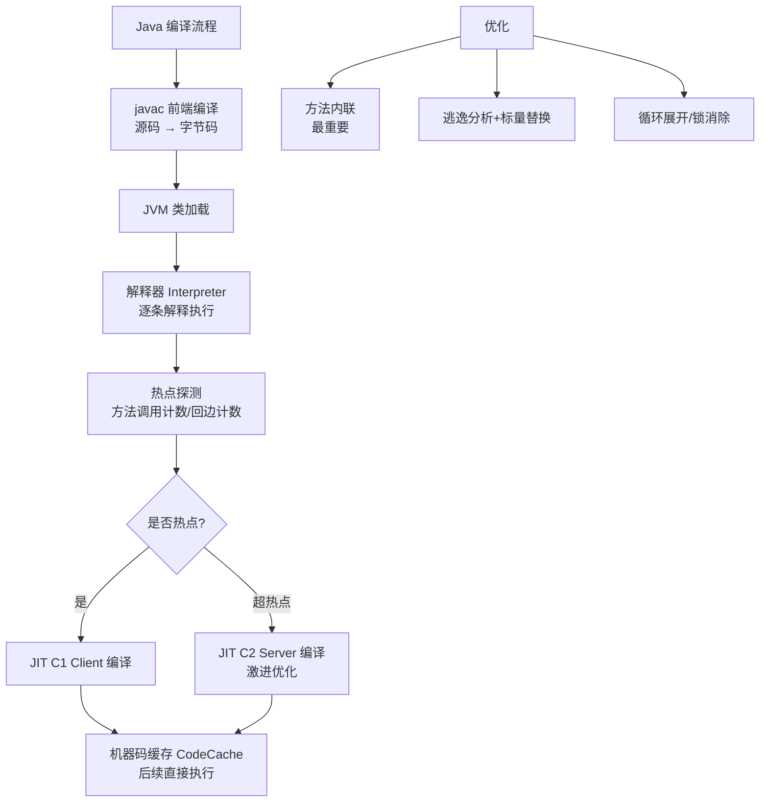

# Java 后端编译优化

### 后端编译优化 (JIT)
- **热点代码**：被多次调用的方法（方法计数器）或多次执行的循环体（回边计数器）。
- **热点探测**：
  - **基于采样**：周期性检查栈顶（不精确，无法精确确定热度，但开销小）。
  - **基于计数器**：统计调用次数和回边次数（精确，HotSpot 采用）。

### 分层编译
1. **C1 (Client Compiler)**：启动快，优化少（第 1-3 层）。主要进行简单的优化，如方法内联、常量传播等。
2. **C2 (Server Compiler)**：启动慢，激进优化，性能高（第 4 层）。基于逃逸分析、标量替换、循环展开等深层优化。

**分层编译层级**：
- Level 0: 解释执行。
- Level 1: C1 编译（仅带profiling）。
- Level 2: C1 编译（带profiling，仅限调用次数很多的循环）。
- Level 3: C1 编译（带profiling，全量优化）。
- Level 4: C2 编译（基于Level 3的profiling信息进行激进优化）。

### 编译模式
- **混合模式**：解释器 + C1 + C2 协同工作。
- **OSR (On-Stack Replacement)**：栈上替换，在方法执行过程中（特别是循环体）将编译后的本地码替换当前字节码，无需等待方法结束。

### 提前编译
- 程序运行前直接编译成机器码（如 GraalVM Native Image），省去运行时编译开销，牺牲优化能力和跨平台性。

### JIT 优化关键细节
- **方法内联**：将目标方法代码复制到调用方法中，消除方法调用开销。
- **逃逸分析**：分析对象作用域，若不逃逸出线程或方法，可进行栈上分配或标量替换（消除对象创建）。
- **循环剥离**：将循环头部的少量代码剥离出来，减少循环内部判断开销。

**实战案例**：
在一次性能压测中，发现 `Math.abs()` 等简单方法在循环中被频繁调用。通过 JIT 日志分析发现由于方法体过大导致未发生内联。使用 `-XX:MaxInlineSize` 调整阈值强制内联后，吞吐量提升了 15%。

**代码示例（查看逃逸分析日志）**：
```bash
# 打印 JVM 的逃逸分析信息
java -XX:+PrintEliminateAllocations com.example.TestEscape

# 如果看到 "escaped"，说明对象发生了逃逸，无法进行栈上分配
# 如果看到 "eliminated"，说明对象被标量替换或栈上分配了
```

## 常见考点
1. **解释模式 vs 编译模式**：解释模式启动快执行慢，编译模式启动慢执行快，混合模式如何平衡？
2. **逃逸分析**：什么是标量替换和栈上分配？它们如何减少 GC 压力？
3. **热点阈值**：默认阈值是多少？如何通过 `-XX:CompileThreshold` 调整？
4. **去优化**：当假设条件失效（如类继承关系改变）时，C2 代码如何回退到解释执行？

### 对比表格：C1 vs C2 编译器

| 特性 | C1 (Client Compiler) | C2 (Server Compiler) |
| :--- | :--- | :--- |
| **编译目标** | 快速启动，低延迟 | 高峰值性能，高吞吐 |
| **优化程度** | 轻量级优化 | 激进的全局优化 |
| **主要优化手段** | 方法内联、常量折叠、去虚拟化 | 逃逸分析、标量替换、循环展开、向量优化 |
| **Profile 信息** | 收集简单信息 | 收集深度信息（类型、分支概率） |
| **触发时机** | 方法调用次数较低 | 方法调用次数极高（默认 10000 次） |
| **代码生成速度** | 快 | 慢 |
| **OSR 支持** | 支持 | 支持 |
| **适用场景** | GUI 应用、短生命周期的应用 | 长时间运行的后台服务、大数据计算 |


## 核心架构图



## 记忆要点

- 热点探测：因为基于计数器精确度高，所以HotSpot用方法调用和循环回边次数触发JIT
- 分层编译对比：C1(Client)负责快速启动与轻量优化，C2(Server)负责收集Profiling做激进深度的全局优化
- 核心优化手段：方法内联消除调用开销，逃逸分析通过标量替换实现栈上分配从而大幅降低GC压力
- 触发与替换：默认C2触发阈值10000次，OSR机制支持在不退出方法的前提下替换循环体机器码

## 结构化回答

**30 秒电梯演讲：** JIT通过热点探测将频繁代码编译为本地机器码，分层平衡启动与性能。打个比方，像学习，解释器是看书看一句懂一句，JIT是把常考的知识点（热点）背下来（编译），下次直接用。

**展开框架：**
1. **热点探测** — 因为基于计数器精确度高，所以HotSpot用方法调用和循环回边次数触发JIT
2. **分层编译对比** — C1(Client)负责快速启动与轻量优化，C2(Server)负责收集Profiling做激进深度的全局优化
3. **核心优化手段** — 方法内联消除调用开销，逃逸分析通过标量替换实现栈上分配从而大幅降低GC压力

**收尾：** 我在项目里踩过坑——在一次性能压测中，发现 `Math.abs()` 等简单方法在循环中被频繁调用。您想深入聊哪一段：原理、避坑还是对比选型？

## 视频脚本

> 预计时长：4 分钟 | 由浅入深

| 时间 | 画面/字幕 | 口播台词 | 讲解要点 |
|------|----------|----------|----------|
| 0:00 | 标题卡：Java 后端编译优化 | "Java 后端编译优化？一句话——像学习，解释器是看书看一句懂一句，JIT是把常考的知识点（热点）背下来（编译），下次直接用。" | 开场钩子 |
| 0:48 | 概念动画/示意图 | "JIT通过热点探测将频繁代码编译为本地机器码，分层平衡启动与性能——像学习，解释器是看书看一句懂一句，JIT是把常考的知识点（热点）背下来（编译），下次直接用" | 核心定义 |
| 1:36 | 热点探测示意 | "因为基于计数器精确度高，所以HotSpot用方法调用和循环回边次数触发JIT" | 要点1 |
| 2:24 | 分层编译对比示意 | "C1(Client)负责快速启动与轻量优化，C2(Server)负责收集Profiling做激进深度的全局优化" | 要点2 |
| 3:12 | 核心优化手段示意 | "方法内联消除调用开销，逃逸分析通过标量替换实现栈上分配从而大幅降低GC压力" | 要点3 |
| 4:00 | 总结卡 | "记住这几条，面试不慌。下期讲进阶追问。" | 收尾 |
