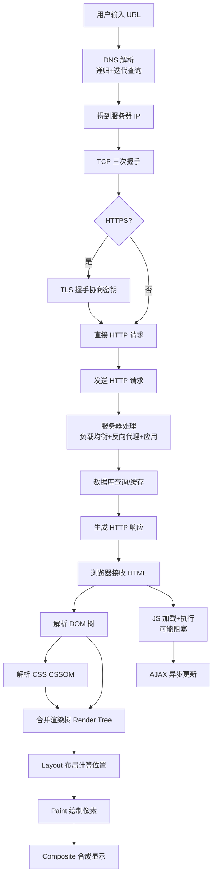
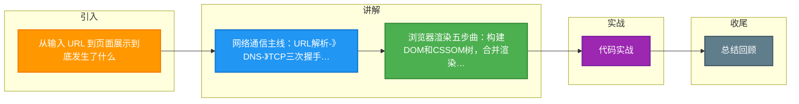

# 从输入 URL 到页面展示到底发生了什么

### 从输入 URL 到页面展示的过程

#### 1. URL 解析
- 浏览器判断输入的是搜索关键字还是合法 URL。如果是 URL，解析协议、主机、端口、路径等。

#### 2. DNS 解析
- **DNS 查询**：查找域名对应的 IP 地址（详见 DNS 题目）。

#### 3. TCP 连接
- **三次握手**：建立连接（SYN -> SYN+ACK -> ACK）。
- **TLS 握手**：如果是 HTTPS，进行 TLS 版本协商、密钥交换、证书验证。

#### 4. 发送 HTTP 请求
- 构建请求报文（请求行、请求头、请求体）。

#### 5. 服务器处理
- Nginx 反向代理 -> 应用服务器 -> 数据库。
- 返回 HTTP 响应报文（状态码、响应头、响应体）。

#### 6. 浏览器渲染（关键路径）
```
[HTML] --> 解析 --> DOM Tree
                 |
                 v
[CSS ] --> 解析 --> CSSOM Tree
                 |
                 +----> Render Tree (Layout/Reflow) --> Paint --> Display
```
- **构建 DOM 树**：字节 -> 字符 -> Tokens -> Nodes -> DOM。
- **构建 CSSOM 树**：解析 CSS，计算样式规则。
- **合成渲染树**：将 DOM 和 CSSOM 合并，包含可见节点及样式（不包含 `display:none` 等元素）。
- **布局**：计算每个节点的几何信息（位置、大小）。
- **绘制**：将节点绘制到图层上。
- **合成**：将图层按正确顺序叠加到屏幕上。

#### 7. 断开连接
- TCP 四次挥手（FIN, ACK, FIN, ACK）。

#### 8. 实战深化

**实战案例**：
在首屏优化项目中，通过分析 Webpack Bundle 发现一个巨大的 Common Chunk 阻塞了 DOM 解析。我们将其拆分并使用 `<link rel="preload">` 预加载关键字体，首屏时间从 1.5s 降至 0.8s。另外，注意 `document.write` 会阻塞解析，切勿在生产环境使用。

**代码示例**：
```html
<!-- 关键 CSS 内联，非关键 JS 异步加载 -->
<style>body{margin:0}/* 关键路径 CSS */</style>
<script defer src="analytics.js"></script>
<script async src="non-critical.js"></script>
```

**渲染优化对比**：

| 策略 | 作用 | 触发时机 | 性能影响 |
| :--- | :--- | :--- | :--- |
| **Refrence (Reflow)** | 计算节点布局（位置、大小） | DOM 树变化、样式变化（宽/高/位置） | 开销最大，需避免频繁触发 |
| **Repaint** | 绘制节点颜色、背景等 | 样式变化（颜色/可见性） | 开销较小，非布局层变化 |
| **Composite** | 图层合成与上传 GPU | Transform/Opacity/Will-change | 性能最好，利用 GPU 加速 |

## 常见考点
1. **重绘与回流**：什么操作会触发 Reflow（布局）？什么触发 Repaint（绘制）？如何优化？
2. **关键渲染路径**：如何减少阻塞渲染的 CSS 和 JS？`<script defer>` 和 `<script async>` 的区别？
3. **输入 URL 后浏览器缓存策略**：Disk Cache, Memory Cache, Service Worker 的优先级？
4. **HTTPS 握手细节**：RSA 和 ECDHE 握手的区别？如何实现前向安全性？


## 核心架构图



## 记忆要点

- 网络通信主线：URL解析->DNS->TCP三次握手与TLS->发请求->服务器处理->四次挥手
- 浏览器渲染五步曲：构建DOM和CSSOM树，合并渲染树，执行布局Layout，绘制Paint，最终合成Composite
- 渲染性能对比：回流Reflow改布局开销最大，重绘Repaint改样式次之，利用GPU合成Composite性能最好

## 结构化回答

**30 秒电梯演讲：** 浏览器通过DNS找地址，建连接发请求，接收响应后解析渲染。打个比方，像寄信查包裹：先查地址（DNS），打集装箱（TCP），寄出去（HTTP），收到货拆包摆好（渲染）。

**展开框架：**
1. **网络通信主线** — URL解析->DNS->TCP三次握手与TLS->发请求->服务器处理->四次挥手
2. **浏览器渲染五步曲** — 构建DOM和CSSOM树，合并渲染树，执行布局Layout，绘制Paint，最终合成Composite
3. **渲染性能对比** — 回流Reflow改布局开销最大，重绘Repaint改样式次之，利用GPU合成Composite性能最好

**收尾：** 我在项目里踩过坑——在首屏优化项目中，通过分析 Webpack Bundle 发现一个巨大的 Common Chunk 阻塞了 DOM 解析。您想深入聊哪一段：原理、避坑还是对比选型？

## 视频脚本

> 预计时长：2 分钟 | 由浅入深

| 时间 | 画面/字幕 | 口播台词 | 讲解要点 |
|------|----------|----------|----------|
| 0:00 | 标题卡：从输入 URL 到页面展示到底发生了… | "从输入 URL 到页面展示到底发生了什么？一句话——像寄信查包裹：先查地址（DNS），打集装箱（TCP），寄出去（HTTP），收到货拆包摆好（渲染）。" | 开场钩子 |
| 0:40 | 概念动画/示意图 | "浏览器通过DNS找地址，建连接发请求，接收响应后解析渲染——像寄信查包裹：先查地址（DNS），打集装箱（TCP），寄出去（HTTP），收到货拆包摆好（渲染）" | 核心定义 |
| 1:20 | 网络通信主线示意 | "URL解析->DNS->TCP三次握手与TLS->发请求->服务器处理->四次挥手" | 要点1 |
| 2:00 | 总结卡 | "记住这几条，面试不慌。下期讲进阶追问。" | 收尾 |

### 视频流程图



