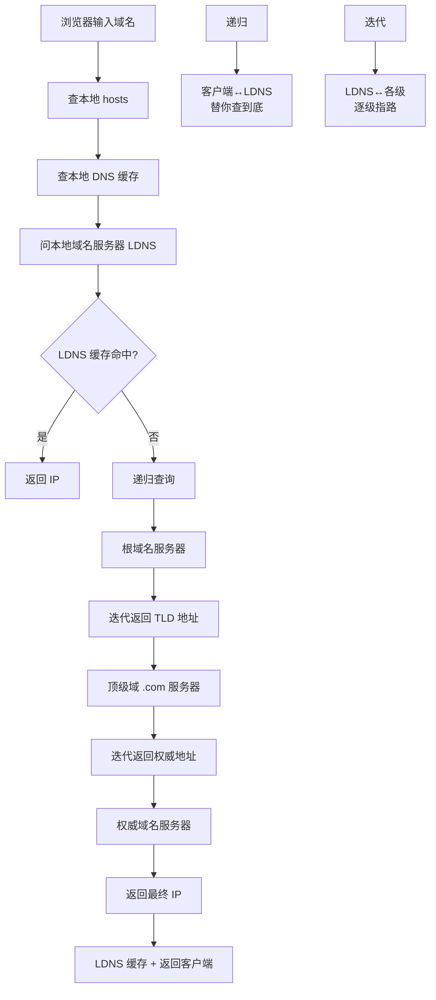
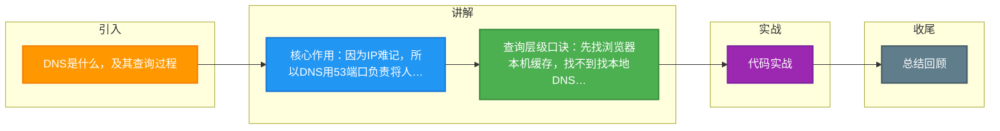

# DNS是什么，及其查询过程

### DNS (Domain Name System)
- **作用**：将人类可读的域名（如 www.google.com）转换为机器可读的 IP 地址。
- **端口**：53（UDP/53，TCP/53 用于区域传输）。

### 查询过程
```
[浏览器] --> 查询缓存 --> 未命中 --> [系统 Hosts] --> 未命中 --> [本地 DNS]
                                                     |
                                                     v
                                            [递归查询或迭代查询]
                                                     |
          +--------------------+--------------------+--------------------+
          v                    v                    v                    v
    [根域名 .]         [顶级域 .com]      [权威域名 google]   [返回 IP 结果]
```
1. **浏览器缓存**：检查本地缓存是否有记录。
2. **系统缓存**：检查本机 Hosts 文件。
3. **本地 DNS 服务器**：向运营商（ISP）提供的 DNS 服务器发起查询（通常是递归查询，即本地 DNS 代劳到底）。
4. **根域名服务器**：本地 DNS 未命中时，查询根服务器（返回顶级域名服务器地址，如 .com）。
5. **顶级域名服务器**：查询顶级域服务器（返回权威域名服务器地址）。
6. **权威域名服务器**：查询权威服务器（返回目标域名对应的 IP）。
7. **返回结果**：本地 DNS 将 IP 返回给浏览器，并缓存。

### DNS 记录类型
- **A 记录**：域名指向 IPv4 地址。
- **AAAA 记录**：域名指向 IPv6 地址。
- **CNAME 记录**：域名别名（指向另一个域名）。
- **MX 记录**：邮件交换服务器。

### HTTPS 与 HTTP 区别
1. **安全性**：HTTPS 是加密的，HTTP 是明文。
2. **端口**：HTTP 80，HTTPS 443。
3. **证书**：HTTPS 需要 CA 数字证书，用于验证服务器身份。
4. **协议栈**：HTTPS = HTTP + SSL/TLS。
5. **性能**：HTTPS 因握手和加密解密消耗 CPU 资源，性能略低于 HTTP（可通过 Session Resumption 优化）。

#### 实战深化

**实战案例**：
在跨域接口调用中，曾遇到浏览器 DNS 缓存了错误的 IP 导致请求失败（DNS 污染）。解决方法是配置 HTTP DNS（DoH）或引导用户手动修改 DNS 为 8.8.8.8。此外，DNS 解析耗时通常在 200ms 左右，对于高并发接口，建议在服务端做长连接缓存，避免频繁 DNS 查询。

**代码示例 (Go DNS 查询)**：
```go
import "github.com/miekg/dns"

func main() {
    m := new(dns.Msg)
    m.SetQuestion("google.com.", dns.TypeA) // 查询 A 记录
    c := new(dns.Client)
    r, _, _ := c.Exchange(m, "8.8.8.8:53")
    for _, ans := range r.Answer {
        fmt.Println(ans) // 输出解析结果
    }
}
```

**DNS 负载均衡策略对比**：

| 方式 | 实现原理 | 优点 | 缺点 | 适用场景 |
| :--- | :--- | :--- | :--- | :--- |
| **DNS 轮询** | 配置多个 A 记录 | 简单，成本低 | 无法感知健康状态；DNS 缓存导致负载不均 | 简单的负载均衡 |
| **GeoDNS** | 根据客户端 IP 返回就近 IP | 降低延迟，提升体验 | 配置复杂，依赖精准 IP 库 | CDN，全球加速 |
| **HTTP DNS** | 应用层通过接口获取 IP | 防止劫持；精准调度 | 需改造客户端 App | 移动端 App，高可用要求 |

## 常见考点
1. **DNS 污染与劫持**：什么是 DNS 劫持？如何通过 HTTPS（DNS over HTTPS, DoH）防止？
2. **递归查询 vs 迭代查询**：本地 DNS 与根服务器之间是什么交互？
3. **负载均衡**：DNS 如何实现简单的负载均衡？有什么缺点（如缓存延迟）？
4. **TLS 握手**：RSA 握手和 ECDHE 握手的完整流程及区别？


## 核心架构图



## 记忆要点

- 核心作用：因为IP难记，所以DNS用53端口负责将人类可读的域名解析为机器IP地址
- 查询层级口诀：先找浏览器本机缓存，找不到找本地DNS服务器，再依次问根、顶级、权威域名服务器
- 递归与迭代区别：客户端向本地DNS是递归查询，本地DNS向各级服务器是迭代查询
- 记录类型对比：A记录指向IPv4，CNAME是域名别名指向另一个域名

## 结构化回答

**30 秒电梯演讲：** DNS是互联网电话簿，将域名翻译为IP；HTTPS是加密版HTTP。打个比方，DNS像查号台，输入名字查号码；HTTP像寄明信片，HTTPS像寄加密信件（锁起来只有收件人能开）。

**展开框架：**
1. **核心作用** — 因为IP难记，所以DNS用53端口负责将人类可读的域名解析为机器IP地址
2. **查询层级口诀** — 先找浏览器本机缓存，找不到找本地DNS服务器，再依次问根、顶级、权威域名服务器
3. **递归与迭代区别** — 客户端向本地DNS是递归查询，本地DNS向各级服务器是迭代查询

**收尾：** 我在项目里踩过坑——在跨域接口调用中，曾遇到浏览器 DNS 缓存了错误的 IP 导致请求失败（DNS 污染）。您想深入聊哪一段：原理、避坑还是对比选型？

## 视频脚本

> 预计时长：2 分钟 | 由浅入深

| 时间 | 画面/字幕 | 口播台词 | 讲解要点 |
|------|----------|----------|----------|
| 0:00 | 标题卡：DNS是什么，及其查询过程 | "DNS是什么，及其查询过程？一句话——DNS像查号台，输入名字查号码；HTTP像寄明信片，HTTPS像寄加密信件（锁起来只有收件人能开）。" | 开场钩子 |
| 0:40 | 概念动画/示意图 | "DNS是互联网电话簿，将域名翻译为IP；HTTPS是加密版HTTP——DNS像查号台，输入名字查号码；HTTP像寄明信片，HTTPS像寄加密信件（锁起来只有收件人能开）" | 核心定义 |
| 1:20 | 核心作用示意 | "因为IP难记，所以DNS用53端口负责将人类可读的域名解析为机器IP地址" | 要点1 |
| 2:00 | 总结卡 | "记住这几条，面试不慌。下期讲进阶追问。" | 收尾 |

### 视频流程图



