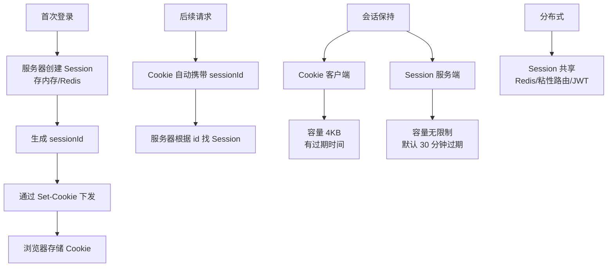
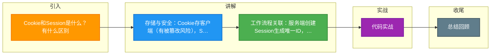

# Cookie和Session是什么？有什么区别

### Cookie 和 Session
**作用**：Cookie 和 Session 都用于 HTTP 协议中管理用户的状态和身份（因为 HTTP 本身是无状态协议）。

#### 1. Cookie
- **定义**：存储在用户浏览器（客户端）中的小型文本文件（通常小于 4KB）。
- **工作流程**：
  1. 服务器发送响应报文，包含 `Set-Cookie` 头部。
  2. 浏览器自动保存 Cookie。
  3. 后续请求浏览器自动在 `Cookie` 头部携带该数据。
- **属性**：`Name/Value`, `Domain`（作用域）, `Path`（路径）, `Expires/Max-Age`（过期时间）, `Secure`（仅 HTTPS）, `HttpOnly`（防 JS 窃取）。

#### 2. Session
- **定义**：存储在服务器端的数据结构，用于保存特定用户会话的信息。
- **工作流程**：
  1. 服务器创建 Session，生成唯一 `SessionID`。
  2. 服务器通过 Cookie 将 `SessionID` 返回给客户端（或 URL 重写）。
  3. 客户端请求携带 `SessionID`，服务器根据 ID 查找对应的 Session 数据。
- **存储**：内存、Redis、数据库等。

#### 3. 区别
| 特性 | Cookie | Session |
| :--- | :--- | :--- |
| **存储位置** | 客户端（浏览器） | 服务器端 |
| **安全性** | 较低（可被篡改或窃取，需配合 HttpOnly/Secure） | 较高（数据不直接暴露给客户端） |
| **存储大小** | 有限制（约 4KB） | 理论无限制（受服务器内存限制） |
| **存取类型** | 仅支持字符串 | 支持任意对象 |
| **有效期** | 可设置长期有效 | 通常随会话结束失效（也可设置） |

#### 补充：Token (JWT)
- **原理**：服务器不保存状态，将用户信息编码并签名生成 Token 发给客户端。
- **区别**：Session 需要服务端存储（有状态），Token 无状态，适合分布式和跨域场景。

#### 实战深化

**实战案例**：
在电商促销活动中，流量激增导致基于 Cookie 的 Session 验证 Redis CPU 飙升。我们采用了将部分非敏感状态（如购物车 ID）迁移到 JWT 中存储，从而减少 70% 的 Redis 读取请求。但要注意 JWT 一旦签发难以失效，涉及资金安全的操作仍需服务端二次校验。

**代码示例 (Node.js 设置安全 Cookie)**：
```javascript
// 服务端设置 Cookie，推荐配置
res.setHeader('Set-Cookie', [
  'sessionId=abc123; ' +
  'HttpOnly; ' +           // 防止 XSS 脚本窃取
  'Secure; ' +            // 仅限 HTTPS 传输
  'SameSite=Strict; ' +   // 防止 CSRF 攻击
  'Max-Age=3600; ' +      // 有效期 1 小时
  'Path=/'                // 作用域
]);
```

**身份认证方案选型对比**：

| 方案 | 存储位置 | 跨域支持 | 水平扩展 | 安全性 | 适用场景 |
| :--- | :--- | :--- | :--- | :--- | :--- |
| **Cookie + Session** | 服务端 | 较差 (需配置 Domain) | 依赖 Session 共享存储 | 高 (数据可控) | 传统 Web，后台管理系统 |
| **Token (JWT)** | 客户端 | 好 (放在 Header 中) | 天然支持 | 中 (无法主动失效) | 移动端 API，分布式服务 |
| **OAuth 2.0** | 第三方服务 | 极好 | 极好 | 高 (令牌解耦) | 第三方登录 (微信/GitHub) |

## 常见考点
1. **禁用 Cookie**：如果客户端禁用了 Cookie，Session 还能用吗？（可以，通过 URL 重写 `jsessionid`）。
2. **分布式 Session**：在多台服务器集群环境下，如何解决 Session 同步问题？（Session 粘滞、Session 复制、集中存储 Redis）。
3. **安全性**：如何防范 Session 劫持？（使用 HttpOnly、定期更换 SessionID、绑定 User-Agent/IP 等）。
4. **存储选择**：为什么 Redis 适合存储 Session？（高性能、支持过期、支持多种数据结构）。


## 核心架构图



## 记忆要点

- 存储与安全：Cookie存客户端(有被篡改风险)，Session存服务端(相对安全但消耗内存)
- 工作流程关联：服务端创建Session生成唯一ID，再通过浏览器的Cookie将其返回给客户端保存
- 大小与类型：Cookie限制4KB仅能存字符串，Session理论无限制且支持存储任意对象

## 结构化回答

**30 秒电梯演讲：** 客户端存凭证，服务端存状态。打个比方，Cookie是会员卡放口袋，Session是档案存在前台。

**展开框架：**
1. **存储与安全** — Cookie存客户端(有被篡改风险)，Session存服务端(相对安全但消耗内存)
2. **工作流程关联** — 服务端创建Session生成唯一ID，再通过浏览器的Cookie将其返回给客户端保存
3. **大小与类型** — Cookie限制4KB仅能存字符串，Session理论无限制且支持存储任意对象

**收尾：** 我在项目里踩过坑——在电商促销活动中，流量激增导致基于 Cookie 的 Session 验证 Redis CPU 飙升。您想深入聊哪一段：原理、避坑还是对比选型？

## 视频脚本

> 预计时长：2 分钟 | 由浅入深

| 时间 | 画面/字幕 | 口播台词 | 讲解要点 |
|------|----------|----------|----------|
| 0:00 | 标题卡：Cookie和Session是什么？… | "Cookie和Session是什么？有什么区别？一句话——Cookie是会员卡放口袋，Session是档案存在前台。" | 开场钩子 |
| 0:40 | 概念动画/示意图 | "客户端存凭证，服务端存状态——Cookie是会员卡放口袋，Session是档案存在前台" | 核心定义 |
| 1:20 | 存储与安全示意 | "Cookie存客户端(有被篡改风险)，Session存服务端(相对安全但消耗内存)" | 要点1 |
| 2:00 | 总结卡 | "记住这几条，面试不慌。下期讲进阶追问。" | 收尾 |

### 视频流程图



