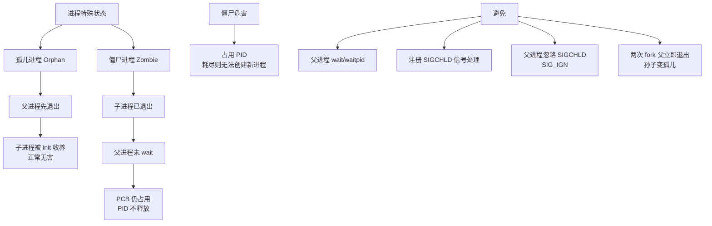

# 进程间有哪些通信方式

进程间通信（IPC, Inter-Process Communication）是指两个或多个进程之间进行数据或信息交换的机制。主要方式包括：

1. **管道**
   - **匿名管道**：本质是内核缓冲区。它是**半双工**通信（数据只能单向流动），且只能在具有**亲缘关系**的进程（父子进程、兄弟进程）之间使用。
   - **命名管道**：提供了一个路径名与之关联，以文件形式存在于文件系统中。允许**无亲缘关系**的进程之间通信。虽然以文件形式存在，但数据读写仍然是在内存中进行的。

2. **信号量**
   - 信号量本质上是一个**计数器**，它主要用于**控制多个进程对共享资源的访问**，常作为一种锁机制，防止竞态条件。它通常不用于传输大量数据，而是用来协调进程间的执行顺序（同步与互斥）。

3. **消息队列**
   - 消息队列是保存在内核中的**消息链表**。与管道相比，它克服了管道只能承载无格式字节流以及缓冲区大小受限的缺点。
   - **特点**：消息队列独立于发送和接收进程存在，进程终止后，队列中的内容（如果没有被取出）通常仍然存在于内核中；它可以实现消息的随机查询，不一定要以先进先出的方式读取。

4. **信号**
   - 信号是一种比较复杂的通信方式，用于通知接收进程某个事件已经发生（如 SIGINT 表示中断，SIGKILL 表示杀死进程）。它主要用于控制进程行为，传输的信息量非常有限。

5. **共享内存**
   - **原理**：映射一段能被其他进程所访问的内存。这段共享内存由一个进程创建，但多个进程都可以访问。
   - **特点**：这是**最快**的 IPC 方式，因为数据不需要在客户机和服务器之间复制（不需要在内核态和用户态之间来回拷贝数据）。
   - **注意**：因为多个进程可以同时修改同一块内存，所以通常需要配合**信号量**来实现同步。

6. **Socket 套接字**
   - Socket 可以用于不同机器之间的进程通信，也可用于同一台机器内部的进程通信（如 Unix Domain Socket）。它是支持 TCP/IP 协议的网络通信的基本操作单元。

### 进程间通信方式对比图

```text
+----------------+       +----------------+
|    进程 A      |       |    进程 B      |
+-------+--------+       +--------+-------+
        |                          |
        |  (1) 管道 (Pipe)         | <--- 单向/双向数据流
        |------------------------->|
        |                          |
        |  (2) 消息队列            |
        |  --> [ 内核队列 ] -->    |
        |                          |
        |  (3) 共享内存            |
        |      +---------+         |
        |      | 共享区  | <------->| <--- 直接读写，最快（需同步）
        |      +---------+         |
        |                          |
        |  (4) 信号量
        |      [计数器]  <------->| <--- 同步与互斥控制
        |                          |
        |  (5) Socket              |
        |<-------- Network --------|
+----------------+       +----------------+
```

#### 实战深化

**实战案例**：
在高性能 Nginx 与 PHP-FPM 通信场景中，相比 TCP Socket，使用 Unix Domain Socket (UDS) 可以减少 TCP 协议栈的开销，QPS 提升约 10%。此外，在开发监控 Agent 时，主进程通过 Unix Socket 接收子进程上报的日志，避免了频繁写磁盘的 IO 阻塞。

**代码示例 (C++ 共享内存)**：
```cpp
#include <sys/shm.h>
#include <iostream>

// 创建共享内存
key_t key = ftok("/tmp", 666);
int shmid = shmget(key, 1024, IPC_CREAT | 0666); 
char *shm = (char*)shmat(shmid, NULL, 0); // 挂载到进程地址空间

// 写入数据
sprintf(shm, "Hello Process B!");

// 注意：实际使用需配合信号量或互斥锁防止竞争条件
// shmdt(shm); // 断开连接
```

**IPC 方式选型对比**：

| 方式 | 传输速度 | 数据量 | 适用场景 | 通信方向 |
| :--- | :--- | :--- | :--- | :--- |
| **匿名管道** | 快 | 较小 | 父子进程简单数据传递（如 `ls | grep`） | 单向 (半双工) |
| **命名管道** | 中等 | 较小 | 无亲缘关系进程的简单数据流 | 单向 (半双工) |
| **消息队列** | 中等 | 适中 | 需要解耦的进程通信、异步任务 | 双向 |
| **共享内存** | **最快** | 大量 | 大数据交换（如视频流、高频行情数据） | 双向 |
| **Unix Socket** | 快 (本机) | 适中 | 本机 C/S 架构（如 Nginx<->PHP, Docker <-> Host） | 双向 |
| **TCP Socket** | 慢 (跨网络) | 任意 | 跨机器网络通信 | 双向 |

## 常见考点
1. **为什么共享内存最快？**
   - 因为共享内存不需要在内核态和用户态之间进行数据拷贝。管道、消息队列等方式，数据需要先从发送方用户态拷贝到内核态，再从内核态拷贝到接收方用户态，涉及两次内存拷贝。

2. **管道的读写特点？**
   - 如果管道为空，读操作会阻塞（除非设置了非阻塞标志）；如果管道已满，写操作会阻塞。
   - 当管道的写端关闭，读端读到 0（EOF）会返回。

3. **消息队列的优势与缺点？**
   - 优势：自带同步与互斥机制，可以实现消息的随机查询，接收方可以根据类型选择读取，不必像管道那样只能先进先出。
   - 缺点：每个消息最大长度有限制（MSGMAX），且队列总容量也有上限（MSGMNB），拷贝次数多于共享内存。


## 核心架构图


## 核心知识点图


## 记忆要点

- 选型对比口诀：管道亲缘单向流，消息队列能格式，信号量做同步，Socket跨主机
- 共享内存最快：因为省去了内核态与用户态间的数据拷贝，所以最高效但需配合同步锁防并发
- 通信域差异：匿名管道限父子进程，命名管道解耦无亲缘关系，Unix Socket用于本机进程低开销通信

## 结构化回答

**30 秒电梯演讲：** 不同进程间交换数据的机制。打个比方，像两人写信（消息）、打电话（管道）、或者共用白板（共享内存）。

**展开框架：**
1. **选型对比口诀** — 管道亲缘单向流，消息队列能格式，信号量做同步，Socket跨主机
2. **共享内存最快** — 因为省去了内核态与用户态间的数据拷贝，所以最高效但需配合同步锁防并发
3. **通信域差异** — 匿名管道限父子进程，命名管道解耦无亲缘关系，Unix Socket用于本机进程低开销通信

**收尾：** 我在项目里踩过坑——在高性能 Nginx 与 PHP-FPM 通信场景中，相比 TCP Socket，使用 Unix Domain Socket (UDS) 可以减少 TCP 协议栈的开销，QPS 提升约 10%。您想深入聊哪一段：原理、避坑还是对比选型？

## 视频脚本

> 预计时长：3 分钟 | 由浅入深

| 时间 | 画面/字幕 | 口播台词 | 讲解要点 |
|------|----------|----------|----------|
| 0:00 | 标题卡：进程间有哪些通信方式 | "进程间有哪些通信方式？一句话——像两人写信（消息）、打电话（管道）、或者共用白板（共享内存）。" | 开场钩子 |
| 0:45 | 概念动画/示意图 | "不同进程间交换数据的机制——像两人写信（消息）、打电话（管道）、或者共用白板（共享内存）" | 核心定义 |
| 1:30 | 选型对比口诀示意 | "管道亲缘单向流，消息队列能格式，信号量做同步，Socket跨主机" | 要点1 |
| 2:15 | 共享内存最快示意 | "因为省去了内核态与用户态间的数据拷贝，所以最高效但需配合同步锁防并发" | 要点2 |
| 3:00 | 总结卡 | "记住这几条，面试不慌。下期讲进阶追问。" | 收尾 |
